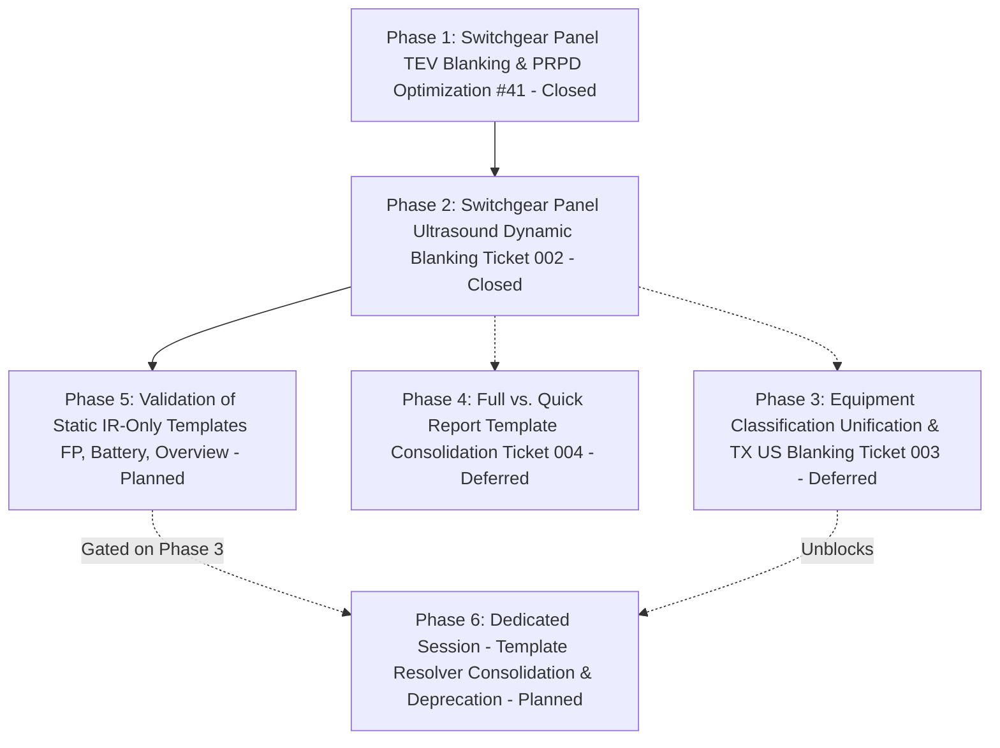

# Quick Report Dynamic Template Consolidation Map

> [!IMPORTANT]
> **Local Map Notice**: This Wayfinder map stays strictly **local** at `.wayfinder/dynamic-template-consolidation/map.md` until all fog of war has been resolved through planned discussion and alignment. Do not publish to remote GitHub issues until team alignment is complete.

---

## Destination

Full consolidation of Quick Report templates into `DEFECT IR US TEV` as the single dynamic source of truth, deprecating `DEFECT IR` and `DEFECT IR US` folders across all equipment families:
- **Switchgear (SWG)**: `swg-panel.docx`, `swg-overview.docx`
- **Transformers (TX)**: `tx-hv-sides.docx`, `tx-lv-sides.docx`, `tx-overview.docx`
- **Feeder Pillars / LVDB (FP)**: `fp-individual-defect.docx`, `fp-overview.docx`
- **Battery Banks**: `battery-overview.docx`

*(Note: Cross-consolidation between Full Report and Quick Report templates is deferred in Ticket 004; each report generator maintains its independent template tree. Full deprecation of legacy Quick Report directories in Phase 6 is gated on Ticket 003).*

---

## Motivation & Architecture

Historically, Quick Report maintained three parallel template directories:
1. `templates/QUICK REPORT/DEFECT IR/`
2. `templates/QUICK REPORT/DEFECT IR US/`
3. `templates/QUICK REPORT/DEFECT IR US TEV/`

### Drawbacks of Multiple Directories
1. **Maintenance Drift**: Edits to placeholders, ActiveX controls, or layout fixes had to be duplicated up to 3 times per equipment.
2. **Brittle Resolution Logic**: Complex template path discovery and branching in `cbm_defect_planner.py`, `environment.py`, and `cbm_family.py`.
3. **Inconsistent Styling**: Styling fixes applied to one folder frequently failed to propagate to the others.

### Solution: Method 1 — Truly Dynamic Templates via OpenXML Blanking
By using `DEFECT IR US TEV` as the canonical template across all jobs:
- **Technology Quadrant Strategy**:
  - **Quadrant 1 & 2 (Top Half, Rows 1–20)**:
    - **Thermal IR & Visual Photo Pair**: Always present and paired across all equipment families and contracts.
    - Never blanked.
  - **Quadrant 3 (Lower-Left, Rows 21–32, Columns 1–8)**:
    - **Ultrasound (US)**: Measurement block (`Decibel (dB)`, `Sound characteristic`, `Severity`, `Sound clip`) + `{{ us.prpd }}` image.
    - Present in: `swg-panel.docx` (24 cols) and `tx-hv-sides.docx` (23 cols).
    - Switchgear US Rule: Follows two-tier architecture mirroring TEV:
      - Tier 1: Active when contract includes `"US"`. Blanked when contract is IR-only (`["IR"]`).
      - Tier 2: Active on all compartments EXCEPT exclusions: `SECONDARY COMPARTMENT` and `LINK BOX`.
    - Action: Text cleared, background shading stripped (`<w:shd>` removed), borders set to `<w:val="nil"/>`, adjacent spacer borders cleared, US PRPD generation skipped.
  - **Quadrant 4 (Lower-Right, Rows 21–32, Columns 11–22)**:
    - **TEV**: Measurement block (`TEV BACKGROUND`, `READING`, `PULSE/CYCLE`, `SEVERITY`) + `{{ tev.prpd }}` image.
    - Present in: `swg-panel.docx` ONLY. (Not present on TX, FP, Battery, or Overviews).
    - Two-Tier Rule: Active only when contract includes `"TEV"` AND compartment is TEV-eligible (`BREAKER`, `CABLE`, `PT`, `FUSE`).
    - Action: `blank_swg_tev_cells()`, text cleared, `<w:shd>` stripped, borders set to `nil`, TEV PRPD generation skipped.

- **Static IR-Only Templates in `DEFECT IR US TEV`**:
  - `tx-lv-sides.docx`: **Always IR-only** (rows 21–32 are permanently empty and borderless).
  - `fp-individual-defect.docx`: **Always IR-only** (rows 21–32 permanently empty).
  - `fp-overview.docx`: **Always IR-only**.
  - `battery-overview.docx`: **Always IR-only**.
  - `swg-overview.docx`, `tx-overview.docx`, `blackbox-overview.docx`: **Always static IR+Visual pairs** with empty lower quadrants.

---

## Work Breakdown & Phasing

### Phase 1: Switchgear Panel Dynamic TEV Blanking & PRPD Optimization (Ticket 001 / #41)
- **Status**: Closed
- **Ticket Reference**: [.wayfinder/dynamic-template-consolidation/tickets/001-swg-panel-tev-blanking.md](file:///C:/Users/ADAM/Desktop/pahang-cli/.wayfinder/dynamic-template-consolidation/tickets/001-swg-panel-tev-blanking.md)
- [x] **Two-Tier Eligibility**:
  - Tier 1: Check if `TEV` is in project awarded technologies (`is_tev_contract_awarded`).
  - Tier 2: Check compartment eligibility (`BREAKER COMPARTMENT`, `CABLE COMPARTMENT`, `PT COMPARTMENT`, `FUSE COMPARTMENT` vs `CABLE ENTRY`, `BUSBAR COMPARTMENT`).
- [x] **OpenXML Blanking**: Clear text, remove cell background shading, and set borders to `<w:val="nil"/>` for rows 21–32, columns 11–22 in `swg-panel.docx`.
- [x] **PRPD Optimization**: Skip TEV PRPD graph generation in `prpd.py` for non-TEV compartments.
- [x] **Scope Parity**: Applied to Full Report (`scan_adapters.py`, `scan_render.py`) and Quick Report (`cbm_render.py`).

### Phase 2: Switchgear Panel Ultrasound Dynamic Blanking (Ticket 002 / #42)
- **Status**: Closed
- **Ticket Reference**: [.wayfinder/dynamic-template-consolidation/tickets/002-swg-panel-us-blanking.md](file:///C:/Users/ADAM/Desktop/pahang-cli/.wayfinder/dynamic-template-consolidation/tickets/002-swg-panel-us-blanking.md)
- **Architectural Directive**: Must strictly mirror the TEV architecture in `src/core/shading.py` (`is_us_contract_awarded`, `is_swg_compartment_us_eligible`, `is_swg_us_active`, `blank_swg_us_cells` on rows 21..32 cols 1..8, and PRPD skipping in `prpd.py` and `scan_adapters.py`).
- [x] **Contract US Eligibility (Tier 1)**:
  - Implement `is_us_contract_awarded(technologies)` helper in `src/core/shading.py`.
  - Handle IR-only contracts (`["IR"]`) where US is deactivated across all compartments.
- [x] **Switchgear Compartment US Eligibility (Tier 2)**:
  - Implement `is_swg_compartment_us_eligible(compartment)` in `src/core/shading.py`.
  - Exclusion Enforcement (`US_BLANKED_SWG_COMPARTMENTS`):
    - `SECONDARY COMPARTMENT`: Excluded (blanked).
    - `LINK BOX`: Excluded (blanked).
    - All other compartments (`BREAKER`, `CABLE`, `PT`, `BUSBAR`, `CABLE ENTRY`, `FUSE`): Eligible (active).
  - Update `normalize_swg_compartment()` with precedence rule ensuring `LINK BOX` (and `CABLE LINK BOX`) is matched before generic `CABLE`, and canonicalizing `SECONDARY COMPARTMENT`.
- [x] **OpenXML US Blanking Engine (`blank_swg_us_cells`)**:
  - Implement in `src/core/shading.py`: Clear text, strip `<w:shd>`, and set borders to `nil` for rows 21–32, columns 1–8 in `swg-panel.docx` (24 cols).
  - Clear adjacent spacer borders: Col 0 right border, Col 9 left border, Row 20 bottom border, Row 33 top border.
  - Wire into `apply_scan_post_processing(..., blank_us=False)`.
- [x] **PRPD Optimization**:
  - Update `generate_prpd_graphs_for_swg_panel()` in `src/quick_report/prpd.py` with `include_us` parameter and compartment US exclusion check to skip decoding/rendering US PRPD.
- [x] **Scope Parity**:
  - Integrate into Full Report (`scan_adapters.py`, `scan_render.py`) and Quick Report (`cbm_render.py`).
  - Blank US context values (`reading`, `char`, `severity`, `prpd`) when US is inactive.
- [x] **Comprehensive Test Suite**:
  - Implement `tests/test_swg_us_dynamic_blanking.py` matching the verification rigor of `test_swg_tev_dynamic_blanking.py`.

### Phase 3: Equipment Classification Unification & Transformer US Blanking (Ticket 003)
- **Status**: Deferred
- **Ticket Reference**: [.wayfinder/dynamic-template-consolidation/tickets/003-equipment-classifier-tx-us-blanking.md](file:///C:/Users/ADAM/Desktop/pahang-cli/.wayfinder/dynamic-template-consolidation/tickets/003-equipment-classifier-tx-us-blanking.md)
- **Deferral Rationale & Architectural Consensus**:
  - Defect area and location classification is currently scattered across ad-hoc ternary checks, regex patterns, and divergent string matching across Full Report and Quick Report (e.g. `tx_location = "HV - SIDE"` in `cbm_render.py` vs `location = "HV SIDE"` in `scan_adapters.py`).
  - Rather than patching `{{ tx.location }}` in isolation, the team decided that a dedicated design session must be held to unify the classifier architecture across all equipment families (`SWG`, `TX`, `FP` / `LVDB`) into dedicated modules (`src/core/classifiers/`).
  - Resolving the classifier design across all equipment will require multiple dedicated sessions; all decisions and open issues must be meticulously documented in this map.
  - Transformer US dynamic blanking on `tx-hv-sides.docx` is strictly deferred until the unified classifier design is ratified and implemented.
- **Future Scope**:
  - Hold dedicated design session to establish `src/core/classifiers/` (`swg.py`, `tx.py`, `fp.py`).
  - Unify `{{ tx.location }}` resolution and 7-point scan mapping (`ADR 0004`).
  - Implement transformer US blanking on `tx-hv-sides.docx` (rows 21–32, cols 1–8, 23-column table) for IR-only contracts.
  - Optimize transformer US PRPD generation in `prpd.py`.
  - Unblock Phase 6 legacy template folder deprecation.

### Phase 4: Full vs. Quick Report Template Consolidation (Ticket 004)
- **Status**: Deferred
- **Ticket Reference**: [.wayfinder/dynamic-template-consolidation/tickets/004-full-quick-report-template-consolidation.md](file:///C:/Users/ADAM/Desktop/pahang-cli/.wayfinder/dynamic-template-consolidation/tickets/004-full-quick-report-template-consolidation.md)
- **Deferral Rationale**:
  - Investigation proved that FLIR thermal image palette selection (`RAIN900` in Full Report vs `RAIN` in Quick Report) is serialized inside proprietary Microsoft OLE Compound Binary storage (`activeX1.bin`).
  - Modifying or mutating these ActiveX binary properties at runtime without Microsoft Word COM automation breaks binary header offsets, internal storage structures, and checksums, directly violating **ADR 0002** and triggering Word unreadable content recovery errors.
  - Concrete test evidence: Tampering with `swg-panel.docx` altered VML shape ID from `_x0000_i1029` to `_x0000_i1027`, instantly failing 3 tests in `tests/test_full_report_normal_templates.py`.
  - Without a clear, validated methodology to dynamically alter thermal image object properties at runtime, merging Full Report and Quick Report templates into a single dynamic file is deferred pending deeper architectural sessions.
- **Future Scope**:
  - Evaluate palette harmonization (standardizing on `RAIN900` across all templates ahead of time).
  - Address template geometry, margin, and placeholder discrepancies between reports.
  - Maintain complete decoupling between `templates/FULL REPORT/` and `templates/QUICK REPORT/`.

### Phase 5: Validation of Static IR-Only Templates (FP, Battery, Overviews)
- **Status**: Planned
- [ ] **Verification of Zero-Blanking Requirements**:
  - Confirm `tx-lv-sides.docx` renders cleanly as IR-only across all contracts without needing blanking (rows 21–32 are permanently blank).
  - Confirm `fp-individual-defect.docx`, `fp-overview.docx`, and `battery-overview.docx` render correctly with IR+Visual pair.
  - Confirm all overview templates (`swg-overview.docx`, `tx-overview.docx`, `fp-overview.docx`, `battery-overview.docx`) show clean IR+Visual layouts and standard Jinja2 dash defaulting (`"-"`).

### Phase 6: Dedicated Session — Resolver Unification & Legacy Directory Deprecation
- **Status**: Planned (Gated on Ticket 003)
- **Dependency Notice**: Full deprecation of `DEFECT IR` and `DEFECT IR US` legacy template directories is strictly gated on Phase 3 (Ticket 003), because IR-only Transformer defects currently rely on legacy `DEFECT IR/tx-hv-sides.docx` until dynamic US blanking on TX is implemented.
- [ ] Point `cbm_family.py`, `environment.py`, and `config.py` exclusively to `DEFECT IR US TEV` for switchgear.
- [ ] Once Ticket 003 is complete: Point transformer resolvers to `DEFECT IR US TEV`.
- [ ] Deprecate legacy folders: `templates/QUICK REPORT/DEFECT IR/` and `templates/QUICK REPORT/DEFECT IR US/`.
- [ ] Clean up redundant folder resolution paths and fallback routing once dynamic templates are 100% field-proven.

---

## Decisions Log & Clarifications

1. **IR-Only Contracts on TX-HV**:
   - **Decision**: For IR-only contracts, `tx-hv-sides.docx` must have its US measurement quadrant (rows 21–32, cols 1–8) cleared, background shading stripped, and borders set to `nil` using the exact same blanking engine.
   - **Note**: `tx-lv-sides.docx` is permanently IR-only across all contracts and already has empty rows 21–32. Implementation deferred to Ticket 003.
2. **Feeder Pillar & Battery Bank Modalities**:
   - **Decision**: `fp-overview.docx`, `fp-individual-defect.docx`, and `battery-overview.docx` are strictly IR-only across all contracts. No US or TEV quadrants are needed or present.
3. **Overview Page Behavior**:
   - **Decision**: All overview pages (`swg-overview`, `tx-overview`, `fp-overview`, `battery-overview`) are static, featuring only the IR and Visual image quadrant pair. No lower quadrant dynamic table restructuring is needed.
4. **Template Deprecation Phasing**:
   - **Decision**: Do not remove legacy folders immediately. A dedicated cleanup session will be held to redirect all paths once the dynamic templates are thoroughly tested and verified.
5. **Switchgear Ultrasound Exclusion Architecture (Ticket 002)**:
   - **Decision**: US dynamic blanking must strictly mirror the TEV architecture in `src/core/shading.py`.
   - **Enforcement**: Tier 1 checks contract `is_us_contract_awarded(techs)`. Tier 2 applies exclusion enforcement (`US_BLANKED_SWG_COMPARTMENTS`) blanking `SECONDARY COMPARTMENT` and `LINK BOX`, while keeping all other compartments active. Rows 21–32 cols 1–8 are blanked via XML DOM traversal, and PRPD graph generation is bypassed.
6. **Deferral of Transformer US Blanking pending Equipment Classifier Unification (Ticket 003)**:
   - **Decision**: Do not patch `{{ tx.location }}` in isolation. Classifier logic is currently fragmented across ad-hoc ternary expressions in Quick Report and Full Report. We must hold a dedicated design session to establish unified classifier modules (`SWG`, `TX`, `FP`) before proceeding with TX US blanking. Multiple sessions may be required; all decisions and issues must be recorded in this map.
7. **Deferral of Full Report vs. Quick Report Template Consolidation (Ticket 004)**:
   - **Decision**: FLIR Tools+ ActiveX palette (`RAIN900` vs `RAIN`) is serialized in proprietary binary OLE storage (`activeX1.bin`). Runtime modification in Python violates ADR 0002 and causes document corruption. Consolidating Full Report and Quick Report templates into a single dynamic template file is deferred pending deeper architectural exploration.
8. **Gating of Full Template Directory Deprecation on Ticket 003**:
   - **Decision**: Phase 6 cannot fully deprecate `DEFECT IR` and `DEFECT IR US` until Ticket 003 is un-deferred and completed. IR-only Transformer jobs will continue to use the legacy `DEFECT IR` folder until Transformer dynamic US blanking is operational.

---

## Fog of War & Next Steps

- [x] **US Blanking Engine Requirements**: Clarified table positions: rows 21–32, cols 1–8 for `swg-panel.docx` (24 cols) and `tx-hv-sides.docx` (23 cols).
- [x] **TX-LV & Overview Dynamics**: Clarified that TX-LV, FP, Battery, and Overviews are statically IR-only.
- [x] **Switchgear US Compartment Exclusions**: Explicitly decided — `SECONDARY COMPARTMENT` and `LINK BOX` are excluded and blanked; all other compartments are eligible. IR-only contracts blank US everywhere.
- [x] **Transformer Classifier Scope**: Explicitly deferred — unified classifier design session scheduled before touching `{{ tx.location }}` or TX US blanking.
- [x] **Full vs. Quick Report Template Merge Feasibility**: Explicitly deferred — FLIR ActiveX `activeX1.bin` binary serialization constraints make pure dynamic runtime consolidation unviable without violating ADR 0002.
- [x] **Ticket 002 Complete**: Implemented Switchgear Panel Ultrasound Dynamic Blanking mirroring TEV blanking architecture and closed Ticket 002.
- [ ] **Next Frontier**: Phase 3 (Ticket 003: Equipment Classification Unification & TX US Blanking).
