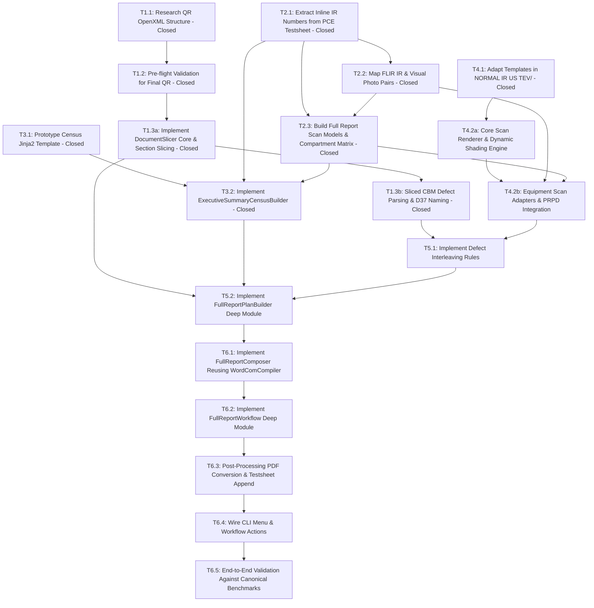

# Full Report Generation Workflow Map

> [!NOTE]
> **Canonical Source of Truth**: The primary local architecture and specification document is [map.md](map.md). This file (`github-map-body.md`) is maintained as the synchronization payload for GitHub Epic Issue [#19](https://github.com/adamlarGit/pahang-cli/issues/19).

---

## Destination

A complete `FullReportWorkflow` automated generator in `pahang-cli` catering to at least 90% of field substation topologies:
- **Switchgear**: 1 RMU SF6 (3 to 5 panels) or 1 VCB board.
- **Transformers**: Up to 2 distribution transformers (0 TX for SSU, 1 TX, or 2 TX).
- **LV Distribution**: Up to 2 LVDBs or Feeder Pillars (2 to 10 active feeder ways).
- **Auxiliary**: 0 or 1 Battery Bank.
- **Workflow Pipeline**: Ingests final analyzed Quick Report `.docx` (reusing cover/front page with signboard photo, condition photo pairs, visual defect pages, sticker page, and analyzed CBM defect detail pages); parses `PCE Testsheet` for healthy IR image numbering and panel operating parameters; pairs visual photos from IR photo numbers via FLIR visual pair pattern (`FLIRxxxx.jpg` thermal $\to$ `FLIRxxxx*-photo*.jpg` visual in `RAW DATA/IR/`); renders Executive Summary Census and healthy component scanning pages using dedicated `templates/FULL REPORT/NORMAL IR US TEV/` templates; dynamic inline defect interleaving; compiles final `.docx` and `.pdf` deliverables into `FULL REPORT/<STATION>/<MONTH>/<DATE>/`.

---

## Notes & Design Principles

- **GitHub-Driven Issue & PR Tracking**: Implementation flow is recorded canonically through GitHub Issues and PRs (under Map Issue #19) via `gh` CLI per `AGENTS.md`. Local files (`map.md`, `github-map-body.md`, and `tickets/`) are maintained in lockstep synchronization with GitHub.
- **Single Dedicated Feature Branch**: All 18 implementation tickets across SPEC 1 through SPEC 6 must be implemented sequentially on a **single unified feature branch** (e.g. `feature/full-report`). Do not create separate per-ticket branches. A single linear branch preserves shared compiler, parser, and model context, prevents integration drift, eliminates merge conflicts across tightly coupled modules (`models.py`, `plan_builder.py`, `composer.py`), and ensures incremental test suites pass continuously.
- **Quick Report Ingestion (DRY / No Re-work)**: Quick Report is generated first and finalized by the inspector (adding thermal and visual images, defect callouts, condition photos). Full Report ingests those finalized sections directly from the completed Quick Report `.docx` rather than regenerating them empty or requiring duplicate manual work.
- **Front Page Reuse**: The front page (including metadata and PE signboard photo) is lifted directly from the finalized Quick Report, eliminating the need for a separate full report front page template. Title transformation (`QUICK` $\to$ `FULL`) is executed via native Word COM Find & Replace during slicing.
- **Compiler Reuse As-Is**: `FullReportComposer` directly reuses `WordComDocumentCompiler` without any custom margin code or section breaks, matching proven Quick Report compilation behavior, benchmark single-section layout parity, and zero `LinkToPrevious` corruption risks.
- **Dedicated Full Report Normal Templates**: Component scanning pages use dedicated Jinja2 templates in `templates/FULL REPORT/NORMAL IR US TEV/` (`swg-overview.docx`, `swg-panel.docx`, `tx-overview.docx`, `tx-hv-sides.docx`, `tx-lv-sides.docx`, `fp-overview.docx`, `battery-overview.docx`). These templates are housed separately under `FULL REPORT` to decouple healthy scanning pages and allow independent styling/layout evolution without risking regressions to Quick Report.
- **Dynamic Post-Generation Shading**: Cell coloring occurs dynamically in code post-generation:
  - Technology severity cells (`{{ ir.severity }}`, `{{ us.severity }}`, `{{ tev.severity }}`) are dynamically shaded Green (`00B050`) when healthy, or Red (`EE0000`) when an active defect exists in that technology.
  - Analysis & Recommendation banners are dynamically shaded Green (`00B050`) for `"Analysis: No Anomaly. | Recommendation: -"`, and Red (`EE0000`) for `"Analysis: Please refer to the following page for details defect."`.
- **Visual Photo Pairing (FLIR Camera Pattern)**: The project camera configuration is set to FLIR camera mode (`ir_mode: "single"`, `ir_prefix: "FLIR"`). For any thermal image `FLIRxxxx.jpg`, the visual photo is paired by discovering `FLIRxxxx*-photo*.jpg` (e.g. `FLIR0290- photo.jpg`) within the same `RAW DATA/IR/` directory. If the visual photo file is missing, the placeholder safely renders as `""`.
- **Resilient US+TEV Waveform Generation**: Healthy switchgear panels auto-render PRPD scatter graphs via `src/quick_report/prpd.py` if the survey folder exists in `RAW DATA/US+TEV/`. If missing, graph placeholders render as `""` while numeric reading tables from `PCE Testsheet` are still rendered.
- **Canonical Benchmark Deliverable Trio**: Concrete development, regression validation, and visual quality auditing are pinned to 3 real substations:
  - **TALAPIA** (PE 5, `CRAU/PCE/J00251`, 04-Aug-2026, Raub W32, IR+VI): RMU 4-panel, TX, 10-way FP, thermal hotspot on FP F2 fuse, 68 raw IR files.
  - **CENDERAWASIH NO.1** (PE 179, `CKTN/PCE/J00030`, 28-Aug-2026, Kuantan W35, IR+VI): RMU 4-panel, TX, FP, thermal hotspot inside RMU TX fuse compartment.
  - **TELEKOM TANAH PUTIH** (PE 144, `CKTN/PCE/J00040`, 24-Aug-2026, Kuantan W35, TEV+VI): RMU 4-panel, TX, LVDB, severe TEV partial discharge across all 4 panels with PRPD waveforms.

---

## High-Level Component Flow

```
[Finalized Quick Report .docx] ───────┐
 (Front Page / Signboard,            │
  Condition Grid, VI Defect Grid,    │
  Stickers, Analyzed Defect Pages)   │
                                     ├───> [FullReportPlanBuilder] ───> [FullReportComposer] ───> [Full Report .docx]
[PCE Testsheet.xlsx & PCE VI.xlsx] ──┤      (Census, Component Plans,    (Modular Part Rendering,
 (Equipment Specs, Healthy IR Photos,│       Defect Interleaving)         Word COM Compilation)
  Load/Heater/Status/US/TEV)         │                                                                  │
                                     │                                                                  ▼
[RAW DATA/ (IR, DC, US+TEV)] ────────┘                                                        [PostProcessing COM PDF]
                                                                                                        │
                                                                                                        ▼
                                                                                             [Merged Full Report .pdf]
```

---

## Decisions So Far

- [x] **D01 - Map Tracking Strategy & GitHub Issue Synchronization**: Transition from local-only brainstorming to canonical GitHub issue and PR tracking. All tickets across SPEC 1 through SPEC 6 are published and tracked on GitHub Issues under Map Issue #19, with the full report feature implementation flow recorded through GitHub issues/PRs while keeping local documentation in lockstep.
- [x] **D02 - 90% Target Boundary**: Scope covers 1 RMU/VCB (3-5 panels), up to 2 TX, up to 2 LVDB/FP, 1 Battery Bank.
- [x] **D03 - Modular Part Stitching**: Assemble deliverables via modular OpenXML parts using `WordComDocumentCompiler` and `BatchComSession`.
- [x] **D04 - Quick Report Ingestion Seam**: Lift completed assets and pages (Front page with signboard photo, condition grid, VI defect grid, sticker page, analyzed defect pages) directly from the finalized Quick Report `.docx`.
- [x] **D05 - Testsheet IR Image Coordinates & Integer Extraction**: IR photo numbers for healthy equipment exist inline in `PCE Testsheet.xlsx`: Switchgear panels (Rows 10, 14, 18, 22 / Column O), Switchgear Overview (Row 26 / Column O), Switchgear Overview Secondary (Row 28 / Column O with Row 28 / Column J specifying `"TOP PANEL"` vs `"BOTTOM"`), Transformers (Rows 33–37 / Column J), Feeder Pillar / LVDB (Rows 49, 53 / Column S), Battery Bank (Row 59 / Column H). All photo numbers are strictly extracted as typed integers (`int` or `tuple[int, ...]`) before being transformed into file paths.
- [x] **D06 - FLIR Visual Photo Pairing**: Visual photo is resolved via the FLIR camera pattern (`FLIRxxxx.jpg` $\to$ `FLIRxxxx*-photo*.jpg`) in `RAW DATA/IR/`. If missing, placeholder renders as `""`.
- [x] **D07 - Operator Sequence**: Operator generates and finalizes Quick Report first $\to$ saves in `QUICK REPORT/` $\to$ runs Full Report. Full Report validates Quick Report presence upfront.
- [x] **D08 - US+TEV Waveform Generation & Clean Fallback Policy**: Normal ultrasound acoustic plots and TEV PRPD graphs for every equipment (SWG panels and TX HV sides) must always be generated and presented whenever raw data files are available in `RAW DATA/US+TEV/`, regardless of whether the component is normal or defective (reusing logic from `prpd.py`). If a component has no raw PRPD data file on disk in `RAW DATA/US+TEV/`, it falls back cleanly to empty string `""` for the graph slot, presenting a clean blank chart quadrant while maintaining the testsheet numeric readings and Green `00B050` severity cell.
- [x] **D09 - Quick Report Document Slicing**: Slicing service extracts finished sections from finalized Quick Report into intermediate `temp_parts/` docx files for `WordComDocumentCompiler`.
- [x] **D10 - Dedicated Full Report Normal Scanning Templates**: Sourcing modular healthy component scanning templates from `templates/FULL REPORT/NORMAL IR US TEV/` (cloned from Quick Report CBM templates to establish an independent template hierarchy for Full Report, enabling future styling divergence without Quick Report regression).
- [x] **D11 - Dynamic Shading via Render Engine**: Templates in `templates/FULL REPORT/NORMAL IR US TEV/` remain pristine; cell coloring and banner shading are applied dynamically at render time by `cbm_render.py` / `FullReportScanPageRenderer`.
- [x] **D12 - Canonical Benchmark Deliverable Trio**: Formalize 3 manually authored Full Report deliverables and their corresponding finalized Quick Reports as the ground-truth benchmarks: TALAPIA (PE 5, CRAU/PCE/J00251, 04-Aug-2026, IR+VI), CENDERAWASIH NO.1 (PE 179, CKTN/PCE/J00030, 28-Aug-2026, IR+VI), and TELEKOM TANAH PUTIH (PE 144, CKTN/PCE/J00040, 24-Aug-2026, TEV+VI).
- [x] **D13 - Word COM Slicing Engine**: Adopt Word COM Automation (`WordComDocumentSlicer`) via an abstract `DocumentSlicer(Protocol)` seam with `FakeDocumentSlicer` for fast CI testing, ensuring 100% preservation of DrawingML shapes (inspector red callout boxes/arrows) and FLIR Tools+ ActiveX controls per ADR 0002.
- [x] **D14 - Slicing Output Directory & Lifecycle**: Store sliced intermediate `.docx` parts in a workspace temporary folder (`.temp/temp_parts/<STATION>/`), automatically cleaned up after successful compilation, with a `--keep-temp` debug flag.
- [x] **D15 - Slicing Granularity & Output Contract**: `QuickReportIngestionService` extracts: `front_page.docx` (1 page), `vi_summary.docx` (1 page, if visual defects exist), `cbm_defects/` (individual `.docx` per CBM defect page to enable inline interleaving in SPEC 5), `condition_pages.docx` (single multi-page `.docx` containing all Substation Condition pages), `vi_defect_pages.docx` (single multi-page `.docx` containing all Visual Defect pages), and `sticker_page.docx` (1 page).
- [x] **D16 - Section Boundary Detection via Word COM Find**: Boundaries are identified cleanly without conditional fragility:
  1. `front_page`: Page 1 (strictly 1 page).
  2. `vi_summary`: Exact paragraph `"VISUAL DEFECT SUMMARY"` between Page 2 and `"SUBSTATION CONDITION"`.
  3. `cond_start`: Paragraph `"SUBSTATION CONDITION"`.
  4. `cbm_defects`: Individual pages between summary tables and `cond_start`.
  5. `sticker_start`: Found unconditionally across the document via the unique paragraph `"NORMAL/DEFECT STICKER"`. `sticker_page` spans `sticker_start` to document end (1 page).
  6. Substation Condition & Visual Defect pages boundary:
     - If visual defects exist: Paragraph `"VISUAL DEFECT"` exists strictly between `cond_start` and `sticker_start` (`vi_start`). `condition_pages` spans from `cond_start` to `vi_start - 1`, and `vi_defect_pages` spans from `vi_start` to `sticker_start - 1`.
     - If zero visual defects exist: `vi_defect_pages` is omitted, and `condition_pages` spans cleanly from `cond_start` to `sticker_start - 1`.
- [x] **D17 - Pre-Flight Finalized Quick Report Integrity Validation**: Multi-tier check validating: 1) File existence in `QUICK REPORT/<STATION>/<MONTH>/<DATE>/`, 2) File size floor >= 1.0 MB (instantly isolating raw unpopulated templates), and 3) Media count floor >= 8 in `word/media/` ensuring inspector photos are populated.
- [x] **D18 - Testsheet IR Photo Coordinates & Integer Parsing**: `TestsheetExtractor` parses inline IR photo numbers (SWG Col O, TX Col J, FP Col S, Battery Col H) into typed integers (`int`) using the existing `_parse_int_safe` helper. If a comma-delimited list exists (e.g. `"9,10"`), integers are parsed via standard `re.findall(r"\d+", str(val))`. Components with a single photo slot use the primary integer while preserving all indices for multi-photo component plans.
- [x] **D19 - FLIR Visual Photo Pairing Governed by Project Settings**: Photo pairing convention (`FLIRxxxx.jpg` $\to$ `FLIRxxxx*-photo*.jpg` in `RAW DATA/IR/`) is governed by active project camera configuration (`ir_mode: "single"`, `ir_prefix: "FLIR"`, `photo_filter`). Future camera variations and diverse photo pairing naming conventions will be managed through this project setting seam. If a paired visual photo is absent on disk, log a non-fatal warning and safely render the placeholder as empty string `""` without crashing.
- [x] **D20 - Thermal Readings Handled by FLIR Plugin (No Testsheet Thermal Extraction Required)**: Component thermal readings (Tmin, Tmax, $\Delta T$, Avg) do not need extraction from testsheet for switchgear panels; the FLIR ActiveX plugin automatically manages thermal readings directly from the embedded IR image in Word. `SwitchgearSpec`, `SwitchgearPanelSpec`, `TransformerSpec`, `LVDBSpec`, and `BatteryBankSpec` store typed photo number tuples `photo_numbers: tuple[int, ...] = ()`.
- [x] **D21 - Major Equipment Group Numbering & Vertical Merge (Option C)**: Col 0 (`NO.`) carries integer group numbering (`1.`, `2.`, `3.`) and is vertically merged via OpenXML `<w:vMerge>` across all sub-rows belonging to that equipment group (Switchgear, TX1, TX2, FP/LVDB, Battery). Merging and group numbering are applied post-render to match Word's native list display.
- [x] **D22 - Feeder Pillar / LVDB Defect-Only Granularity**: 1 `OVERVIEW` row always. Individual feeder rows are appended only for feeder ways with active defects.
- [x] **D23 - Defect Measurement Formatting Reuse**: Table 3 defect readings reuse `format_temperature_reading` (`{val:.1f} °C`) and `format_db_reading` (`{val}dB`) from `src/quick_report/cbm_summary.py`. Inactive/healthy technologies show `"-"`.
- [x] **D24 - Severity-Only Cell Shading**: Only the `SEVERITY` cell is shaded (`00B050` Green for Normal, `EE0000` Red for Defect, text cleared). Overview rows have text `"-"` and unshaded background. Measurement cells (`IR`, `U/S`, `TEV`) remain unshaded with black text.
- [x] **D25 - Unified Summary Template Schema & Placeholders**: `templates/FULL REPORT/executive_summary_census.docx` inherits directly from Quick Report's `CBM DEFECT IR+US+TEV SUMMARY.docx` schema with unified keys (`no`, `equipment`, `defect_area`, `ir_abs`, `us_dB`, `tev_dB`, `severity`), binding Col 0 to `{{ item.no }}` and Col 6 to `{{ item.severity }}`.
- [x] **D26 - Switchgear Compartment Matrix & Overview Decoupling**: Switchgear scanning is cleanly decoupled between Board Overview scanning and Panel scanning:
  1. Board Overview scanning (via `swg-overview.docx` and `resolve_overview_compartments()`): TAMCO/LUCY boards generate 2 overview pages (`OVERVIEW` and `OVERVIEW BOTTOM`); INDKOM, VCB, and other RMUs generate 1 overview page (`OVERVIEW`).
  2. Panel scanning (via `swg-panel.docx` and `resolve_switchgear_compartments()`): TAMCO/LUCY panels strictly generate 2 scanning pages (`CABLE COMPARTMENT` and `CABLE ENTRY`) without conflating overview pages. INDKOM panels generate 1 scanning page (`FUSE COMPARTMENT` for TX feeder bays, `CABLE COMPARTMENT` for incoming/bus bays). Other RMUs generate 1 scanning page (`CABLE COMPARTMENT`). VCB panels generate 1 scanning page for each active compartment across standard 7 compartments.
- [x] **D27 - Unconditional Transformer HV CABLE SPLIT Generation (ADR 0004)**: Full Report unconditionally generates an `HV CABLE SPLIT` row and scanning page for each active transformer via `has_hv_cable_split(...) -> True` per ADR 0004 choice by design. If a secondary split photo is absent on disk, it falls back cleanly to empty string `""` without crashing.
- [x] **D28 - Inventory-to-Defect Cross-Referencing Engine**: `ExecutiveSummaryCensusBuilder` iterates `SubstationEquipmentPackage` physical inventory, matching against Quick Report `CbmDefectRecord`s to set defect readings and red/green severity tokens.
- [x] **D29 - Manufacturer-Driven Switchgear Scanning Page Counts**: If manufacturer is `TAMCO`, `SSE LUCY`, or `LUCY`: Generate 2 scanning pages per panel (`CABLE COMPARTMENT` and `CABLE ENTRY` using `swg-panel.docx`). If `INDKOM` or other RMUs: Generate 1 scanning page per panel (`CABLE COMPARTMENT` for incomers/bus; `FUSE COMPARTMENT` for TX feeder on INDKOM). For `VCB`: Generate 1 scanning page for each active compartment per panel.
- [x] **D30 - Overview Page Downstream Defect Forwarding**: For SWG, TX, FP/LVDB, Battery: If all subordinate components are 100% healthy, Overview banner is shaded Green `00B050` (`Analysis: No Anomaly. | Recommendation: -`). If ANY subordinate component has an active defect, Overview banner displays Red forwarding text (`Analysis: Please refer to the following page for details defect. | Recommendation: Please refer to the following page for details defect.`).
- [x] **D31 - Transformer 7-Point Scanning Template Mapping**: Each TX generates 7 pages: 1) `tx-overview.docx` (`OVERVIEW`), 2) `tx-overview.docx` (`OVERVIEW TOP`), 3) `tx-hv-sides.docx` (`HV BUSHING`), 4) `tx-hv-sides.docx` (`HV CABLE`), 5) `tx-hv-sides.docx` (`HV CABLE SPLIT`), 6) `tx-lv-sides.docx` (`LV BUSHING`), 7) `tx-lv-sides.docx` (`LV CABLE`).
- [x] **D32 - Scanning Page Dynamic Shading Scope**: `{{ ir.severity }}`, `{{ us.severity }}`, `{{ tev.severity }}` cells have text cleared `""` and are dynamically shaded Green `00B050` (healthy) or Red `EE0000` (defective). Bottom Analysis & Recommendation banner cell is dynamically shaded Green `00B050` for `No Anomaly.`, or Red `EE0000` for defect forwarding/analysis prose.
- [x] **D33 - Dedicated Scanning Renderer Architecture**: Implement `FullReportScanPageRenderer` in `src/full_report/scan_render.py`, resolving templates exclusively from `templates/FULL REPORT/NORMAL IR US TEV/`, and reusing OpenXML utilities (`set_cell_shading`, `clear_cell_text`, `_build_jinja_env`) from `src/quick_report/`.
- [x] **D34 - Switchgear Panel Defect Polymorphic Interleaving**: Standard IR defects directly replace the panel's scan page (`swg-panel.docx`, per Cenderawasih). High TEV / PRPD defects render a panel scan page with Red forwarding banner followed immediately by the inline TEV detail page (per Telekom Tanah Putih).
- [x] **D35 - Transformer Component-Level Inline Interleaving**: Defect detail pages are inserted immediately behind that specific component's scan page (e.g. behind `LV BUSHING` scan page, per Bukit Setongkol Mewah). The parent component scan page displays the Red forwarding banner.
- [x] **D36 - Feeder Pillar Overview Block Interleaving**: Feeder Pillar / LVDB defect detail pages sequence immediately after `fp-overview.docx` in left-to-right channel order (`IN1..IN3`, `OT1..OT10`, per Talapia).
- [x] **D37 - Fine-Tuned Sliced Defect Grammar & Dual-Layer Matching**: Slicer outputs `{eq_instance}_{seq}_{id}_{area}_{idx}.docx` encoding left-to-right physical panel sequence and equipment lineup (e.g. `swg1_p04_CKN01309_FUSE_COMPARTMENT_01.docx`). Interleaver pairs this with OpenXML Table 1 inspection for bulletproof validation.
- [x] **D38 - Orphan Defect Safe Append**: Sliced defect pages that cannot be matched to physical equipment nodes are safely appended at the end of the equipment scanning pages (before Substation Condition) with a prominent warning, preserving zero inspector work loss.
- [x] **D39 - Assembly Order & Visual Defect Summary**: Full Report follows the canonical 8-part sequence (`Front Page` -> `Executive Summary Census` -> `Visual Defect Summary` (if present) -> `Component Scanning Stream` (with interleaved CBM defects) -> `Substation Condition` -> `Visual Defect Pages` -> `Sticker Page` -> `Testsheet Append` (PDF stage)). `QuickReportIngestionService` slices `vi_summary.docx` from the finalized Quick Report if present; if the substation has zero visual defects, Part 3 is cleanly omitted.
- [x] **D40 - Word COM Page Break Mechanics & Direct Compiler Reuse**: Assemble parts via `WordComDocumentCompiler` using pure hard page breaks (`wdPageBreak = 7`) without Word headers/footers or page numbers, matching canonical benchmark deliverables. `WordComDocumentCompiler` is reused directly as-is without any custom margin code or section breaks, guaranteeing exact parity with Quick Report.
- [x] **D41 - Pre-Flight Quick Report Fail-Fast**: `FullReportWorkflow.inspect()` and `generate()` enforce strict fail-fast validation against the finalized Quick Report in `QUICK REPORT/.../<STEM>.docx` (file existence, file size >= 1.0 MB, media count >= 8). Unready substations are blocked with `ready_to_generate = False` and clear error diagnostics before any Word COM process is spawned.
- [x] **D42 - Two-Stage Decoupled Workflow Architecture**: Stage 1 (`FullReportWorkflow`) strictly generates `FULL REPORT/.../<STEM>.docx` so diagnostic engineers can perform quantitative FLIR Tools+ thermal image adjustments and callouts. Stage 2 (`FullReportPostProcessingWorkflow`) converts the finalized Full Report `.docx` to `.pdf` and merges it with the testsheet PDF.
- [x] **D43 - Testsheet PDF Reuse & Strict Fail-Fast**: Full Report post-processing directly reuses the pre-existing testsheet PDF generated during Quick Report post-processing (`TESTSHEET/<DATE>/processed_testsheet/pdf/<stem>.pdf`). If missing, it fails fast with a clear error prompt to complete Quick Report post-processing first, preventing un-signed or non-diagonalized raw files from entering client deliverables.
- [x] **D44 - CLI Menu Integration & Sequencing**: Two dedicated actions positioned at the bottom of the CLI menu in `cli_menu.py`: 1) `"Generate Full Reports"` (orchestrating Stage 1 `FullReportWorkflow`), and 2) `"Post-Process Full Reports (PDF + Testsheet Merge)"` (orchestrating Stage 2 `FullReportPostProcessingWorkflow`). Both feature upfront dry-run telemetry, interactive substation selection with all ready stations pre-checked, and execution summary tables.
- [x] **D45 - Uniform Virtual Printer Conversion**: Full Report Word-to-PDF conversion uses `BatchComSession` configured with `configure_uniform_printer(word)` (Adobe PDF / Microsoft Print to PDF) and Word COM `ExportAsFixedFormat(0, ...)` to preserve exact A4 formatting.
- [x] **D46 - Native Word COM Front Page Title Transformation**: Sliced `front_page.docx` is loaded in Word COM during slicing; native Word COM Find & Replace (`part_doc.Content.Find.Execute(FindText="QUICK SCANNING REPORT", ReplaceWith="FULL SCANNING REPORT", Replace=2)`) transforms the title while natively preserving run boundaries, 24pt bold typography, colors, and layout anchors without OpenXML fragmentation issues.
- [x] **D47 - Defective Equipment Overview Page Ingestion Policy**: When an equipment group (e.g. Switchgear or Feeder Pillar) has an active defect in Quick Report, its finalized Overview page(s) (`swg-overview.docx` / `fp-overview.docx`) are sliced directly from Quick Report as part of `cbm_defects/`, preserving the inspector's overview photo and Red forwarding banner. Healthy overview templates are only rendered when the equipment group is 100% healthy.
- [x] **D48 - Transformer Overview Top Resolution Fallback**: In the absence of a standardized testsheet coordinate for TX Overview Top, `resolve_tx_overview_top_photo` returns `None` / `""`, safely rendering a clean blank quadrant in `tx-overview.docx`.
- [x] **D49 - Battery Bank Ingestion Condition**: Battery Bank scanning page (`battery-overview.docx`) and Executive Summary row are included if and only if `len(equipment.battery_banks) > 0`, strictly reusing the authoritative extraction logic in `TestsheetExtractor._extract_battery_banks()` without bespoke row checks.
- [x] **D50 - FullReportPlanBuilder Deterministic Part BOM**: Slicing, rendering, and interleaving are unified under `FullReportPlanBuilder` deep module, which computes the complete, ordered Bill of Materials (`FullReportStationPlan`) upfront before Word COM compilation, preventing post-hoc disk file churn and eliminating race conditions.

---

## Dependency Graph (18 Fine-Grained Tickets)



---

## Specifications Overview & Child Tickets

All child tickets are tracked as sub-issues of this map, each declaring its blocking edges and assigned the triage label `ready-for-agent`.

- **SPEC 1: Pre-Flight Integrity & Quick Report Ingestion**
  - Child ticket: `T1.1: Research QR OpenXML Structure & Part Boundaries` (Closed, #20)
  - Child ticket: `T1.2: Pre-Flight Integrity Validation for Finalized Quick Report` (Closed, #21)
  - Child ticket: `T1.3a: Implement DocumentSlicer Core, Slicing Protocol & Section Boundary Extraction` (Closed, #22)
  - Child ticket: `T1.3b: Sliced CBM Defect Header Parsing & D37 Naming` (Closed, #23)
- **SPEC 2: Testsheet Extraction, Photo Pairing & Scan Specifications**
  - Child ticket: `T2.1: Extract Inline IR Numbers from PCE Testsheet` (Closed, #24)
  - Child ticket: `T2.2: Map FLIR IR & Visual Photo Pairs` (Closed, #25)
  - Child ticket: `T2.3: Build Full Report Scan Models & Switchgear Compartment Matrix` (Closed, #26)
- **SPEC 3: Executive Summary Equipment Census Engine**
  - Child ticket: `T3.1: Prototype Census Jinja2 Template` (Closed, #27)
  - Child ticket: `T3.2: Implement ExecutiveSummaryCensusBuilder with Group Vertical Merge` (Closed, #28)
- **SPEC 4: Component Scanning Page Rendering & Dynamic Shading**
  - Child ticket: `T4.1: Adapt Component Scanning Templates in NORMAL IR US TEV/` (Closed, #29)
  - Child ticket: `T4.2a: Implement Core Scan Page Renderer & Dynamic Shading Engine` (#30)
  - Child ticket: `T4.2b: Implement Equipment Scan Adapters & PRPD Waveform Integration` (#31)
- **SPEC 5: Defect Interleaving & Deterministic Plan Building**
  - Child ticket: `T5.1: Implement Defect Interleaving Rules` (#32)
  - Child ticket: `T5.2: Implement FullReportPlanBuilder Deep Module` (#33)
- **SPEC 6: Workflow Orchestration, Post-Processing & CLI Integration**
  - Child ticket: `T6.1: Implement FullReportComposer Reusing WordComCompiler` (#34)
  - Child ticket: `T6.2: Implement FullReportWorkflow Deep Module` (#35)
  - Child ticket: `T6.3: Post-Processing PDF Conversion & Testsheet Append` (#36)
  - Child ticket: `T6.4: Wire CLI Menu & Workflow Actions` (#37)
  - Child ticket: `T6.5: End-to-End Auditing & Validation against Canonical Benchmarks` (#38)

---

## Out of Scope

- **Non-RMU/VCB Switchgear**: OCB, legacy AIS, and proprietary switchgear models.
- **3+ Switchgear Lineups**: Stations with 3 or more independent switchgear lineups.
- **3+ Transformers**: Large stations with 3 or 4 transformers.
- **Independent from Quick Report**: Standalone Full Report generation that bypasses the Quick Report.
