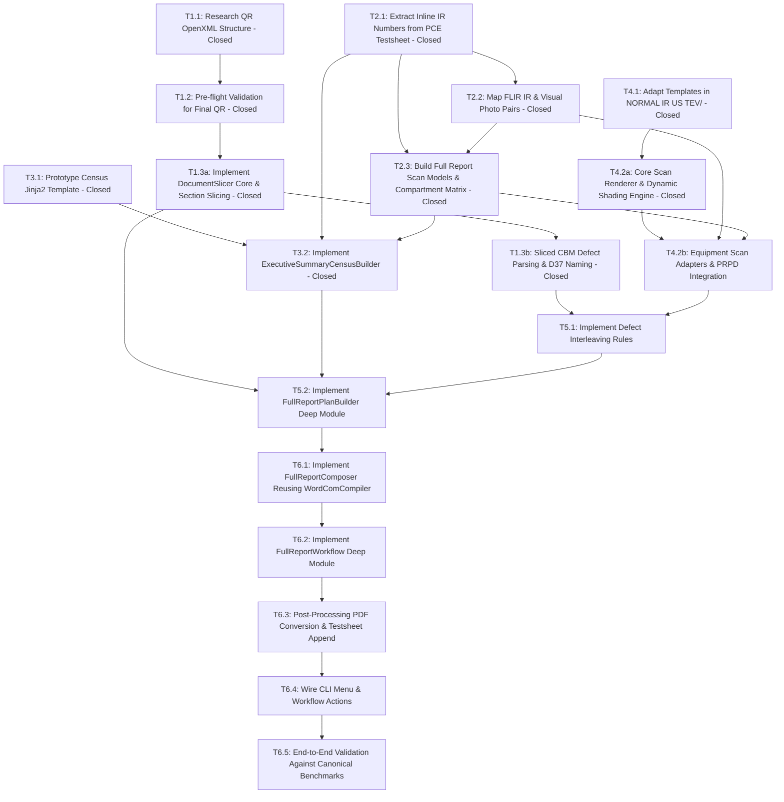

# Full Report Generation Workflow Map

This document is the local canonical Wayfinder map for charting and implementing the Full Report automated generator in `pahang-cli`. It tracks the destination, architecture decisions, high-level component flows, specification breakdown, frontier tickets, and active fog of war across multiple sessions before publishing to GitHub Issues.

---

## Destination

A complete `FullReportWorkflow` automated generator in `pahang-cli` catering to at least 90% of field substation topologies:
- **Switchgear**: 1 RMU SF6 (3 to 5 panels) or 1 VCB board.
- **Transformers**: Up to 2 distribution transformers (0 TX for SSU, 1 TX, or 2 TX).
- **LV Distribution**: Up to 2 LVDBs or Feeder Pillars (2 to 10 active feeder ways).
- **Auxiliary**: 0 or 1 Battery Bank.
- **Workflow Pipeline**: Ingests final analyzed Quick Report `.docx` (reusing cover/front page with signboard photo, condition photo pairs, visual defect pages, sticker page, and analyzed CBM defect detail pages); parses `PCE Testsheet` for healthy IR image numbering and panel operating parameters; pairs visual photos from IR photo numbers via FLIR visual pair pattern (`FLIRxxxx.jpg` thermal $\to$ `FLIRxxxx*-photo*.jpg` visual in `RAW DATA/IR/`); renders Executive Summary Census and healthy component scanning pages using dedicated `templates/FULL REPORT/NORMAL IR US TEV/` templates; dynamic inline defect interleaving; compiles final `.docx` and `.pdf` deliverables into `FULL REPORT/<STATION>/<MONTH>/<DATE>/`.

---

## Notes & Design Principles

- **GitHub-Driven Issue & PR Tracking**: Implementation flow is recorded canonically through GitHub Issues and PRs (under Map Issue #19) via `gh` CLI per `AGENTS.md`. Local files (`map.md`, `github-map-body.md`, and `tickets/`) are maintained in lockstep synchronization with GitHub.
- **Quick Report Ingestion (DRY / No Re-work)**: Quick Report is generated first and finalized by the inspector (adding thermal and visual images, defect callouts, condition photos). Full Report ingests those finalized sections directly from the completed Quick Report `.docx` rather than regenerating them empty or requiring duplicate manual work.
- **Front Page Reuse**: The front page (including metadata and PE signboard photo) is lifted directly from the finalized Quick Report, eliminating the need for a separate full report front page template. Title transformation (`QUICK` $\to$ `FULL`) is executed via native Word COM Find & Replace during slicing.
- **Compiler Reuse As-Is**: `FullReportComposer` directly reuses `WordComDocumentCompiler` without any custom margin code or section breaks, matching proven Quick Report compilation behavior, benchmark single-section layout parity, and zero `LinkToPrevious` corruption risks.
- **Dedicated Full Report Normal Templates**: Component scanning pages use dedicated Jinja2 templates in `templates/FULL REPORT/NORMAL IR US TEV/` (`swg-overview.docx`, `swg-panel.docx`, `tx-overview.docx`, `tx-hv-sides.docx`, `tx-lv-sides.docx`, `fp-overview.docx`, `battery-overview.docx`). These templates are housed separately under `FULL REPORT` to decouple healthy scanning pages and allow independent styling/layout evolution without risking regressions to Quick Report.
- **Dynamic Post-Generation Shading**: Cell coloring occurs dynamically in code post-generation:
  - Technology severity cells (`{{ ir.severity }}`, `{{ us.severity }}`, `{{ tev.severity }}`) are dynamically shaded Green (`00B050`) when healthy, or Red (`EE0000`) when an active defect exists in that technology.
  - Analysis & Recommendation banners are dynamically shaded Green (`00B050`) for `"Analysis: No Anomaly. | Recommendation: -"`, and Red (`EE0000`) for `"Analysis: Please refer to the following page for details defect."`.
- **Visual Photo Pairing (FLIR Camera Pattern)**: The project camera configuration is set to FLIR camera mode (`ir_mode: "single"`, `ir_prefix: "FLIR"`). For any thermal image `FLIRxxxx.jpg`, the visual photo is paired by discovering `FLIRxxxx*-photo*.jpg` (e.g. `FLIR0290- photo.jpg`) within the same `RAW DATA/IR/` directory. If the visual photo file is missing, the placeholder safely renders as `""`.
- **Resilient US+TEV Waveform Generation**: Healthy switchgear panels auto-render PRPD scatter graphs via `src/quick_report/prpd.py` if the survey folder exists in `RAW DATA/US+TEV/`. If missing, graph placeholders render as `""` while numeric reading tables from `PCE Testsheet` are still rendered.
- **Single Dedicated Feature Branch**: All 18 implementation tickets, specifications, and code changes across SPEC 1 through SPEC 6 must be implemented sequentially on a **single unified feature branch** (e.g. `feature/full-report`). Do not create separate per-ticket branches. A single linear branch preserves shared compiler, parser, and model context, prevents integration drift, eliminates merge conflicts across tightly coupled modules (`models.py`, `plan_builder.py`, `composer.py`), and ensures incremental test suites pass continuously.
- **Canonical Benchmark Deliverable Trio**: Concrete development, regression validation, and visual quality auditing are pinned to 3 real substations:
  - **TALAPIA** (PE 5, `CRAU/PCE/J00251`, 04-Aug-2026, Raub W32, IR+VI): RMU 4-panel, TX, 10-way FP, thermal hotspot on FP F2 fuse, 68 raw IR files.
  - **CENDERAWASIH NO.1** (PE 179, `CKTN/PCE/J00030`, 28-Aug-2026, Kuantan W35, IR+VI): RMU 4-panel, TX, FP, thermal hotspot inside RMU TX fuse compartment.
  - **TELEKOM TANAH PUTIH** (PE 144, `CKTN/PCE/J00040`, 24-Aug-2026, Kuantan W35, TEV+VI): RMU 4-panel, TX, LVDB, severe TEV partial discharge across all 4 panels with PRPD waveforms.

---

## High-Level Component Flow

```
[Finalized Quick Report .docx] ───────┐
 (Front Page / Signboard,            │
  Condition Grid, VI Defect Grid,    │
  Stickers, Analyzed Defect Pages)   │
                                     ├───> [FullReportPlanBuilder] ───> [FullReportComposer] ───> [Full Report .docx]
[PCE Testsheet.xlsx & PCE VI.xlsx] ──┤      (Census, Component Plans,    (Modular Part Rendering,
 (Equipment Specs, Healthy IR Photos,│       Defect Interleaving)         Word COM Compilation)
  Load/Heater/Status/US/TEV)         │                                                                  │
                                     │                                                                  ▼
[RAW DATA/ (IR, DC, US+TEV)] ────────┘                                                        [PostProcessing COM PDF]
                                                                                                        │
                                                                                                        ▼
                                                                                             [Merged Full Report .pdf]
```

---

## Decisions So Far

- [x] **D01 - Map Tracking Strategy & GitHub Issue Synchronization**: Transition from local-only brainstorming to canonical GitHub issue and PR tracking. All tickets across SPEC 1 through SPEC 6 are published and tracked on GitHub Issues under Map Issue #19, with the full report feature implementation flow recorded through GitHub issues/PRs while keeping local documentation in lockstep.
- [x] **D02 - 90% Target Boundary**: Scope covers 1 RMU/VCB (3-5 panels), up to 2 TX, up to 2 LVDB/FP, 1 Battery Bank.
- [x] **D03 - Modular Part Stitching**: Assemble deliverables via modular OpenXML parts using `WordComDocumentCompiler` and `BatchComSession`.
- [x] **D04 - Quick Report Ingestion Seam**: Lift completed assets and pages (Front page with signboard photo, condition grid, VI defect grid, sticker page, analyzed defect pages) directly from the finalized Quick Report `.docx`.
- [x] **D05 - Testsheet IR Image Coordinates & Integer Extraction**: IR photo numbers for healthy equipment exist inline in `PCE Testsheet.xlsx`: Switchgear panels (Rows 10, 14, 18, 22 / Column O), Switchgear Overview (Row 26 / Column O), Switchgear Overview Secondary (Row 28 / Column O with Row 28 / Column J specifying `"TOP PANEL"` vs `"BOTTOM"`), Transformers (Rows 33–37 / Column J), Feeder Pillar / LVDB (Rows 49, 53 / Column S), Battery Bank (Row 59 / Column H). All photo numbers are strictly extracted as typed integers (`int` or `tuple[int, ...]`) before being transformed into file paths.
- [x] **D06 - FLIR Visual Photo Pairing**: Visual photo is resolved via the FLIR camera pattern (`FLIRxxxx.jpg` $\to$ `FLIRxxxx*-photo*.jpg`) in `RAW DATA/IR/`. If missing, placeholder renders as `""`.
- [x] **D07 - Operator Sequence**: Operator generates and finalizes Quick Report first $\to$ saves in `QUICK REPORT/` $\to$ runs Full Report. Full Report validates Quick Report presence upfront.
- [x] **D08 - US+TEV Waveform Generation & Clean Fallback Policy**: Normal ultrasound acoustic plots and TEV PRPD graphs for every equipment (SWG panels and TX HV sides) must always be generated and presented whenever raw data files are available in `RAW DATA/US+TEV/`, regardless of whether the component is normal or defective (reusing logic from `prpd.py`). If a component has no raw PRPD data file on disk in `RAW DATA/US+TEV/`, it falls back cleanly to empty string `""` for the graph slot, presenting a clean blank chart quadrant while maintaining the testsheet numeric readings and Green `00B050` severity cell.
- [x] **D09 - Quick Report Document Slicing**: Slicing service extracts finished sections from finalized Quick Report into intermediate `temp_parts/` docx files for `WordComDocumentCompiler`.
- [x] **D10 - Dedicated Full Report Normal Scanning Templates**: Sourcing modular healthy component scanning templates from `templates/FULL REPORT/NORMAL IR US TEV/` (cloned from Quick Report CBM templates to establish an independent template hierarchy for Full Report, enabling future styling divergence without Quick Report regression).
- [x] **D11 - Dynamic Shading via Render Engine**: Templates in `templates/FULL REPORT/NORMAL IR US TEV/` remain pristine; cell coloring and banner shading are applied dynamically at render time by `cbm_render.py` / `FullReportScanPageRenderer`.
- [x] **D12 - Canonical Benchmark Deliverable Trio**: Formalize 3 manually authored Full Report deliverables and their corresponding finalized Quick Reports as the ground-truth benchmarks: TALAPIA (PE 5, CRAU/PCE/J00251, 04-Aug-2026, IR+VI), CENDERAWASIH NO.1 (PE 179, CKTN/PCE/J00030, 28-Aug-2026, IR+VI), and TELEKOM TANAH PUTIH (PE 144, CKTN/PCE/J00040, 24-Aug-2026, TEV+VI).
- [x] **D13 - Word COM Slicing Engine**: Adopt Word COM Automation (`WordComDocumentSlicer`) via an abstract `DocumentSlicer(Protocol)` seam with `FakeDocumentSlicer` for fast CI testing, ensuring 100% preservation of DrawingML shapes (inspector red callout boxes/arrows) and FLIR Tools+ ActiveX controls per ADR 0002.
- [x] **D14 - Slicing Output Directory & Lifecycle**: Store sliced intermediate `.docx` parts in a workspace temporary folder (`.temp/temp_parts/<STATION>/`), automatically cleaned up after successful compilation, with a `--keep-temp` debug flag.
- [x] **D15 - Slicing Granularity & Output Contract**: `QuickReportIngestionService` extracts: `front_page.docx` (1 page), `vi_summary.docx` (1 page, if visual defects exist), `cbm_defects/` (individual `.docx` per CBM defect page to enable inline interleaving in SPEC 5), `condition_pages.docx` (single multi-page `.docx` containing all Substation Condition pages), `vi_defect_pages.docx` (single multi-page `.docx` containing all Visual Defect pages), and `sticker_page.docx` (1 page).
- [x] **D16 - Section Boundary Detection via Word COM Find**: Boundaries are identified cleanly without conditional fragility:
  1. `front_page`: Page 1 (strictly 1 page).
  2. `vi_summary`: Exact paragraph `"VISUAL DEFECT SUMMARY"` between Page 2 and `"SUBSTATION CONDITION"`.
  3. `cond_start`: Paragraph `"SUBSTATION CONDITION"`.
  4. `cbm_defects`: Individual pages between summary tables and `cond_start`.
  5. `sticker_start`: Found unconditionally across the document via the unique paragraph `"NORMAL/DEFECT STICKER"`. `sticker_page` spans `sticker_start` to document end (1 page).
  6. Substation Condition & Visual Defect pages boundary:
     - If visual defects exist: Paragraph `"VISUAL DEFECT"` exists strictly between `cond_start` and `sticker_start` (`vi_start`). `condition_pages` spans from `cond_start` to `vi_start - 1`, and `vi_defect_pages` spans from `vi_start` to `sticker_start - 1`.
     - If zero visual defects exist: `vi_defect_pages` is omitted, and `condition_pages` spans cleanly from `cond_start` to `sticker_start - 1`.
- [x] **D17 - Pre-Flight Finalized Quick Report Integrity Validation**: Multi-tier check validating: 1) File existence in `QUICK REPORT/<STATION>/<MONTH>/<DATE>/`, 2) File size floor >= 1.0 MB (instantly isolating raw unpopulated templates), and 3) Media count floor >= 8 in `word/media/` ensuring inspector photos are populated.
- [x] **D18 - Testsheet IR Photo Coordinates & Integer Parsing**: `TestsheetExtractor` parses inline IR photo numbers (SWG Col O, TX Col J, FP Col S, Battery Col H) into typed integers (`int`) using the existing `_parse_int_safe` helper. If a comma-delimited list exists (e.g. `"9,10"`), integers are parsed via standard `re.findall(r"\d+", str(val))`. Components with a single photo slot use the primary integer while preserving all indices for multi-photo component plans.
- [x] **D19 - FLIR Visual Photo Pairing Governed by Project Settings**: Photo pairing convention (`FLIRxxxx.jpg` $\to$ `FLIRxxxx*-photo*.jpg` in `RAW DATA/IR/`) is governed by active project camera configuration (`ir_mode: "single"`, `ir_prefix: "FLIR"`, `photo_filter`). Future camera variations and diverse photo pairing naming conventions will be managed through this project setting seam. If a paired visual photo is absent on disk, log a non-fatal warning and safely render the placeholder as empty string `""` without crashing.
- [x] **D20 - Thermal Readings Handled by FLIR Plugin (No Testsheet Thermal Extraction Required)**: Component thermal readings (Tmin, Tmax, $\Delta T$, Avg) do not need extraction from testsheet for switchgear panels; the FLIR ActiveX plugin automatically manages thermal readings directly from the embedded IR image in Word. `SwitchgearSpec`, `SwitchgearPanelSpec`, `TransformerSpec`, `LVDBSpec`, and `BatteryBankSpec` store typed photo number tuples `photo_numbers: tuple[int, ...] = ()`.
- [x] **D21 - Major Equipment Group Numbering & Vertical Merge (Option C)**: Col 0 (`NO.`) carries integer group numbering (`1.`, `2.`, `3.`) and is vertically merged via OpenXML `<w:vMerge>` across all sub-rows belonging to that equipment group (Switchgear, TX1, TX2, FP/LVDB, Battery). Merging and group numbering are applied post-render to match Word's native list display.
- [x] **D22 - Feeder Pillar / LVDB Defect-Only Granularity**: 1 `OVERVIEW` row always. Individual feeder rows are appended only for feeder ways with active defects.
- [x] **D23 - Defect Measurement Formatting Reuse**: Table 3 defect readings reuse `format_temperature_reading` (`{val:.1f} °C`) and `format_db_reading` (`{val}dB`) from `src/quick_report/cbm_summary.py`. Inactive/healthy technologies show `"-"`.
- [x] **D24 - Severity-Only Cell Shading**: Only the `SEVERITY` cell is shaded (`00B050` Green for Normal, `EE0000` Red for Defect, text cleared). Overview rows have text `"-"` and unshaded background. Measurement cells (`IR`, `U/S`, `TEV`) remain unshaded with black text.
- [x] **D25 - Unified Summary Template Schema & Placeholders**: `templates/FULL REPORT/executive_summary_census.docx` inherits directly from Quick Report's `CBM DEFECT IR+US+TEV SUMMARY.docx` schema with unified keys (`no`, `equipment`, `defect_area`, `ir_abs`, `us_dB`, `tev_dB`, `severity`), binding Col 0 to `{{ item.no }}` and Col 6 to `{{ item.severity }}`.
- [x] **D26 - Switchgear Compartment Matrix & Overview Decoupling**: Switchgear scanning is cleanly decoupled between Board Overview scanning and Panel scanning:
  1. Board Overview scanning (via `swg-overview.docx` and `resolve_overview_compartments()`): TAMCO/LUCY boards generate 2 overview pages (`OVERVIEW` and `OVERVIEW BOTTOM`); INDKOM, VCB, and other RMUs generate 1 overview page (`OVERVIEW`).
  2. Panel scanning (via `swg-panel.docx` and `resolve_switchgear_compartments()`): TAMCO/LUCY panels strictly generate 2 scanning pages (`CABLE COMPARTMENT` and `CABLE ENTRY`) without conflating overview pages. INDKOM panels generate 1 scanning page (`FUSE COMPARTMENT` for TX feeder bays, `CABLE COMPARTMENT` for incoming/bus bays). Other RMUs generate 1 scanning page (`CABLE COMPARTMENT`). VCB panels generate 1 scanning page for each active compartment across standard 7 compartments.
- [x] **D27 - Unconditional Transformer HV CABLE SPLIT Generation (ADR 0004)**: Full Report unconditionally generates an `HV CABLE SPLIT` row and scanning page for each active transformer via `has_hv_cable_split(...) -> True` per ADR 0004 choice by design. If a secondary split photo is absent on disk, it falls back cleanly to empty string `""` without crashing.
- [x] **D28 - Inventory-to-Defect Cross-Referencing Engine**: `ExecutiveSummaryCensusBuilder` iterates `SubstationEquipmentPackage` physical inventory, matching against Quick Report `CbmDefectRecord`s to set defect readings and red/green severity tokens.
- [x] **D29 - Manufacturer-Driven Switchgear Scanning Page Counts**: If manufacturer is `TAMCO`, `SSE LUCY`, or `LUCY`: Generate 2 scanning pages per panel (`CABLE COMPARTMENT` and `CABLE ENTRY` using `swg-panel.docx`). If `INDKOM` or other RMUs: Generate 1 scanning page per panel (`CABLE COMPARTMENT` for incomers/bus; `FUSE COMPARTMENT` for TX feeder on INDKOM). For `VCB`: Generate 1 scanning page for each active compartment per panel.
- [x] **D30 - Overview Page Downstream Defect Forwarding**: For SWG, TX, FP/LVDB, Battery: If all subordinate components are 100% healthy, Overview banner is shaded Green `00B050` (`Analysis: No Anomaly. | Recommendation: -`). If ANY subordinate component has an active defect, Overview banner displays Red forwarding text (`Analysis: Please refer to the following page for details defect. | Recommendation: Please refer to the following page for details defect.`).
- [x] **D31 - Transformer 7-Point Scanning Template Mapping**: Each TX generates 7 pages: 1) `tx-overview.docx` (`OVERVIEW`), 2) `tx-overview.docx` (`OVERVIEW TOP`), 3) `tx-hv-sides.docx` (`HV BUSHING`), 4) `tx-hv-sides.docx` (`HV CABLE`), 5) `tx-hv-sides.docx` (`HV CABLE SPLIT`), 6) `tx-lv-sides.docx` (`LV BUSHING`), 7) `tx-lv-sides.docx` (`LV CABLE`).
- [x] **D32 - Scanning Page Dynamic Shading Scope**: `{{ ir.severity }}`, `{{ us.severity }}`, `{{ tev.severity }}` cells have text cleared `""` and are dynamically shaded Green `00B050` (healthy) or Red `EE0000` (defective). Bottom Analysis & Recommendation banner cell is dynamically shaded Green `00B050` for `No Anomaly.`, or Red `EE0000` for defect forwarding/analysis prose.
- [x] **D33 - Dedicated Scanning Renderer Architecture**: Implement `FullReportScanPageRenderer` in `src/full_report/scan_render.py`, resolving templates exclusively from `templates/FULL REPORT/NORMAL IR US TEV/`, and reusing OpenXML utilities (`set_cell_shading`, `clear_cell_text`, `_build_jinja_env`) from `src/quick_report/`.
- [x] **D34 - Switchgear Panel Defect Polymorphic Interleaving**: Standard IR defects directly replace the panel's scan page (`swg-panel.docx`, per Cenderawasih). High TEV / PRPD defects render a panel scan page with Red forwarding banner followed immediately by the inline TEV detail page (per Telekom Tanah Putih).
- [x] **D35 - Transformer Component-Level Inline Interleaving**: Defect detail pages are inserted immediately behind that specific component's scan page (e.g. behind `LV BUSHING` scan page, per Bukit Setongkol Mewah). The parent component scan page displays the Red forwarding banner.
- [x] **D36 - Feeder Pillar Overview Block Interleaving**: Feeder Pillar / LVDB defect detail pages sequence immediately after `fp-overview.docx` in left-to-right channel order (`IN1..IN3`, `OT1..OT10`, per Talapia).
- [x] **D37 - Fine-Tuned Sliced Defect Grammar & Dual-Layer Matching**: Slicer outputs `{eq_instance}_{seq}_{id}_{area}_{idx}.docx` encoding left-to-right physical panel sequence and equipment lineup (e.g. `swg1_p04_CKN01309_FUSE_COMPARTMENT_01.docx`). Interleaver pairs this with OpenXML Table 1 inspection for bulletproof validation.
- [x] **D38 - Orphan Defect Safe Append**: Sliced defect pages that cannot be matched to physical equipment nodes are safely appended at the end of the equipment scanning pages (before Substation Condition) with a prominent warning, preserving zero inspector work loss.
- [x] **D39 - Assembly Order & Visual Defect Summary**: Full Report follows the canonical 8-part sequence (`Front Page` -> `Executive Summary Census` -> `Visual Defect Summary` (if present) -> `Component Scanning Stream` (with interleaved CBM defects) -> `Substation Condition` -> `Visual Defect Pages` -> `Sticker Page` -> `Testsheet Append` (PDF stage)). `QuickReportIngestionService` slices `vi_summary.docx` from the finalized Quick Report if present; if the substation has zero visual defects, Part 3 is cleanly omitted.
- [x] **D40 - Word COM Page Break Mechanics & Direct Compiler Reuse**: Assemble parts via `WordComDocumentCompiler` using pure hard page breaks (`wdPageBreak = 7`) without Word headers/footers or page numbers, matching canonical benchmark deliverables. `WordComDocumentCompiler` is reused directly as-is without any custom margin code or section breaks, guaranteeing exact parity with Quick Report.
- [x] **D41 - Pre-Flight Quick Report Fail-Fast**: `FullReportWorkflow.inspect()` and `generate()` enforce strict fail-fast validation against the finalized Quick Report in `QUICK REPORT/.../<STEM>.docx` (file existence, file size >= 1.0 MB, media count >= 8). Unready substations are blocked with `ready_to_generate = False` and clear error diagnostics before any Word COM process is spawned.
- [x] **D42 - Two-Stage Decoupled Workflow Architecture**: Stage 1 (`FullReportWorkflow`) strictly generates `FULL REPORT/.../<STEM>.docx` so diagnostic engineers can perform quantitative FLIR Tools+ thermal image adjustments and callouts. Stage 2 (`FullReportPostProcessingWorkflow`) converts the finalized Full Report `.docx` to `.pdf` and merges it with the testsheet PDF.
- [x] **D43 - Testsheet PDF Reuse & Strict Fail-Fast**: Full Report post-processing directly reuses the pre-existing testsheet PDF generated during Quick Report post-processing (`TESTSHEET/<DATE>/processed_testsheet/pdf/<stem>.pdf`). If missing, it fails fast with a clear error prompt to complete Quick Report post-processing first, preventing un-signed or non-diagonalized raw files from entering client deliverables.
- [x] **D44 - CLI Menu Integration & Sequencing**: Two dedicated actions positioned at the bottom of the CLI menu in `cli_menu.py`: 1) `"Generate Full Reports"` (orchestrating Stage 1 `FullReportWorkflow`), and 2) `"Post-Process Full Reports (PDF + Testsheet Merge)"` (orchestrating Stage 2 `FullReportPostProcessingWorkflow`). Both feature upfront dry-run telemetry, interactive substation selection with all ready stations pre-checked, and execution summary tables.
- [x] **D45 - Uniform Virtual Printer Conversion**: Full Report Word-to-PDF conversion uses `BatchComSession` configured with `configure_uniform_printer(word)` (Adobe PDF / Microsoft Print to PDF) and Word COM `ExportAsFixedFormat(0, ...)` to preserve exact A4 formatting.
- [x] **D46 - Native Word COM Front Page Title Transformation**: Sliced `front_page.docx` is loaded in Word COM during slicing; native Word COM Find & Replace (`part_doc.Content.Find.Execute(FindText="QUICK SCANNING REPORT", ReplaceWith="FULL SCANNING REPORT", Replace=2)`) transforms the title while natively preserving run boundaries, 24pt bold typography, colors, and layout anchors without OpenXML fragmentation issues.
- [x] **D47 - Defective Equipment Overview Page Ingestion Policy**: When an equipment group (e.g. Switchgear or Feeder Pillar) has an active defect in Quick Report, its finalized Overview page(s) (`swg-overview.docx` / `fp-overview.docx`) are sliced directly from Quick Report as part of `cbm_defects/`, preserving the inspector's overview photo and Red forwarding banner. Healthy overview templates are only rendered when the equipment group is 100% healthy.
- [x] **D48 - Transformer Overview Top Resolution Fallback**: In the absence of a standardized testsheet coordinate for TX Overview Top, `resolve_tx_overview_top_photo` returns `None` / `""`, safely rendering a clean blank quadrant in `tx-overview.docx`.
- [x] **D49 - Battery Bank Ingestion Condition**: Battery Bank scanning page (`battery-overview.docx`) and Executive Summary row are included if and only if `len(equipment.battery_banks) > 0`, strictly reusing the authoritative extraction logic in `TestsheetExtractor._extract_battery_banks()` without bespoke row checks.
- [x] **D50 - FullReportPlanBuilder Deterministic Part BOM**: Slicing, rendering, and interleaving are unified under `FullReportPlanBuilder` deep module, which computes the complete, ordered Bill of Materials (`FullReportStationPlan`) upfront before Word COM compilation, preventing post-hoc disk file churn and eliminating race conditions.

---

## Dependency Graph (18 Fine-Grained Tickets)



---

## Specifications Overview & Child Tickets

All child tickets are tracked as sub-issues of this map on GitHub (Map Issue #19), each declaring its blocking edges and assigned the triage label `ready-for-agent`.

- **SPEC 1: Pre-Flight Integrity & Quick Report Ingestion**
  - Child ticket: `T1.1: Research QR OpenXML Structure & Part Boundaries` (Closed, #20)
  - Child ticket: `T1.2: Pre-Flight Integrity Validation for Finalized Quick Report` (Closed, #21)
  - Child ticket: `T1.3a: Implement DocumentSlicer Core, Slicing Protocol & Section Boundary Extraction` (Closed, #22)
  - Child ticket: `T1.3b: Sliced CBM Defect Header Parsing & D37 Naming` (Closed, #23)
- **SPEC 2: Testsheet Extraction, Photo Pairing & Scan Specifications**
  - Child ticket: `T2.1: Extract Inline IR Numbers from PCE Testsheet` (Closed, #24)
  - Child ticket: `T2.2: Map FLIR IR & Visual Photo Pairs` (Closed, #25)
  - Child ticket: `T2.3: Build Full Report Scan Models & Switchgear Compartment Matrix` (Closed, #26)
- **SPEC 3: Executive Summary Equipment Census Engine**
  - Child ticket: `T3.1: Prototype Census Jinja2 Template` (Closed, #27)
  - Child ticket: `T3.2: Implement ExecutiveSummaryCensusBuilder with Group Vertical Merge` (Closed, #28)
- **SPEC 4: Component Scanning Page Rendering & Dynamic Shading**
  - Child ticket: `T4.1: Adapt Component Scanning Templates in NORMAL IR US TEV/` (Closed, #29)
  - Child ticket: `T4.2a: Implement Core Scan Page Renderer & Dynamic Shading Engine` (Closed, #30)
  - Child ticket: `T4.2b: Implement Equipment Scan Adapters & PRPD Waveform Integration` (#31)
- **SPEC 5: Defect Interleaving & Deterministic Plan Building**
  - Child ticket: `T5.1: Implement Defect Interleaving Rules` (#32)
  - Child ticket: `T5.2: Implement FullReportPlanBuilder Deep Module` (#33)
- **SPEC 6: Workflow Orchestration, Post-Processing & CLI Integration**
  - Child ticket: `T6.1: Implement FullReportComposer Reusing WordComCompiler` (#34)
  - Child ticket: `T6.2: Implement FullReportWorkflow Deep Module` (#35)
  - Child ticket: `T6.3: Post-Processing PDF Conversion & Testsheet Append` (#36)
  - Child ticket: `T6.4: Wire CLI Menu & Workflow Actions` (#37)
  - Child ticket: `T6.5: End-to-End Auditing & Validation against Canonical Benchmarks` (#38)

---

## Specifications & Tickets Breakdown

Each specification follows the `/to-spec` standard, and each associated ticket follows the `/to-tickets` standard with complete acceptance criteria and dependency boundaries.

> [!IMPORTANT]
> **Single Feature Branch Mandate**: All 18 implementation tickets across SPEC 1 through SPEC 6 are to be developed and landed sequentially on a **single unified feature branch** (e.g. `feature/full-report`). No separate per-ticket branches are to be created, ensuring unbroken compiler context, incremental passing test suites, and zero merge drift across interconnected modules.

---

### SPEC 1: Pre-Flight Integrity & Quick Report Ingestion

#### Problem Statement
Operators currently spend hours re-entering substation signboard metadata, re-cropping visual inspection photo pairs, re-drawing callout shapes, and re-pasting condition grids when authoring the contractual Full Scanning Report. Since these sections are already finalized inside the completed Quick Report `.docx`, regenerating them from scratch causes massive duplication of effort, human error, and inconsistent formatting. Furthermore, attempting to process empty, non-finalized, or corrupted Quick Reports through Word COM locks background processes and corrupts output documents.

#### Solution
Provide an automated ingestion and pre-flight validation pipeline that:
1. Validates the existence, size floor (>= 1.0 MB), and media count floor (>= 8 images in `word/media/`) of the finalized Quick Report `.docx` before executing any heavyweight automation.
2. Implements a robust Word COM slicing service backed by a testable protocol (`DocumentSlicer`) that slices finalized sections (`front_page.docx`, `vi_summary.docx`, `cbm_defects/`, `condition_pages.docx`, `vi_defect_pages.docx`, `sticker_page.docx`) into an isolated temporary folder.
3. Performs native Word COM Find & Replace on the sliced front page to transform `"QUICK SCANNING REPORT"` into `"FULL SCANNING REPORT"` while natively preserving 24pt bold typography and layout anchors.
4. Extracts Table 1 defect headers from CBM defect pages to generate fine-grained left-to-right physical naming tokens per D37 (`{eq_instance}_{seq}_{id}_{area}_{idx}.docx`).

#### User Stories
1. As an operator running Full Report generation, I want the CLI to fail fast if my Quick Report is missing, incomplete, or un-finalized, so that I don't waste time running Word COM against empty templates.
2. As an operator, I want the finalized front page with the substation signboard photo and metadata copied directly from my Quick Report, so that I don't have to manually re-insert photos or re-type substation names.
3. As a diagnostic engineer, I want the cover title automatically transformed to `"FULL SCANNING REPORT"` while retaining exact styling, so that the document is immediately ready for client delivery.
4. As an automated compilation pipeline, I want CBM defect pages sliced into individual documents with standardized equipment and panel naming tokens, so that they can be accurately interleaved behind their respective equipment scan pages.
5. As a developer running unit tests, I want a `FakeDocumentSlicer` that runs headlessly in CI without Microsoft Office installed, so that ingestion logic can be tested in sub-seconds.

#### Implementation Decisions
- Implement `validate_finalized_quick_report` as a pure-Python fail-fast guard checking `.docx` zip package integrity, file size (>= 1.0 MB), and `word/media/` image count (>= 8) (D17, D41).
- Define `DocumentSlicer(Protocol)` with methods `slice_sections(source_path, target_dir)` and `slice_cbm_defects(source_path, target_dir)`.
- Implement `WordComDocumentSlicer` using Microsoft Word COM Automation to preserve DrawingML callout shapes and FLIR ActiveX controls (ADR 0002, D13).
- Implement `FakeDocumentSlicer` writing minimal mock bytes for headless CI testing (ADR 0003).
- Use Word COM `Find.Execute` directly during slicing for front page title replacement (D46).
- Implement `CbmDefectHeaderParser` to read Table 1 from sliced defect pages and emit `CbmDefectSliceMetadata` (D37).
- Store sliced parts in `.temp/temp_parts/<STATION>/` with automatic cleanup upon completion and a `--keep-temp` flag (D14).

#### Testing Decisions
- Test pre-flight validator against valid docx fixtures, truncated files (< 1.0 MB), missing files, and unpopulated templates (< 8 media files).
- Test `CbmDefectHeaderParser` against openpyxl/python-docx mocks of Table 1 across Switchgear, Transformer, and Feeder Pillar defect pages.
- Test `WordComDocumentSlicer` section boundary discovery logic with mocked COM ranges.

#### Out of Scope
- Regenerating front page or signboard photos from raw files (strictly ingested from Quick Report).
- Modifying defect callouts or visual inspection text inside Quick Report parts during slicing.

---

#### Tickets for SPEC 1

##### T1.1: Research QR OpenXML Structure & Part Boundaries
- **Labels**: `wayfinder:research`, `ready-for-agent`
- **GitHub Issue**: [#20](https://github.com/adamlarGit/pahang-cli/issues/20)
- **Parent**: [Full Report Generation Workflow Map](map.md)
- **Status**: Closed (Decisions D13, D14, D15, D16 locked)
- **What to build**: Comprehensive empirical analysis of OpenXML part boundaries across completed Quick Reports for the 3 benchmark stations.
- **Blocked by**: None (can start immediately)
- **Acceptance criteria**:
  - [x] Identified Word COM search tokens for all 6 section boundaries (`front_page`, `vi_summary`, `cond_start`, `cbm_defects`, `vi_start`, `sticker_start`).
  - [x] Verified DrawingML shape retention requirements under COM vs pure Python slicing.

##### T1.2: Pre-Flight Integrity Validation for Finalized Quick Report
- **Labels**: `wayfinder:task`, `ready-for-agent`
- **GitHub Issue**: [#21](https://github.com/adamlarGit/pahang-cli/issues/21)
- **Parent**: [Full Report Generation Workflow Map](map.md)
- **Status**: Closed
- **What to build**: A fast, pure-Python pre-flight validator that checks whether the finalized Quick Report `.docx` exists, exceeds the 1.0 MB size floor, and contains at least 8 media files before allowing Full Report generation to proceed.
- **Blocked by**: T1.1
- **Acceptance criteria**:
  - [x] Validates presence of `QUICK REPORT/<STATION>/<MONTH>/<DATE>/<STEM>.docx`.
  - [x] Enforces file size floor >= 1.0 MB, rejecting empty/unpopulated templates.
  - [x] Enforces `word/media/` count >= 8 images via standard `zipfile.ZipFile` inspection.
  - [x] Returns structured `PreFlightValidationResult` with clear error diagnostics if unready.
  - [x] Comprehensive unit tests with valid, undersized, and missing mock docx archives.

##### T1.3a: Implement DocumentSlicer Core, Slicing Protocol & Section Boundary Extraction
- **Labels**: `wayfinder:task`, `ready-for-agent`
- **GitHub Issue**: [#22](https://github.com/adamlarGit/pahang-cli/issues/22)
- **Parent**: [Full Report Generation Workflow Map](map.md)
- **Status**: Closed
- **What to build**: The core `DocumentSlicer(Protocol)`, headless `FakeDocumentSlicer`, and production `WordComDocumentSlicer` that opens the finalized Quick Report in Microsoft Word, slices out static sections (`front_page.docx`, `vi_summary.docx`, `condition_pages.docx`, `vi_defect_pages.docx`, `sticker_page.docx`) into `.temp/temp_parts/<STATION>/`, and applies native Word COM Find & Replace on the front page to transform the title to `"FULL SCANNING REPORT"`.
- **Blocked by**: T1.2
- **Acceptance criteria**:
  - [x] `DocumentSlicer(Protocol)` defined with `FakeDocumentSlicer` for headless unit testing.
  - [x] `WordComDocumentSlicer` locates boundary paragraphs per D16 and slices parts cleanly.
  - [x] Front page title transformed via Word COM `Find.Execute(FindText="QUICK SCANNING REPORT", ReplaceWith="FULL SCANNING REPORT", Replace=2)` per D46.
  - [x] DrawingML shapes and FLIR ActiveX controls are preserved intact in sliced `.docx` parts.
  - [x] Temporary directory lifecycle managed with `--keep-temp` debug support.

##### T1.3b: Sliced CBM Defect Header Parsing & D37 Naming
- **Labels**: `wayfinder:task`, `ready-for-agent`
- **GitHub Issue**: [#23](https://github.com/adamlarGit/pahang-cli/issues/23)
- **Parent**: [Full Report Generation Workflow Map](map.md)
- **Status**: Closed
- **What to build**: An inspector that extracts individual CBM defect pages from Quick Report, parses Table 1 metadata (Equipment, ID, Defect Area, Severity), and saves them into `temp_parts/cbm_defects/` using the fine-tuned left-to-right naming grammar `{eq_instance}_{seq}_{id}_{area}_{idx}.docx` per D37.
- **Blocked by**: T1.3a
- **Acceptance criteria**:
  - [x] Parses Table 1 on each CBM defect page to extract equipment category, instance, ID, and defect area.
  - [x] Slices individual CBM defect pages into separate `.docx` files under `temp_parts/cbm_defects/`.
  - [x] Adheres strictly to D37 naming grammar (e.g. `swg1_p04_CKN01309_FUSE_COMPARTMENT_01.docx`).
  - [x] Unit tests verifying parsing against mock Switchgear, Transformer, and Feeder Pillar defect tables.

---

### SPEC 2: Testsheet Extraction, Photo Pairing & Scan Specifications

#### Problem Statement
To generate healthy component scanning pages, Full Report requires operating parameters (load current, anti-condensation heater current, breaker status, serial number, cable type, ultrasound readings, and TEV readings) and thermal image numbers. These values exist inside `PCE Testsheet.xlsx`, but existing extractors only pull defect-related data. Furthermore, thermal IR numbers must be matched against corresponding visual photos on disk using camera-specific naming conventions.

#### Solution
Extend the testsheet extraction and material resolution layer to:
1. Parse inline IR photo numbers as typed integers (`int` or `tuple[int, ...]`) across Switchgear, Transformer, Feeder Pillar, and Battery Bank rows in `PCE Testsheet.xlsx`.
2. Map integer IR photo numbers to physical image paths in `RAW DATA/IR/` and discover paired visual photos using FLIR camera patterns (`FLIRxxxx.jpg` $\to$ `FLIRxxxx*-photo*.jpg`).
3. Construct strongly-typed domain scanning models (`SwitchgearScanSpec`, `TransformerScanSpec`, `LVDBScanSpec`, `BatteryBankScanSpec`) capturing operating parameters and compartment matrices per D26.

#### User Stories
1. As an automated report generator, I want to extract healthy IR photo numbers from `PCE Testsheet.xlsx`, so that I can automatically bind thermal photos to healthy component scanning pages.
2. As an automated report generator, I want thermal photos automatically paired with their corresponding visual photos from `RAW DATA/IR/`, so that inspectors don't have to manually match hundreds of image files.
3. As a diagnostic engineer, I want component operating parameters (load, heater, status, cable type, US/TEV) populated directly from the testsheet into scanning page sidebars, ensuring 100% technical fidelity.
4. As an operator running a substation without visual photos or secondary cable split photos, I want the system to fall back safely to empty placeholders without crashing, so that batch generation continues uninterrupted.

#### Implementation Decisions
- Extend `SwitchgearPanelSpec`, `SwitchgearSpec`, `TransformerSpec`, `LVDBSpec`, and `BatteryBankSpec` in `src/testsheet/models.py` with `photo_numbers: tuple[int, ...] = ()` with default empty tuples to maintain 100% backward compatibility (D20).
- Update extraction methods in `src/testsheet/extractor.py` to extract IR numbers using `_parse_int_safe` and `re.findall(r"\d+", ...)` (D05, D18).
- Implement `RawPhotoResolver` in `src/full_report/photo_resolver.py` resolving IR files and paired visual photos (`FLIRxxxx*-photo*.jpg`) governed by project `CameraConfig`, falling back safely to `""` (D06, D19, D48).
- Implement Switchgear Compartment Matrix resolver in `src/full_report/models.py` supporting `INDKOM`, `TAMCO`, `LUCY`, and `VCB` configurations (D26, D29).

#### Testing Decisions
- Test `TestsheetExtractor` against real and mocked `PCE Testsheet.xlsx` workbooks for SWG (Col O), SWG Overview (R26/R28 Col O), TX (Col J), FP (Col S), and Battery (Col H).
- Test `RawPhotoResolver` against mocked directory listings simulating standard FLIR photos, space-separated visual pairs (`FLIR0290- photo.jpg`), and missing visual files.
- Test compartment matrix resolver asserting correct compartment lists for each manufacturer.

#### Out of Scope
- Extracting thermal readings ($T_{min}, T_{max}, \Delta T$) from testsheet for switchgear (managed automatically by FLIR Tools+ ActiveX plugin per D20).
- Extracting visual defect observations (ingested directly from Quick Report).

---

#### Tickets for SPEC 2

##### T2.1: Extract Inline IR Numbers from PCE Testsheet
- **Labels**: `wayfinder:task`, `ready-for-agent`
- **GitHub Issue**: [#24](https://github.com/adamlarGit/pahang-cli/issues/24)
- **Parent**: [Full Report Generation Workflow Map](map.md)
- **Status**: Closed
- **What to build**: Enhancement to `TestsheetExtractor` and `src/testsheet/models.py` to parse inline IR photo numbers as typed integers (`int` / `tuple[int, ...]`) from `PCE Testsheet.xlsx` (SWG panels Col O, SWG Overview R26 Col O, SWG Overview Secondary R28 Col O/J, TX Col J, FP Col S, Battery Col H).
- **Blocked by**: None (can start immediately)
- **Acceptance criteria**:
  - [x] `SwitchgearPanelSpec`, `SwitchgearSpec`, `TransformerSpec`, `LVDBSpec`, `BatteryBankSpec` extended with `photo_numbers: tuple[int, ...] = ()`.
  - [x] SWG panel IR numbers parsed from Column O (Rows 10, 14, 18, 22).
  - [x] SWG Overview IR numbers parsed from Row 26 Col O and Row 28 Col O/J.
  - [x] Transformer IR numbers parsed from Column J (Rows 33–37).
  - [x] Feeder Pillar IR numbers parsed from Column S (Rows 49, 53).
  - [x] Battery Bank IR numbers parsed from Row 59 Col H.
  - [x] Comma-separated strings (e.g. `"9,10"`) parsed cleanly via `re.findall`.
  - [x] Unit tests verifying parsing against mock workbooks without breaking existing tests.

##### T2.2: Map FLIR IR & Visual Photo Pairs
- **Labels**: `wayfinder:task`, `ready-for-agent`
- **GitHub Issue**: [#25](https://github.com/adamlarGit/pahang-cli/issues/25)
- **Parent**: [Full Report Generation Workflow Map](map.md)
- **Status**: Closed
- **What to build**: `RawPhotoResolver` module that takes integer IR photo numbers, locates the thermal image file in `RAW DATA/IR/` (`FLIRxxxx.jpg`), and pairs the corresponding visual inspection photo (`FLIRxxxx*-photo*.jpg`) governed by project `CameraConfig`.
- **Blocked by**: T2.1
- **Acceptance criteria**:
  - [x] Resolves integer photo number `290` to `RAW DATA/IR/FLIR0290.jpg`.
  - [x] Discovers paired visual photo matching `FLIR0290*-photo*.jpg` (e.g. `FLIR0290- photo.jpg`).
  - [x] Safely returns empty string `""` with a warning if the paired visual photo is missing on disk.
  - [x] Handles secondary cable split photo lookup with empty fallback per D27/D48.
  - [x] Unit tests verifying resolution across various file naming patterns.

##### T2.3: Build Full Report Scan Models & Compartment Matrix
- **Labels**: `wayfinder:task`, `ready-for-agent`
- **GitHub Issue**: [#26](https://github.com/adamlarGit/pahang-cli/issues/26)
- **Parent**: [Full Report Generation Workflow Map](map.md)
- **Status**: Closed
- **What to build**: Strongly-typed domain scan specifications (`SwitchgearScanSpec`, `TransformerScanSpec`, `LVDBScanSpec`, `BatteryBankScanSpec`) and compartment matrix logic in `src/full_report/models.py` capturing operating parameters and equipment scanning layouts.
- **Blocked by**: T2.1, T2.2
- **Acceptance criteria**:
  - [x] DTOs capture load current, heater current, breaker status, serial no, cable type, US, and TEV readings.
  - [x] Implements switchgear compartment matrix per D26 (`INDKOM`: TX feeder $\to$ `FUSE COMPARTMENT`, others $\to$ `CABLE COMPARTMENT`; `TAMCO`/`LUCY`: board overview decoupled to `OVERVIEW`/`OVERVIEW BOTTOM`, panel scan pages strictly `CABLE COMPARTMENT` + `CABLE ENTRY`; `VCB`: standard 7 compartments).
  - [x] Implements manufacturer-driven scanning page count rules per D29.
  - [x] Evaluates battery bank presence strictly via `len(equipment.battery_banks) > 0` per D49.
  - [x] Unit tests verifying matrix emission across all 4 switchgear categories.

---

### SPEC 3: Executive Summary Equipment Census Engine

#### Problem Statement
Contractual Full Reports require an Executive Summary (Table 2: Equipment Census) that catalogs every high-voltage and low-voltage asset in the substation across 7 columns (`NO. | EQUIPMENT | DEFECT AREA | IR | U/S | TEV | SEVERITY`). Currently, engineers manually construct this table in Word, hand-calculate vertical cell merges across equipment groups, format measurement units, and apply background color shading. This manual process is slow, prone to omitting components (such as the mandatory Transformer HV Cable Split), and introduces styling inconsistencies.

#### Solution
Provide an automated Executive Summary Census generation engine that:
1. Designs a modular Jinja2 template (`templates/FULL REPORT/executive_summary_census.docx`) using flat table rows with standard placeholders.
2. Implements `ExecutiveSummaryCensusBuilder` to traverse the substation equipment package, unconditionally provision 7-point TX rows per ADR 0004, and cross-reference active Quick Report defects.
3. Performs a post-render OpenXML DOM pass to vertically merge Column 0 (`NO.`) across equipment groups with integer numbering (`1.`, `2.`, `3.`) per D21.
4. Dynamically applies Green (`00B050`) or Red (`EE0000`) background shading to Severity cells per D24.

#### User Stories
1. As a client utility auditor, I want a complete census table listing every substation equipment component with its IR, US, and TEV status, so that I have a single-page overview of substation health.
2. As a diagnostic engineer, I want Column 0 vertically merged per major equipment group with clean sequential numbers, matching TNB contractual presentation standards.
3. As an operator, I want Severity cells shaded green for normal components and red for defective components with measurement values formatted consistently, eliminating manual Word formatting toil.
4. As an engineer reviewing a transformer with no cable split, I want the HV Cable Split row unconditionally present per ADR 0004 with healthy status, ensuring full deliverable compliance.

#### Implementation Decisions
- Design `templates/FULL REPORT/executive_summary_census.docx` using flat table rows bound to `{{ item.no }}`, `{{ item.equipment }}`, `{{ item.defect_area }}`, `{{ item.ir_abs }}`, `{{ item.us_dB }}`, `{{ item.tev_dB }}`, and `{{ item.severity }}` (D25).
- Build `ExecutiveSummaryCensusBuilder` in `src/full_report/census.py` traversing `SubstationEquipmentPackage` and cross-referencing `CbmDefectRecord`s (D28).
- Unconditionally emit 7-point transformer rows (`OVERVIEW`, `OVERVIEW TOP`, `HV BUSHING`, `HV CABLE`, `HV CABLE SPLIT`, `LV BUSHING`, `LV CABLE`) per ADR 0004 and D27.
- Implement Feeder Pillar defect-only granularity: 1 overview row always, with individual feeder rows added only for ways with active defects (D22).
- Apply OpenXML `<w:vMerge>` post-render via Python DOM traversal to prevent template syntax corruption (D21).
- Apply dynamic cell shading: Green `00B050` (clearing text) for normal, Red `EE0000` (clearing text) for defects, and unshaded `"-"` for overview rows (D24).

#### Testing Decisions
- Unit test census builder verifying correct row counts and ordering across TALAPIA (hotspot on FP F2), CENDERAWASIH NO.1 (RMU TX fuse defect), and TELEKOM TANAH PUTIH (TEV across all panels).
- Unit test `<w:vMerge>` DOM pass asserting that `<w:vMerge w:val="restart"/>` is applied to row 0 and `<w:vMerge/>` to continuing rows of each equipment group.
- Verify that measurement formatters from `src/quick_report/cbm_summary.py` format values with correct units (`°C`, `dB`).

#### Out of Scope
- Modifying Quick Report defect summary tables (Census engine is dedicated strictly to Full Report).

---

#### Tickets for SPEC 3

##### T3.1: Prototype Census Jinja2 Template
- **Labels**: `wayfinder:prototype`, `ready-for-agent`
- **GitHub Issue**: [#27](https://github.com/adamlarGit/pahang-cli/issues/27)
- **Parent**: [Full Report Generation Workflow Map](map.md)
- **Status**: Closed
- **What to build**: Prototype Jinja2 docx template `templates/FULL REPORT/executive_summary_census.docx` matching Table 2 layout with 7 columns (`NO. | EQUIPMENT | DEFECT AREA | IR | U/S | TEV | SEVERITY`) using flat loop rows without static XML merges.
- **Blocked by**: None (can start immediately)
- **Acceptance criteria**:
  - [x] Template contains title heading `"2.0 EXECUTIVE SUMMARY (EQUIPMENT CENSUS)"`.
  - [x] Table structure defines exactly 7 columns with correct standard widths and header styling.
  - [x] Jinja loop `` binds all 7 fields.
  - [x] Verifiable by rendering mock items through `docxtpl`.

##### T3.2: Implement ExecutiveSummaryCensusBuilder with Group Vertical Merge
- **Labels**: `wayfinder:task`, `ready-for-agent`
- **GitHub Issue**: [#28](https://github.com/adamlarGit/pahang-cli/issues/28)
- **Parent**: [Full Report Generation Workflow Map](map.md)
- **Status**: Closed
- **What to build**: `ExecutiveSummaryCensusBuilder` module that traverses `SubstationEquipmentPackage`, provisions 7-point TX rows per ADR 0004, cross-references CBM defects, applies post-render Column 0 `<w:vMerge>` group numbering (`1.`, `2.`, `3.`), and applies Green `00B050` / Red `EE0000` severity shading.
- **Blocked by**: T3.1, T2.1, T2.3
- **Acceptance criteria**:
  - [x] Assembles census row items from physical equipment inventory.
  - [x] Provisions unconditional 7-point TX rows per ADR 0004 and D27.
  - [x] Emits single FP overview row when healthy, appending active defect feeder rows per D22.
  - [x] Cross-references Quick Report `CbmDefectRecord`s to set measurement readings and defect severity.
  - [x] Performs post-render OpenXML DOM pass setting `<w:vMerge>` on Column 0 with integer group numbering per D21.
  - [x] Dynamically shades Severity cells Green `00B050` (healthy) or Red `EE0000` (defective) per D24.
  - [x] Comprehensive unit tests verifying row structure across benchmark substations.

---

### SPEC 4: Component Scanning Page Rendering & Dynamic Shading

#### Problem Statement
A contractual Full Report must present scanning pages for every component in the substation. Healthy components require clean 4-quadrant scanning pages showing thermal IR images, paired visual photos, operating parameter sidebars, acoustic ultrasound readings, TEV PRPD scatter graphs, and green `"No Anomaly."` recommendation banners. Currently, engineers manually duplicate Quick Report defect pages, erase defect callouts, and re-color banners by hand, creating severe layout drift and risking broken ActiveX controls.

#### Solution
Provide an automated scanning page rendering engine that:
1. Manages modular Jinja2 scanning templates in `templates/FULL REPORT/NORMAL IR US TEV/` for Switchgear, Transformers, Feeder Pillars, and Batteries.
2. Implements a core rendering and dynamic shading engine that renders docx templates and applies OpenXML cell shading (Green `00B050` for normal, Red `EE0000` for defect) and banner shading.
3. Implements equipment-specific scan adapters that inject operating parameters, IR/visual photos, and headless Chrome PRPD waveform graphs from `src/quick_report/prpd.py` with empty chart fallbacks.
4. Ingests finalized overview pages from Quick Report when an equipment group contains active defects per D47.

#### User Stories
1. As a utility client reviewing a healthy switchgear panel, I want to see thermal IR and visual photos alongside operating load, heater, and US/TEV readings with a green `"No Anomaly."` banner, confirming asset integrity.
2. As an operator running a station with partial discharge, I want PRPD phase-resolved scatter plots automatically generated and embedded into the scanning pages, eliminating manual graph export steps.
3. As a diagnostic engineer reviewing an equipment group with defects, I want the overview page lifted directly from Quick Report with its red forwarding banner, maintaining consistency between overview and detail pages.
4. As an operator running tests in CI, I want template rendering to run headlessly without Microsoft Office, ensuring fast regression testing.

#### Implementation Decisions
- Source scanning templates exclusively from `templates/FULL REPORT/NORMAL IR US TEV/` (D10).
- Split implementation into a core rendering engine (`FullReportScanPageRendererCore`) and equipment scan adapters (`SwitchgearScanAdapter`, `TransformerScanAdapter`, etc.) to stay within 100K token budgets.
- Apply dynamic cell shading post-render via OpenXML DOM: Technology severity cells shaded Green `00B050` / Red `EE0000`; Bottom Analysis & Recommendation banner shaded Green `00B050` (`"Analysis: No Anomaly. | Recommendation: -"`) or Red `EE0000` (`"Analysis: Please refer to the following page for details defect."`) (D30, D32).
- Integrate PRPD waveform generation via `src/quick_report/prpd.py` (Option C headless Chrome with Option B fallback), safely falling back to empty string `""` if survey data is absent (D08).
- Implement D47 overview page substitution: If an equipment group has active defects, ingest its finalized overview page from Quick Report `cbm_defects/`; if healthy, render fresh normal overview template.

#### Testing Decisions
- Unit test core renderer verifying that Jinja placeholders bind cleanly across all 7 scanning templates.
- Unit test dynamic shading engine verifying that cell background hex colors match `00B050` and `EE0000` exactly and text is cleared appropriately.
- Unit test PRPD graph embedding with present vs missing survey directories.
- Unit test overview substitution logic under healthy vs defective equipment states.

#### Out of Scope
- Modifying FLIR Tools+ ActiveX control internal parameters (handled natively by Word COM during compilation).
- Generating custom vector callout shapes on healthy photos.

---

#### Tickets for SPEC 4

##### T4.1: Adapt Component Scanning Templates in `NORMAL IR US TEV/`
- **Labels**: `wayfinder:task`, `ready-for-agent`
- **GitHub Issue**: [#29](https://github.com/adamlarGit/pahang-cli/issues/29)
- **Parent**: [Full Report Generation Workflow Map](map.md)
- **Status**: Closed
- **What to build**: Audit, adapt, and verify transparent Jinja2 scanning templates in `templates/FULL REPORT/NORMAL IR US TEV/` (`swg-overview.docx`, `swg-panel.docx`, `tx-overview.docx`, `tx-hv-sides.docx`, `tx-lv-sides.docx`, `fp-overview.docx`, `battery-overview.docx`) ensuring placeholder consistency.
- **Blocked by**: None (can start immediately)
- **Acceptance criteria**:
  - [x] Verifies all 7 templates have consistent Jinja placeholders for metadata, photos, parameters, and US/TEV.
  - [x] Verifies image placeholders support docxtpl inline image binding.
  - [x] Confirms templates are decoupled from `templates/QUICK REPORT/`.
  - [x] Render smoke test passing for all 7 templates.

##### T4.2a: Implement Core Scan Page Renderer & Dynamic Shading Engine
- **Labels**: `wayfinder:task`, `ready-for-agent`
- **GitHub Issue**: [#30](https://github.com/adamlarGit/pahang-cli/issues/30)
- **Parent**: [Full Report Generation Workflow Map](map.md)
- **Status**: Closed
- **What to build**: The core rendering and OpenXML post-render shading engine in `src/full_report/scan_render.py` that renders scanning templates via `docxtpl` and dynamically applies Green `00B050` / Red `EE0000` cell shading and banner styling per D30 and D32.
- **Blocked by**: T4.1
- **Acceptance criteria**:
  - [x] Implements `FullReportScanPageRendererCore` wrapping `docxtpl.DocxTemplate`.
  - [x] Dynamically shades technology severity cells (`ir`, `us`, `tev`) Green `00B050` (healthy) or Red `EE0000` (defective), clearing text.
  - [x] Dynamically shades Analysis & Recommendation banner Green `00B050` for `"No Anomaly."` or Red `EE0000` for defect forwarding prose per D30.
  - [x] Unit tests verifying XML cell shading attributes on generated documents.

##### T4.2b: Implement Equipment Scan Adapters & PRPD Integration
- **Labels**: `wayfinder:task`, `ready-for-agent`
- **GitHub Issue**: [#31](https://github.com/adamlarGit/pahang-cli/issues/31)
- **Parent**: [Full Report Generation Workflow Map](map.md)
- **What to build**: Concrete equipment scan adapters (Switchgear, Transformer 7-point, Feeder Pillar, Battery Bank) that construct template contexts, resolve IR and paired visual photos via `RawPhotoResolver`, generate PRPD waveform graphs via `prpd.py`, and handle defective overview page substitution per D47.
- **Blocked by**: T4.2a, T2.2, T2.3
- **Acceptance criteria**:
  - [ ] Switchgear adapter renders panel scanning pages per manufacturer compartment matrix (D26, D29).
  - [ ] Transformer adapter renders unconditional 7-point scanning pages per ADR 0004 and D31.
  - [ ] Feeder Pillar and Battery Bank adapters render overview pages with operating parameters.
  - [ ] Integrates `prpd.py` scatter plots, falling back cleanly to `""` if survey data is missing (D08).
  - [ ] Implements D47 overview page substitution when equipment group has active defects.
  - [ ] Unit tests verifying context generation across all equipment families.

---

### SPEC 5: Defect Interleaving & Deterministic Plan Building

#### Problem Statement
In a Full Report, defect detail pages cannot simply be dumped at the end of the document; client standards dictate that they must be interleaved inline immediately following the anomalous component (e.g. behind a defective switchgear panel or transformer bushing). Furthermore, standard IR defects replace healthy switchgear panel pages, whereas TEV partial discharge defects append detail pages after the panel page. If this assembly is performed via post-hoc file copying on disk, it results in file race conditions, duplicate rendering, and untracked document structure.

#### Solution
Provide an upfront, deterministic document planning and defect interleaving engine:
1. Implements `DefectInterleavingPolicy` defining explicit rules for matching sliced CBM defect pages to physical equipment nodes using D37 naming tokens and Table 1 metadata.
2. Implements polymorphic interleaving rules: Switchgear IR replacement vs TEV append (D34), Transformer component insertion (D35), Feeder Pillar channel sequencing (D36), and safe orphan appending (D38).
3. Introduces `FullReportPlanBuilder` deep module that evaluates equipment health and constructs the complete, ordered Bill of Materials (`FullReportStationPlan`) containing all document parts 1 through 7 before compilation begins.

#### User Stories
1. As a utility inspector reviewing a switchgear panel with a thermal hotspot, I want the defect analysis page to appear in place of the normal panel page, matching Cenderawasih benchmark deliverable structure.
2. As a utility inspector reviewing a substation with severe TEV activity, I want the panel scanning page followed immediately by the TEV PRPD analysis detail page, matching Telekom Tanah Putih benchmark structure.
3. As an operator, I want any defect page that could not be matched to a physical component safely appended before the condition section with a warning, guaranteeing zero loss of inspection data.
4. As an automated compilation system, I want a deterministic Bill of Materials computed upfront, so that rendering and compiling execute in a single linear pass without file swapping on disk.

#### Implementation Decisions
- Implement `DefectInterleavingPolicy` in `src/full_report/interleaving.py` (D34, D35, D36, D37, D38).
- Implement polymorphic interleaving:
  - SWG IR Hotspot: Sliced defect page **replaces** `swg-panel.docx` (D34).
  - SWG TEV Partial Discharge: `swg-panel.docx` rendered with Red forwarding banner, followed immediately by sliced TEV detail page (D34).
  - Transformer Defect: Inserted immediately behind specific component scan page (e.g. behind `HV BUSHING`) (D35).
  - Feeder Pillar Defect: Sequenced immediately after `fp-overview.docx` in left-to-right channel order (`IN1..IN3`, `OT1..OT10`) (D36).
  - Unmatched Orphans: Safely appended at the end of the component scanning stream before Substation Condition (D38).
- Implement `FullReportPlanBuilder` in `src/full_report/plan_builder.py` outputting `FullReportStationPlan` containing an ordered list of `DocxPartPlan` items representing the canonical 8-part document structure (D39, D50).

#### Testing Decisions
- Unit test interleaving policy against TALAPIA (FP F2 defect sequenced after FP overview).
- Unit test interleaving policy against CENDERAWASIH NO.1 (SWG TX fuse defect replacing panel 4 page).
- Unit test interleaving policy against TELEKOM TANAH PUTIH (TEV defect pages appended after each SWG panel page).
- Unit test orphan append rule by feeding an unparseable defect filename and verifying it appears before Substation Condition with a logged warning.

#### Out of Scope
- Re-analyzing or recalculating defect severity (interleaving acts strictly as an assembly policy).

---

#### Tickets for SPEC 5

##### T5.1: Implement Defect Interleaving Rules
- **Labels**: `wayfinder:task`, `ready-for-agent`
- **GitHub Issue**: [#32](https://github.com/adamlarGit/pahang-cli/issues/32)
- **Parent**: [Full Report Generation Workflow Map](map.md)
- **What to build**: `DefectInterleavingPolicy` module that matches sliced CBM defect pages (`temp_parts/cbm_defects/`) to physical equipment components using D37 grammar and Table 1 metadata, implementing replacement and insertion sequencing rules.
- **Blocked by**: T1.3b, T4.2b
- **Acceptance criteria**:
  - [ ] Implements SWG IR defect page replacement for `swg-panel.docx` per D34.
  - [ ] Implements SWG TEV defect page append following `swg-panel.docx` per D34.
  - [ ] Implements Transformer defect page insertion behind specific component per D35.
  - [ ] Implements Feeder Pillar defect page sequencing after `fp-overview.docx` in channel order per D36.
  - [ ] Implements safe orphan defect page append before Substation Condition with logged warning per D38.
  - [ ] Unit tests verifying interleaving behavior across the 3 benchmark scenarios.

##### T5.2: Implement FullReportPlanBuilder Deep Module
- **Labels**: `wayfinder:task`, `ready-for-agent`
- **GitHub Issue**: [#33](https://github.com/adamlarGit/pahang-cli/issues/33)
- **Parent**: [Full Report Generation Workflow Map](map.md)
- **What to build**: `FullReportPlanBuilder` deep module that evaluates substation equipment packages, testsheet specs, and ingested Quick Report parts to construct a complete, deterministic Bill of Materials (`FullReportStationPlan`) ordering all document parts 1 through 7 before compilation.
- **Blocked by**: T1.3a, T3.2, T5.1
- **Acceptance criteria**:
  - [ ] Evaluates component health to determine rendered vs sliced overview pages (D47).
  - [ ] Assembles canonical 8-part sequence: Front Page $\to$ Census $\to$ VI Summary (if present) $\to$ Component Stream (with interleaved defects) $\to$ Substation Condition $\to$ VI Defect Pages $\to$ Sticker Page per D39.
  - [ ] Omits `vi_summary.docx` and `vi_defect_pages.docx` cleanly if zero visual defects exist.
  - [ ] Outputs strongly-typed `FullReportStationPlan` ready for composer consumption.
  - [ ] Comprehensive unit tests verifying plan structure across benchmark topologies.

---

### SPEC 6: Workflow Orchestration, Post-Processing & CLI Integration

#### Problem Statement
Once individual parts are planned and rendered, they must be compiled into the final master Word deliverable (`.docx`), converted to PDF, and merged with the official testsheet PDF. Compiling multi-part documents via Word COM can trigger container margin resets, zombie Word processes, and OLE clipboard deadlocks if not properly isolated. Furthermore, the Full Report feature must be wired into the CLI with interactive substation selection, dry-run inspection, and formatted progress reporting matching existing Quick Report workflows.

#### Solution
Implement the complete composer, workflow orchestrators, and CLI actions:
1. `FullReportComposer` compiling planned parts into `FULL REPORT/.../<STEM>.docx` by reusing `WordComDocumentCompiler` directly as-is without modification.
2. `FullReportWorkflow` deep module exposing `generate()` and `inspect()` under `SubstationIsolatedBatchResiliencePolicy` with pre-flight integrity enforcement.
3. `FullReportPostProcessingWorkflow` converting `.docx` to `.pdf` via Word COM virtual printer and merging with the existing testsheet PDF from `processed_testsheet/pdf/`.
4. Register `"Generate Full Reports"` and `"Post-Process Full Reports (PDF + Testsheet Merge)"` actions in `cli_menu.py` and `project_workflow_actions.py`.
5. Execute end-to-end regression validation against the three canonical benchmark substations.

#### User Stories
1. As an operator, I want to select `"Generate Full Reports"` from the CLI project workflow menu and see a dry-run list of ready substations, so that I can choose which stations to generate.
2. As an operator running a batch of 20 substations, I want an error on one substation to be logged while the remaining 19 continue compiling, ensuring batch resilience.
3. As a diagnostic engineer, I want the compiled `.docx` saved in `FULL REPORT/` so that I can open it in Word to adjust thermal scales using the FLIR Tools+ plugin before final PDF export.
4. As an operator, I want to select `"Post-Process Full Reports"` to automatically export the finalized `.docx` to PDF and append the signed testsheet PDF, producing the final client deliverable.
5. As a QA engineer, I want automated verification comparing generated documents against TALAPIA, CENDERAWASIH NO.1, and TELEKOM TANAH PUTIH benchmarks to guarantee zero visual regressions.

#### Implementation Decisions
- Implement `FullReportComposer` in `src/full_report/composer.py` wrapping `WordComDocumentCompiler` (D03, D40).
- Implement `FullReportWorkflow` in `src/workflows/full_report.py` exposing `generate(target, environment, ...)` and `inspect(target, environment)` adhering to ADR 0003 and D42.
- Implement batch COM session optimization: enter `with self._compiler.session():` across batch runs for $O(1)$ Word process lifecycle.
- Implement `FullReportPostProcessingWorkflow` in `src/workflows/full_report_postprocessing.py`: converts `.docx` to `.pdf` using `ComDocumentConverter` and `configure_uniform_printer`, validates pre-existing testsheet PDF in `processed_testsheet/pdf/`, and merges via `PyPDF2` (D42, D43, D45).
- Add `FullReportAction` and `FullReportPostProcessingAction` to `cli_menu.py` and `project_workflow_actions.py` with multi-station checkbox prompts and execution summary boxes (D44).
- Validate output against canonical benchmarks: TALAPIA, CENDERAWASIH NO.1, TELEKOM TANAH PUTIH (D12).

#### Testing Decisions
- Unit test `FullReportComposer` using `FakeDocumentCompiler` (100% headless, sub-second execution).
- Unit test `FullReportWorkflow.inspect()` and `generate()` with fake compilers and fake slicers verifying error capture in `SubstationIsolatedBatchResiliencePolicy`.
- Unit test `FullReportPostProcessingWorkflow` with `FakeDocumentConverter` asserting testsheet PDF presence check and merge calls.
- Run real-world COM compilation audit on Windows against the 3 canonical benchmark substations.

#### Out of Scope
- Standalone Full Report generation that bypasses Quick Report (strictly decoupled two-stage architecture per D42).
- Direct Excel-to-PDF conversion inside Full Report post-processing (strictly reuses pre-processed testsheet PDF per D43).

---

#### Tickets for SPEC 6

##### T6.1: Implement FullReportComposer Reusing WordComCompiler
- **Labels**: `wayfinder:task`, `ready-for-agent`
- **GitHub Issue**: [#34](https://github.com/adamlarGit/pahang-cli/issues/34)
- **Parent**: [Full Report Generation Workflow Map](map.md)
- **What to build**: `FullReportComposer` module in `src/full_report/composer.py` that iterates parts from `FullReportStationPlan`, delegates rendering to stage renderers, and compiles the final deliverable into `FULL REPORT/<STATION>/<MONTH>/<DATE>/<STEM>.docx` by reusing `WordComDocumentCompiler` directly as-is.
- **Blocked by**: T5.2
- **Acceptance criteria**:
  - [ ] Implements `FullReportComposer(compiler: DocumentCompiler | None = None)`.
  - [ ] Supports swappable compiler seam (`WordComDocumentCompiler` vs `FakeDocumentCompiler`).
  - [ ] Compiles all planned parts into master document via `compiler.compile(parts, output_path)`.
  - [ ] Automatically cleans up `temp_parts/` in a `finally` block unless `--keep-temp` is set.
  - [ ] Unit tests verifying compilation flow with `FakeDocumentCompiler`.

##### T6.2: Implement FullReportWorkflow Deep Module
- **Labels**: `wayfinder:task`, `ready-for-agent`
- **GitHub Issue**: [#35](https://github.com/adamlarGit/pahang-cli/issues/35)
- **Parent**: [Full Report Generation Workflow Map](map.md)
- **What to build**: `FullReportWorkflow` deep module in `src/workflows/full_report.py` exposing `inspect(target, environment)` and `generate(target, environment, ...)` with pre-flight Quick Report integrity validation and batch resilience policy.
- **Blocked by**: T6.1
- **Acceptance criteria**:
  - [ ] Implements `inspect()` discovering substations, validating Quick Report presence/integrity, and returning inspection telemetry without disk writes.
  - [ ] Implements `generate()` establishing a single `BatchComSession` context across all batch substations.
  - [ ] Implements `SubstationIsolatedBatchResiliencePolicy`: errors on one station are captured in `result.errors` while remaining stations continue.
  - [ ] Reports progress through `progress_sink` callbacks.
  - [ ] Comprehensive unit tests covering single station, batch success, and partial failure modes.

##### T6.3: Post-Processing PDF Conversion & Testsheet Append
- **Labels**: `wayfinder:task`, `ready-for-agent`
- **GitHub Issue**: [#36](https://github.com/adamlarGit/pahang-cli/issues/36)
- **Parent**: [Full Report Generation Workflow Map](map.md)
- **What to build**: `FullReportPostProcessingWorkflow` in `src/workflows/full_report_postprocessing.py` converting finalized Full Report `.docx` to `.pdf` via Word COM virtual printer and merging with pre-existing testsheet PDF from `processed_testsheet/pdf/` using `PyPDF2`.
- **Blocked by**: T6.2
- **Acceptance criteria**:
  - [ ] Fails fast with clear diagnostic if testsheet PDF is missing in `processed_testsheet/pdf/` per D43.
  - [ ] Converts `.docx` to `.pdf` via `ComDocumentConverter` and `configure_uniform_printer` per D45.
  - [ ] Merges converted PDF and testsheet PDF into final client PDF deliverable using `PyPDF2`.
  - [ ] Supports swappable converter seam (`FakeDocumentConverter`) for headless testing.
  - [ ] Unit tests covering missing testsheet failure, conversion, and merge steps.

##### T6.4: Wire CLI Menu & Workflow Actions
- **Labels**: `wayfinder:task`, `ready-for-agent`
- **GitHub Issue**: [#37](https://github.com/adamlarGit/pahang-cli/issues/37)
- **Parent**: [Full Report Generation Workflow Map](map.md)
- **What to build**: Registration of `FullReportAction` and `FullReportPostProcessingAction` in `src/cli_menu.py` and `src/project_workflow_actions.py` providing interactive station selection, dry-run telemetry, and execution summary tables.
- **Blocked by**: T6.3
- **Acceptance criteria**:
  - [ ] Adds `"Generate Full Reports"` and `"Post-Process Full Reports (PDF + Testsheet Merge)"` to CLI menu.
  - [ ] Presents interactive multi-station checkbox prompt with all ready stations pre-checked.
  - [ ] Displays dry-run telemetry and pre-flight validation status before generation confirmation.
  - [ ] Prints formatted execution summary box with counts for total, succeeded, failed, and output paths.
  - [ ] Unit tests verifying CLI action execution and prompt routing.

##### T6.5: End-to-End Auditing & Validation against Canonical Benchmarks
- **Labels**: `wayfinder:task`, `ready-for-agent`
- **GitHub Issue**: [#38](https://github.com/adamlarGit/pahang-cli/issues/38)
- **Parent**: [Full Report Generation Workflow Map](map.md)
- **What to build**: Real-world Windows Word COM execution and visual layout audit against the three canonical ground-truth benchmarks: TALAPIA, CENDERAWASIH NO.1, and TELEKOM TANAH PUTIH.
- **Blocked by**: T6.4
- **Acceptance criteria**:
  - [ ] Generates Full Report for TALAPIA: verifies RMU scanning pages, 10-way FP overview, interleaved FP F2 defect page, and condition/sticker pages.
  - [ ] Generates Full Report for CENDERAWASIH NO.1: verifies RMU scanning pages with TX fuse compartment defect replacing panel 4 scan page.
  - [ ] Generates Full Report for TELEKOM TANAH PUTIH: verifies PRPD waveforms and TEV defect pages appended behind each panel scan page.
  - [ ] Verifies FLIR Tools+ ActiveX controls function interactively in compiled `.docx` files.
  - [ ] Verifies post-processing PDF export and testsheet PDF merge completeness.

---

## Out of Scope

- **Non-RMU/VCB Switchgear**: OCB, legacy AIS, and proprietary switchgear models.
- **3+ Switchgear Lineups**: Stations with 3 or more independent switchgear lineups.
- **3+ Transformers**: Large stations with 3 or 4 transformers.
- **Independent from Quick Report**: Standalone Full Report generation that bypasses the Quick Report.
