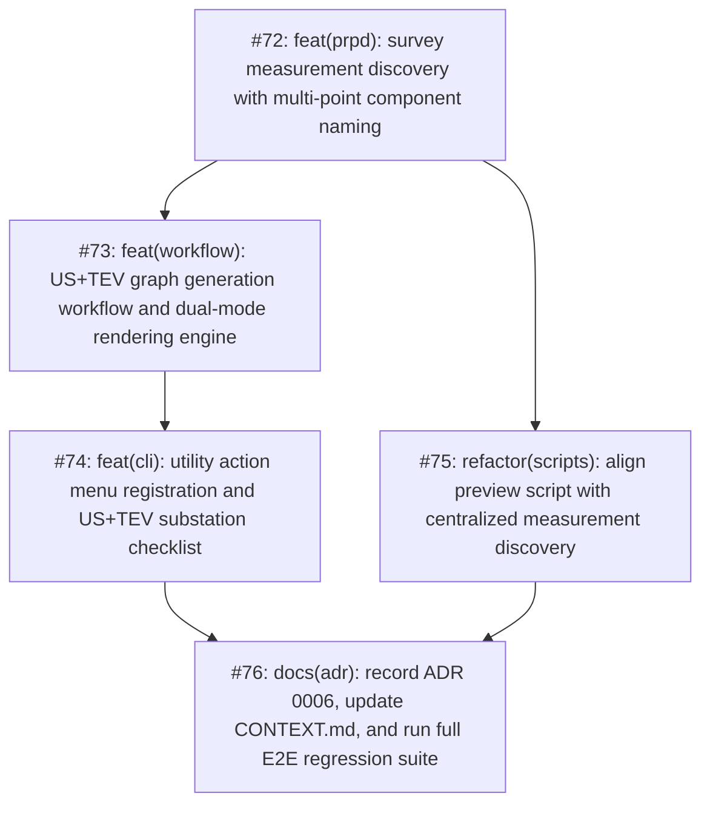

# Standalone US+TEV Survey Graph Generation Utility Map

> [!IMPORTANT]
> **Branching & QA Merge Policy**:
> - **Feature Branch**: All implementation work across all tickets must be performed on a dedicated feature branch: `feature/generate-us-tev-survey-graphs` (branched from `main`).
> - **Isolation Invariant**: Under no circumstances should implementation commits be pushed directly to `main`.
> - **Merge Gate**: Merging `feature/generate-us-tev-survey-graphs` back into `main` requires:
>   1. 100% green automated test suite (`pytest`) across all unit, adapter, workflow, and regression test suites.
>   2. Complete manual verification and CLI dry-run inspection approved by the human maintainer.

---

## Destination
Deliver a dedicated, reliable CLI utility action labeled `"Generate US+TEV survey graphs"` at position #9 in the Utilities menu (`src/utility_actions.py`). The utility empowers operators to independently generate Phase-Resolved Partial Discharge (PRPD) ultrasound and TEV graphs for selected inspection dates and substations into `<SUBSTATION>/RAW DATA/US+TEV/graphs/`. It establishes an unambiguous naming schema (`{ASSET}_{SUBASSET}_{COMPONENT}_{TECH}.png`) capable of differentiating multi-point Vacuum Circuit Breaker (VCB) cubicles without blind numeric collisions, adheres to the workspace PRPD mode (`option_c` vs `option_b`), isolates errors across batch executions (`SubstationIsolatedBatchResiliencePolicy`), and leaves downstream report generation pipelines completely isolated.

---

## Specification Reference
The authoritative specification for this effort is documented in [spec.md](./spec.md). It establishes the formal problem statement, 7 user stories, core implementation decisions, testing seams, concrete file schemas, and out-of-scope boundaries. All tickets in this map implement vertical slices of this specification.

---

## Notes
- **Domain Model**: `UsTevGraphWorkflow`, `UsTevGraphOutputDirectory`, `SurveyMeasurementNaming`, `BrowserPrerequisitePolicy`, `SubstationIsolatedBatchResiliencePolicy`, `MultiDateSelectionPolicy`, `PrpdConfig`, `WorkspaceStorage`.
- **Relevant Skills**: `tdd`, `codebase-design`, `caveman-commit`, `unslop`.
- **Operating Invariant**: Downstream Quick Report and Full Report adapters, Word templates, and pipelines remain 100% untouched.

---

## Work Breakdown & Phasing

---

## Tickets

### #72: feat(prpd): survey measurement discovery with multi-point component naming
- **Status**: Open
- **GitHub Issue**: [#72](https://github.com/adamlarGit/pahang-cli/issues/72)
- **Blocked by**: None (can start immediately)
- **Ticket File**: [tickets/072-survey-measurement-discovery-and-naming.md](file:///C:/Users/ADAM/Desktop/pahang-cli/.wayfinder/generate-us-tev-survey-graphs/tickets/072-survey-measurement-discovery-and-naming.md)
- **Delivers**: `DiscoveredMeasurement` model, canonical label formatting (`{ASSET}_{SUBASSET}_{COMPONENT}_{TECH}`), manifest parsing (`survey_summary.js`) using `raw_decode`, deterministic directory traversal reading `measurement_metadata.js`, unit tests with VCB, RMU, and TX synthetic survey fixtures.

### #73: feat(workflow): US+TEV graph generation workflow and dual-mode rendering engine
- **Status**: Open
- **GitHub Issue**: [#73](https://github.com/adamlarGit/pahang-cli/issues/73)
- **Blocked by**: #72
- **Ticket File**: [tickets/073-us-tev-graph-workflow-engine.md](file:///C:/Users/ADAM/Desktop/pahang-cli/.wayfinder/generate-us-tev-survey-graphs/tickets/073-us-tev-graph-workflow-engine.md)
- **Delivers**: `BrowserPrerequisiteError`, `UsTevGraphWorkflow` dual-mode rendering engine reusing `SurveyHttpServer` / `render_prpd_option_c_image()` and `decode_tev_event_data()` / `generate_prpd_figure()` from `src/quick_report/prpd.py`, output destination resolution to `RAW DATA/US+TEV/graphs/`, idempotent overwrite, batch error isolation (`SubstationIsolatedBatchResiliencePolicy`), workflow unit tests.

### #74: feat(cli): utility action menu registration and US+TEV substation checklist
- **Status**: Open
- **GitHub Issue**: [#74](https://github.com/adamlarGit/pahang-cli/issues/74)
- **Blocked by**: #73
- **Ticket File**: [tickets/074-cli-utility-action-and-substation-checklist.md](file:///C:/Users/ADAM/Desktop/pahang-cli/.wayfinder/generate-us-tev-survey-graphs/tickets/074-cli-utility-action-and-substation-checklist.md)
- **Delivers**: Zero-arg runner factory `_load_generate_us_tev_graphs_runner()` wrapping `get_or_create_utility_environment()`, Station $\to$ Month $\to$ Date interactive selection (`select_pahang_inspection_dates_interactive`) and range input (`prompt_target_inspection_dates_with_ranges`), substation package discovery filtered strictly to stations with valid `RAW DATA/US+TEV/` surveys, single merged checklist prefixed with `[{date_str}]`, `UTILITY_ACTIONS` registration at Position #9 with label `"Generate US+TEV survey graphs"`, CLI integration unit tests.

### #75: refactor(scripts): align preview script with centralized measurement discovery
- **Status**: Open
- **GitHub Issue**: [#75](https://github.com/adamlarGit/pahang-cli/issues/75)
- **Blocked by**: #72 (can execute in parallel with #73 and #74)
- **Ticket File**: [tickets/075-developer-preview-script-refactoring.md](file:///C:/Users/ADAM/Desktop/pahang-cli/.wayfinder/generate-us-tev-survey-graphs/tickets/075-developer-preview-script-refactoring.md)
- **Delivers**: Refactor `scripts/generate_prpd_option_c_html.py` to import and reuse `discover_survey_measurements` and canonical label formatting from `src/quick_report/prpd.py`, eliminating duplicate legacy parsing code and ensuring 100% naming parity between preview outputs and production CLI utilities.

### #76: docs(adr): record ADR 0006, update CONTEXT.md, and run full E2E regression suite
- **Status**: Open
- **GitHub Issue**: [#76](https://github.com/adamlarGit/pahang-cli/issues/76)
- **Blocked by**: #74, #75
- **Ticket File**: [tickets/076-adr-context-docs-and-e2e-verification.md](file:///C:/Users/ADAM/Desktop/pahang-cli/.wayfinder/generate-us-tev-survey-graphs/tickets/076-adr-context-docs-and-e2e-verification.md)
- **Delivers**: Formal `docs/adr/0006-us-tev-survey-graph-generation-workflow.md`, updated `CONTEXT.md` with new domain concepts (`UsTevGraphWorkflow`, `UsTevGraphOutputDirectory`, `SurveyMeasurementNaming`, `BrowserPrerequisitePolicy`, broadening `SubstationIsolatedBatchResiliencePolicy`), manual CLI menu dry-run verification, and 100% green run across the entire automated `pytest` test suite.

---

## Decisions so far
- **D1 (Output Location)**: Generated graphs are strictly saved inside `<SUBSTATION_FOLDER>/RAW DATA/US+TEV/graphs/`, isolating outputs from raw instrument data without polluting parent folders.
- **D2 (Naming Convention)**: Standardized schema is `{ASSET}_{SUBASSET}_{COMPONENT}_{TECH}.png` (e.g. `VCB_PANEL_1_CIRCUIT_BREAKER_TEV.png`, `VCB_PANEL_1_CABLE_BOX_TEV.png`, `VCB_PANEL_1_UPPER_BUSBARS_US.png`). If `$COMPONENT` is missing or `$NONE`, it cleanly outputs `{ASSET}_{SUBASSET}_{TECH}.png`.
- **D3 (Deterministic Fallback)**: Fallback filesystem traversal reads `measurement_metadata.js` inside each measurement directory to extract literal `$`-prefixed field values, ensuring exact naming parity with manifest parsing.
- **D4 (Substation Checklist Filtering)**: The interactive checklist strictly displays only substations that contain a verified `RAW DATA/US+TEV/` directory with UltraTEV data.
- **D5 (PRPD Config Adherence & Pre-flight Browser Check)**: Respects `environment.get_prpd_config().mode`. In Option C, pre-flight checks Chromium presence before the batch begins, immediately halting with `BrowserPrerequisiteError` if neither Chrome nor Edge is detected.
- **D6 (Scope Isolation & Known Limitation)**: Downstream Quick Report and Full Report workflows remain 100% untouched. Generated graphs are not automatically ingested by reports; operators manually insert regenerated graphs where needed.
- **D7 (Menu Label & Position)**: Utility menu action is labeled `"Generate US+TEV survey graphs"`, placed at Position #9 (index 8) immediately after `"Rename FLIR raw files numbering"`.
- **D8 (Overwrite Invariant)**: Re-generating graphs overwrites existing files in `graphs/` idempotently.
- **D9 (Batch Error Isolation)**: Follows `SubstationIsolatedBatchResiliencePolicy`: skips zero-measurement surveys with a non-blocking warning, isolates per-substation exceptions, and displays a consolidated summary at batch completion.
- **D10 (Multi-Date Merged Checklist)**: Reuses `MultiDateSelectionPolicy` and displays a single merged checklist across all selected dates with `[{date_str}]` disambiguation prefixes matching Full Report.
- **D11 (Parallel Execution for Preview Script)**: Ticket #75 depends only on #72 and can be developed/tested in parallel with the workflow engine and CLI wiring (#73/#74).

---

## Not yet specified
- Automatic fallback ingestion in Quick/Full Report (deferred to a future PRPD caching epic if requested).

---

## Out of scope
- Ingesting unzipped raw survey data directly from `TESTSHEET/.../UNSORTED RAW DATA/`.
- Modifying Quick Report or Full Report Word `.docx` templates or scan adapters.
- Altering existing Option B Matplotlib plot styling or Option C Flexbox layout specifications.
