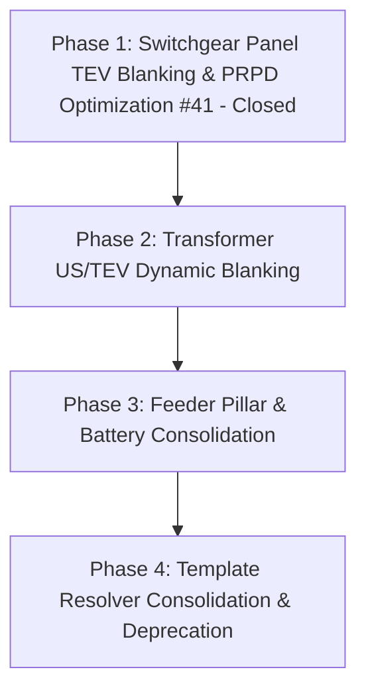

# Quick Report Dynamic Template Consolidation Map

> [!IMPORTANT]
> **Local Map Notice**: This Wayfinder map stays strictly **local** at `.wayfinder/map.md` until all fog of war has been resolved through planned discussion and alignment. Do not publish to remote GitHub issues until team alignment is complete.

---

## Destination

Full consolidation of Quick Report templates into `DEFECT IR US TEV` as the single dynamic source of truth, deprecating `DEFECT IR` and `DEFECT IR US` folders across all equipment families:
- **Switchgear (SWG)**: `swg-panel.docx`, `swg-overview.docx`
- **Transformers (TX)**: `tx-hv-sides.docx`, `tx-lv-sides.docx`, `tx-overview.docx`
- **Feeder Pillars / LVDB (FP)**: `fp-individual-defect.docx`, `fp-overview.docx`
- **Battery Banks**: `battery-overview.docx`

---

## Motivation & Architecture

Historically, Quick Report maintained three parallel template directories:
1. `templates/QUICK REPORT/DEFECT IR/`
2. `templates/QUICK REPORT/DEFECT IR US/`
3. `templates/QUICK REPORT/DEFECT IR US TEV/`

### Drawbacks of Multiple Directories
1. **Maintenance Drift**: Edits to placeholders, ActiveX controls, or layout fixes had to be duplicated up to 3 times per equipment.
2. **Brittle Resolution Logic**: Complex template path discovery and branching in `cbm_defect_planner.py` and `cbm_family.py`.
3. **Inconsistent Styling**: Styling fixes applied to one folder frequently failed to propagate to the others.

### Solution: Method 1 — Truly Dynamic Templates via OpenXML Blanking
By using `DEFECT IR US TEV` as the canonical template across all jobs:
- **Two-Tier Model**:
  - **Tier 1**: Contract awarded technologies (checks if technology like TEV/US is part of project contract).
  - **Tier 2**: Equipment / compartment eligibility (e.g. switchgear compartment eligibility rules).
- **Blanking Engine**:
  - Inactive technology cells have their text cleared, background shading removed (`<w:shd>` stripped), and borders set to `<w:val="nil"/>`.
  - Empty string context injection prevents placeholder artifacts.
  - Waveform PRPD generation is dynamically skipped to eliminate unnecessary disk I/O and compute.

---

## Work Breakdown & Phasing

### Phase 1: Switchgear Panel Dynamic Blanking & PRPD Optimization (Ticket #41)
- **Status**: Closed
- [x] **Two-Tier Eligibility**:
  - Tier 1: Check if `TEV` is in project awarded technologies.
  - Tier 2: Check compartment eligibility (`BREAKER COMPARTMENT`, `CABLE COMPARTMENT`, `PT COMPARTMENT`, `FUSE COMPARTMENT` vs `CABLE ENTRY`, `BUSBAR COMPARTMENT`).
- [x] **OpenXML Blanking**: Clear text, remove cell background shading, and set borders to `<w:val="nil"/>` for rows 21–32, columns 11–22 in `swg-panel.docx`.
- [x] **PRPD Optimization**: Skip TEV PRPD graph generation in `prpd.py` for non-TEV compartments.
- [x] **Scope Parity**: Applied to Full Report (`scan_adapters.py`, `scan_render.py`) and Quick Report (`cbm_render.py`).

### Phase 2: Transformer US/TEV Dynamic Blanking
- [ ] **Transformer Scan & Defect Templates**: Dynamically blank US and TEV measurement blocks on `tx-hv-sides.docx` and `tx-lv-sides.docx` when contract or component lacks US/TEV.
- [ ] **PRPD Waveform Skipping**: Skip transformer PRPD graph rendering when non-qualifying.

### Phase 3: Feeder Pillar & Battery Template Consolidation
- [ ] Verify `fp-individual-defect.docx` and `fp-overview.docx` in `DEFECT IR US TEV` support single-technology and multi-technology seamlessly.
- [ ] Verify `battery-overview.docx` parity.

### Phase 4: Resolver Unification & Directory Deprecation
- [ ] Point `cbm_family.py` and `config.py` exclusively to `DEFECT IR US TEV`.
- [ ] Deprecate `templates/QUICK REPORT/DEFECT IR/` and `templates/QUICK REPORT/DEFECT IR US/`.
- [ ] Remove obsolete fallback template routing.

---

## Fog of War & Open Questions (To Be Resolved Locally)

1. **ActiveX Control Behavior on Blanked Templates**: Confirm Word COM compiler leaves FLIR ActiveX shapes completely unharmed during dynamic cell blanking across all Word versions.
2. **Overview Page Parity**: Audit whether any equipment overview page requires dynamic table restructuring or if standard Jinja2 dash defaulting (`"-"`) is sufficient.
3. **Migration Grace Period**: Determine whether an explicit deprecation warning should be emitted if legacy template directories are referenced by custom user configuration.
