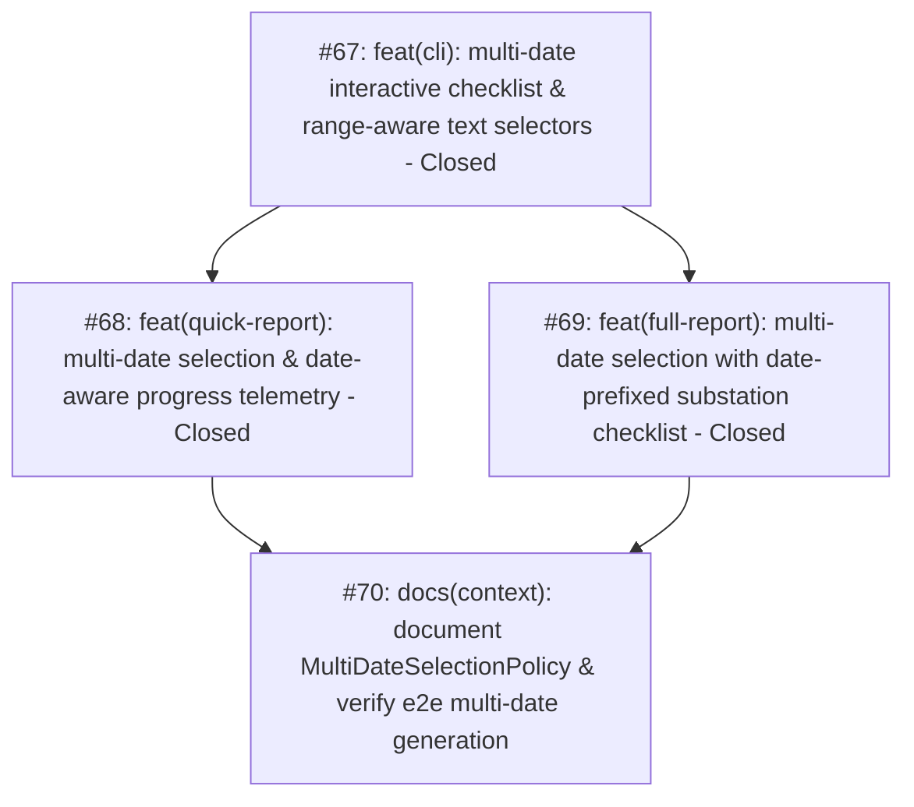

# Multi-Date Report Generation for Quick Report and Full Report Map

> [!IMPORTANT]
> **Branching & QA Merge Policy**:
> - **Feature Branch**: All implementation work across all tickets must be performed on a dedicated feature branch: `feature/multi-date-report-generation` (branched from `main`).
> - **Isolation Invariant**: Under no circumstances should implementation commits be pushed directly to `main`.
> - **Merge Gate**: Merging `feature/multi-date-report-generation` back into `main` requires:
>   1. 100% green automated test suite (`pytest`) across all unit, adapter, workflow, and regression test suites.
>   2. Complete manual verification and CLI dry-run inspection approved by the human maintainer.

---

## Destination

Deliver an intuitive, dual-mode multi-date selection capability across Quick Report and Full Report generation workflows, enabling operators to select multiple inspection date folders via an interactive checklist (with unchecked defaults and select-all toggles) or enter dates/ranges via text input with tolerant confirmation, compiling multi-day batches in a single resilient COM session with date-aware telemetry.

---

## Specification Reference

The authoritative specification for this effort is documented in [spec.md](./spec.md). It establishes the formal problem statement, 12 user stories, core implementation decisions, testing seams, and out-of-scope boundaries. All tickets in this map implement slices of this specification.

---

## Notes

- **Domain Model**: `MultiDateSelectionPolicy`, `ReportTarget`, `DailyDateFolder`, `QuickReportWorkflow`, `FullReportWorkflow`.
- **Relevant Skills**: `tdd`, `codebase-design`, `caveman-commit`.
- **Operating Invariant**: Existing single-folder selection and manual FL input remain 100% backward-compatible. Generated reports are strictly routed to their canonical daily output folders (`QUICK REPORT/<STATION>/<MONTH>/<DATE>/` and `FULL REPORT/<STATION>/<MONTH>/<DATE>/`).

---

## Work Breakdown & Phasing

---

## Tickets

### #67: feat(cli): multi-date interactive checklist & range-aware text selectors
- **Status**: Closed
- **GitHub Issue**: [#67](https://github.com/adamlarGit/pahang-cli/issues/67)
- **Blocked by**: None (can start immediately)
- **Ticket File**: [.wayfinder/multi-date-report-generation/tickets/067-cli-multi-date-selectors-and-range-syntax.md](file:///C:/Users/ADAM/Desktop/pahang-cli/.wayfinder/multi-date-report-generation/tickets/067-cli-multi-date-selectors-and-range-syntax.md)
- **Delivers**: `expand_date_range_syntax` helper, `select_multiple` unchecked defaults and toggle-all shortcuts, `select_pahang_inspection_dates_interactive` with zero-selection loop-back, and `prompt_target_inspection_dates_with_ranges` with visual syntax guide and tolerant confirmation.

### #68: feat(quick-report): multi-date selection & date-aware progress telemetry
- **Status**: Closed
- **GitHub Issue**: [#68](https://github.com/adamlarGit/pahang-cli/issues/68)
- **Blocked by**: #67
- **Ticket File**: [.wayfinder/multi-date-report-generation/tickets/068-quick-report-multi-date-integration.md](file:///C:/Users/ADAM/Desktop/pahang-cli/.wayfinder/multi-date-report-generation/tickets/068-quick-report-multi-date-integration.md)
- **Delivers**: `QuickReportAction` multi-date menu integration (`Browse Date Folders` and `Enter Target Date(s)`), automated batch discovery across chosen dates, and date-tagged progress sink messages (`[1/N] [DD-MM-YYYY] Generating ...`).

### #69: feat(full-report): multi-date selection with date-prefixed substation checklist
- **Status**: Closed
- **GitHub Issue**: [#69](https://github.com/adamlarGit/pahang-cli/issues/69)
- **Blocked by**: #67
- **Ticket File**: [.wayfinder/multi-date-report-generation/tickets/069-full-report-multi-date-substation-checklist.md](file:///C:/Users/ADAM/Desktop/pahang-cli/.wayfinder/multi-date-report-generation/tickets/069-full-report-multi-date-substation-checklist.md)
- **Delivers**: `generate_full_reports_action` multi-date menu integration, interactive substation review checklist with date prefixes (`[DD-MM-YYYY] <STEM> [READY]`), and date-tagged progress sink messages.

### #70: docs(context): document MultiDateSelectionPolicy & verify e2e multi-date generation
- **Status**: Open
- **GitHub Issue**: [#70](https://github.com/adamlarGit/pahang-cli/issues/70)
- **Blocked by**: #68, #69
- **Ticket File**: [.wayfinder/multi-date-report-generation/tickets/070-e2e-verification-and-domain-documentation.md](file:///C:/Users/ADAM/Desktop/pahang-cli/.wayfinder/multi-date-report-generation/tickets/070-e2e-verification-and-domain-documentation.md)
- **Delivers**: Canonical `MultiDateSelectionPolicy` concept in `CONTEXT.md`, and 100% green automated test suite across unit, adapter, workflow, and regression tests.

---

## Decisions so far

- **D66.1**: Date selection across Quick Report and Full Report generation is expanded to dual-mode: *Browse Date Folders (Interactive Checklist)* and *Enter Target Date(s) (Text Input / Range)* alongside existing *Manual FL Input*.
- **D66.2**: In interactive browsing, dates inside `TESTSHEET/<STATION>/<MONTH>/` are unchecked by default (`[ ]`). Keyboard shortcut `'a'` toggles all. If 0 items are selected or cancelled, execution loops back to Month/Station selection instead of aborting.
- **D66.3**: Text input mode displays a visual formatting guide, parses comma-separated dates and range syntax (`DD-MM-YYYY..DD-MM-YYYY` or `DD-MM-YYYY to DD-MM-YYYY`), and implements tolerant confirmation when some dates exist and some are missing.
- **D66.4**: Quick Report executes automated batch generation across all discovered packages for the selected dates without per-substation prompting.
- **D66.5**: Full Report presents an interactive checklist of discovered substations prefixed by date (`[DD-MM-YYYY] <STEM> [READY]`).
- **D66.6**: Batch progress sinks format progress with the date tag: `[1/N] [DD-MM-YYYY] Generating ...`.
- **D66.7**: Generated reports are placed into their respective daily folders (`QUICK REPORT/<STATION>/<MONTH>/<DATE>/` and `FULL REPORT/<STATION>/<MONTH>/<DATE>/`).
- **D66.8**: Scope is strictly focused on Stage 1 report generation; Stage 2 post-processing pipelines remain untouched in this update.
