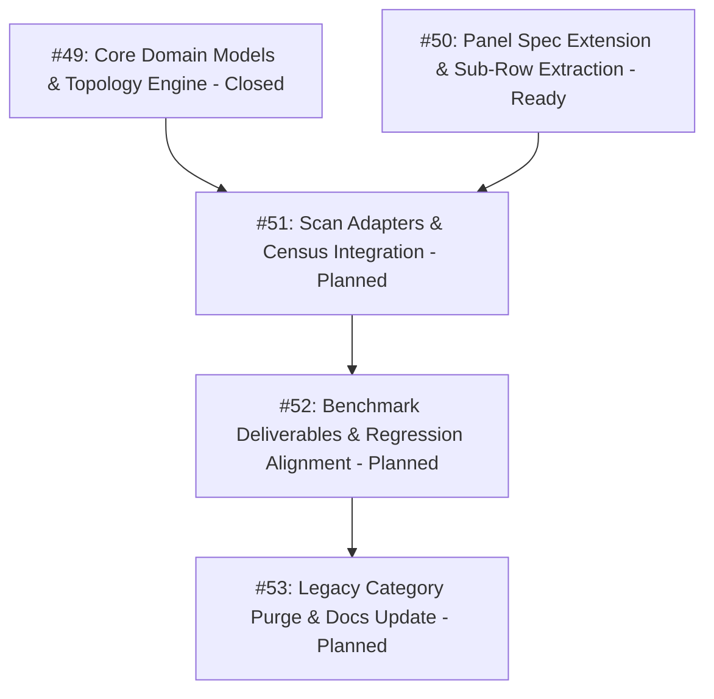

# Switchgear Topology Engine & Sub-Row Evidence Pipeline Map

> [!IMPORTANT]
> **Branching & QA Merge Policy**:
> - **Feature Branch**: All implementation work across all tickets must be performed on a dedicated feature branch: `feature/switchgear-topology-engine` (branched from `main`).
> - **Isolation Invariant**: Under no circumstances should implementation commits be pushed directly to `main`.
> - **Merge Gate**: Merging `feature/switchgear-topology-engine` back into `main` requires:
>   1. 100% green automated test suite (`pytest`) across all unit, adapter, workflow, and regression test suites.
>   2. Complete manual verification and visual deliverable inspection performed and explicitly approved by the human maintainer.

---

## Destination & Motivation

Distribution substation condition-based monitoring (CBM) inspection reports require 100% fidelity to physical on-site equipment assets. Current switchgear reporting relies on a legacy procedural categorization system (`SwitchgearCategory`) that groups switchboards into broad manufacturer buckets (`INDKOM`, `TAMCO_LUCY`, `OTHER_RMU`, `VCB`) and applies rigid, hardcoded compartment lists.

This refactor replaces the legacy model with a **hybrid hierarchical topology engine**:
1. **Phase 1: Board-Level Classification (Macro Archetype & Voltage Class)**:
   Given board-level metadata (switchgear type, manufacturer, model, voltage rating), classify into one of 6 canonical physical hardware archetypes (`VCB_CUBICLE`, `GIS_CUBICLE`, `RMU_DUAL_CABLE_ENTRY`, `RMU_FUSE_CANISTER`, `RMU_OIL`, `RMU_STANDARD`) and a normalized `VoltageClass` (`11kV`, `33kV`). Resolves board-level overviews (`swg-overview.docx`).
2. **Phase 2: Bay-Level Resolution (Dynamic Bay Roles & Empirical Presence Gates)**:
   Given an archetype, bay functional role (`STANDARD`, `TRANSFORMER`, `TRANSITION`, `BUS_SECTION`, `BUS_COUPLER`), and sub-row testsheet evidence, evaluate empirical presence gates:
   - **Empirical PT Gate**: Emits `PT COMPARTMENT` on VCB/GIS standard and transformer bays if and only if sub-row `r+3` contains recorded photo evidence or non-empty measurement data.
   - **Dynamic Secondary Gate**: Emits `SECONDARY COMPARTMENT` on transition bays if and only if a secondary IR photo was recorded in column `P`. Standard, Transformer, and Bus Section bays include `SECONDARY COMPARTMENT` unconditionally (rejecting fragile heater current gating).
3. **Downstream Isolation**:
   - **Scan Adapter with Strict Zero-Fallback**: Resolves 1-to-1 photo assignments for each active compartment. Missing photos render as blank placeholders with `"-"` metrics; under no circumstances are photos duplicated from other compartments (`photo_numbers[0]` fallback eliminated).
   - **Executive Summary Census**: Populates Table 2 with exact active compartments. Healthy components render with `"-"` and solid Green status fill (`#00B050`); confirmed defects render with quantitative defect readings from `CbmDefectRecord` objects and solid Red status fill (`#EE0000`). Absent compartments produce zero rows.

---

## Work Breakdown & Phasing

---

### #49: Core Domain Models & Switchgear Topology Engine
- **Status**: Closed
- **GitHub Issue**: [#49](https://github.com/adamlarGit/pahang-cli/issues/49)
- **Blocked by**: None
- **Ticket File**: [.wayfinder/switchgear-topology/tickets/049-core-domain-models-and-switchgear-topology-engine.md](file:///C:/Users/ADAM/Desktop/pahang-cli/.wayfinder/switchgear-topology/tickets/049-core-domain-models-and-switchgear-topology-engine.md)
- [x] Define `SwitchgearArchetype`, `VoltageClass`, and `BayRole` enums in `src/core/topology.py`.
- [x] Implement `classify_voltage_rating(rating: str) -> VoltageClass` with normalizations for `11kV`, `12kV`, blank.
- [x] Implement `extract_model_from_manufacturer(manufacturer: str, model: str) -> str`.
- [x] Implement `resolve_switchgear_archetype(switchgear_type: str, manufacturer: str, model: str) -> SwitchgearArchetype` strictly requiring `INS24` token for `RMU_FUSE_CANISTER` (Indkom JMW12 $\to$ `RMU_STANDARD`), all Lucy $\to$ `RMU_DUAL_CABLE_ENTRY`, MRMU $\to$ `RMU_STANDARD`.
- [x] Implement `resolve_overview_compartments(archetype: SwitchgearArchetype, voltage_class: VoltageClass = VoltageClass.KV_11) -> tuple[str, ...]`.
- [x] Implement `classify_bay_role(name: str = "", panel_feeder_no: str = "", panel_type: str = "", archetype: SwitchgearArchetype = SwitchgearArchetype.RMU_STANDARD) -> BayRole` with keyword matching for `TRANSFORMER`, `BUS_SECTION`, `BUS_COUPLER`, `TRANSITION`, and `STANDARD`.
- [x] Implement base blueprint profiles (including `RMU_OIL` panels as `("CABLE COMPARTMENT", "CABLE ENTRY")`) and dynamic presence gates (`eval_pt_gate`, `eval_secondary_gate`).
- [x] Implement `SwitchgearTopologyEngine` facade class with `classify_board(...)` and `resolve_panel_compartments(...)`.
- [x] Implement comprehensive unit test suite in `tests/test_topology.py` validating 100% of archetypes, roles, and gates.

---

### #50: SwitchgearPanelSpec Model Extension & Sub-Row Extraction
- **Status**: Ready
- **GitHub Issue**: [#50](https://github.com/adamlarGit/pahang-cli/issues/50)
- **Blocked by**: None (parallel execution with #49)
- **Ticket File**: [.wayfinder/switchgear-topology/tickets/050-switchgear-panel-spec-model-extension-and-subrow-extraction.md](file:///C:/Users/ADAM/Desktop/pahang-cli/.wayfinder/switchgear-topology/tickets/050-switchgear-panel-spec-model-extension-and-subrow-extraction.md)
- [ ] Add `cable_photo`, `breaker_photo`, `secondary_photo`, `busbar_photo`, `pt_photo`, and `has_pt_measurement` to `SwitchgearPanelSpec` in `src/testsheet/models.py` and `SwitchgearPanelScanSpec` in `src/full_report/models.py`.
- [ ] Propagate all 6 sub-row attributes in `build_switchgear_panel_scan_spec()`.
- [ ] Update `_extract_overview_photos` in `src/testsheet/extractor.py` to extract rows 26, 27, and 28.
- [ ] Implement Col P secondary photo regex parsing (with bare digit support) in `src/testsheet/extractor.py`.
- [ ] Update `_extract_panels` in `src/testsheet/extractor.py` to extract all 4 sub-rows (`r..r+3`) and Col P.
- [ ] Update panel slot exclusion logic to check all sub-row photo attributes.
- [ ] Add unit tests in `tests/test_testsheet_extractor.py` verifying sub-row and overview photo extraction against benchmark workbooks (`157` including `secondary_photo == 520`, `082`, `156`).

---

### #51: Scan Adapters & Executive Summary Census Integration
- **Status**: Planned
- **GitHub Issue**: [#51](https://github.com/adamlarGit/pahang-cli/issues/51)
- **Blocked by**: #49, #50
- **Ticket File**: [.wayfinder/switchgear-topology/tickets/051-scan-adapters-and-executive-summary-census-integration.md](file:///C:/Users/ADAM/Desktop/pahang-cli/.wayfinder/switchgear-topology/tickets/051-scan-adapters-and-executive-summary-census-integration.md)
- [ ] Update `build_switchgear_scan_spec` and `build_switchgear_panel_scan_spec` in `src/full_report/models.py` to consume `SwitchgearTopologyEngine`.
- [ ] Implement strict 1-to-1 photo pairing with zero-fallback in `SwitchgearScanAdapter` (`src/full_report/scan_adapters.py`), mapping `"FRONT COMPARTMENT"` $\to$ `panel.breaker_photo` and `"REAR COMPARTMENT"` $\to$ `panel.cable_photo`, and explicitly eliminating the `ir_num = panel.photo_numbers[0]` fallback line.
- [ ] Update `SwitchgearScanAdapter` overview photo mapping to handle Front (Row 27), Rear (Row 26), and Top (Row 28) views.
- [ ] Migrate `resolve_switchgear_compartments()` callsite at line ~580 in `src/full_report/scan_adapters.py` to `SwitchgearTopologyEngine`.
- [ ] Update `ExecutiveSummaryCensusBuilder` (`src/full_report/census.py`) to generate switchgear rows dynamically via `SwitchgearTopologyEngine` using `CbmDefectRecord` objects.
- [ ] Ensure omitted compartments generate zero census rows in Table 2.
- [ ] Add unit tests in `tests/test_full_report_scan_adapters.py` validating zero-fallback.
- [ ] Add unit tests in `tests/test_full_report_census_builder.py` validating dynamic census row generation across all 6 archetypes.

---

### #52: Benchmark Deliverables & Regression Suite Alignment
- **Status**: Planned
- **GitHub Issue**: [#52](https://github.com/adamlarGit/pahang-cli/issues/52)
- **Blocked by**: #51
- **Ticket File**: [.wayfinder/switchgear-topology/tickets/052-benchmark-deliverables-and-regression-suite-alignment.md](file:///C:/Users/ADAM/Desktop/pahang-cli/.wayfinder/switchgear-topology/tickets/052-benchmark-deliverables-and-regression-suite-alignment.md)
- [ ] Add and verify PE 179 Cenderawasih NO.1 benchmark test asserting 6 SWG pages and 14 total substation pages.
- [ ] Add and verify PE 144 Telekom Tanah Putih benchmark test (RMU_FUSE_CANISTER - INDKOM INS24 with `model="INS24"`) asserting 10 SWG pages (with 4 TEV defect interleaving pages) and 19 total substation pages.
- [ ] Add and verify PE 005 Talapia benchmark test asserting 10 SWG pages and 19 total substation pages.
- [ ] Add benchmark assertion for PE 157 Perpustakaan Awam asserting 3 VCB overviews, 4-compartment standard bays, 5-compartment PT bay, 24 SWG pages, and 34 total substation pages.
- [ ] Ensure 100% green pass rate across `pytest tests/test_full_report_*.py` (including `test_full_report_defect_interleaving.py` and `test_full_report_plan_builder.py`).

---

### #53: Legacy Category Purge & Documentation Update
- **Status**: Planned
- **GitHub Issue**: [#53](https://github.com/adamlarGit/pahang-cli/issues/53)
- **Blocked by**: #52
- **Ticket File**: [.wayfinder/switchgear-topology/tickets/053-legacy-category-purge-and-documentation-update.md](file:///C:/Users/ADAM/Desktop/pahang-cli/.wayfinder/switchgear-topology/tickets/053-legacy-category-purge-and-documentation-update.md)
- [ ] Completely delete `SwitchgearCategory` enum from `src/full_report/models.py`.
- [ ] Delete `VCB_STANDARD_COMPARTMENTS`, `VCB_TRANSITION_COMPARTMENTS`, and `OVERVIEW_COMPARTMENTS_MAP` constants from `src/full_report/models.py`.
- [ ] Remove deprecated procedural helpers (`classify_switchgear`, `resolve_overview_compartments`, `resolve_switchgear_compartments`, `resolve_panel_page_count`, `is_tx_feeder`) from `src/full_report/models.py`.
- [ ] Remove all remaining references to `TAMCO_LUCY` and `OTHER_RMU` across codebase and tests.
- [ ] Update `CONTEXT.md` with ubiquitous vocabulary (`SwitchgearArchetype`, `VoltageClass`, `BayRole`, `SwitchgearTopologyEngine`).
- [ ] Run full test suite (`pytest`) to confirm 100% green pass rate.
