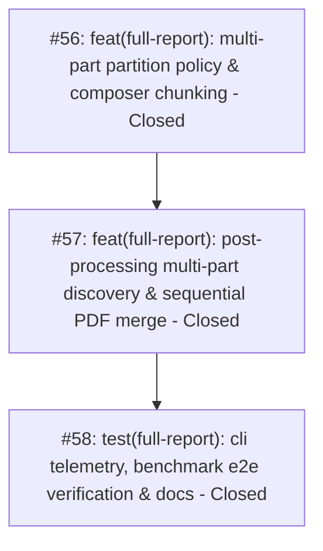

# VCB and GIS Multi-Part Full Report Generation and PDF Stitching Map

> [!IMPORTANT]
> **Branching & QA Merge Policy**:
> - **Feature Branch**: All implementation work across all tickets must be performed on a dedicated feature branch: `feature/vcb-multipart-full-report` (branched from `main`).
> - **Isolation Invariant**: Under no circumstances should implementation commits be pushed directly to `main`.
> - **Merge Gate**: Merging `feature/vcb-multipart-full-report` back into `main` requires:
>   1. 100% green automated test suite (`pytest`) across all unit, adapter, workflow, and regression test suites.
>   2. Complete manual verification and visual deliverable inspection performed and explicitly approved by the human maintainer.

---

## Destination

Deliver an automated multi-part Word generation and post-processing PDF stitching pipeline for high-page-volume VCB and GIS switchgear, generating stable individual panel Word documents for inspector editing and consolidating them into a single deliverable PDF with testsheets for TNB.

---

## Specification Reference

The authoritative specification for this effort is documented in [spec.md](./spec.md). It establishes the formal problem statement, 14 user stories, core implementation decisions, testing seams, and out-of-scope boundaries. All tickets in this map implement slices of this specification.

---

## Notes

- **Domain Model**: Full Report document architecture, `SwitchgearArchetype` (`VCB_CUBICLE`, `GIS_CUBICLE`), `PlanDocumentChunk`, `FullReportStationPlan`, `FullReportPostProcessingWorkflow`.
- **Relevant Skills**: `tdd`, `codebase-design`, `caveman-commit`.
- **Operating Invariant**: Standard RMU switchgear continues generating as a single Word document. Multi-part generation activates automatically for any switchgear type `VCB` or `GIS`.

---

## Work Breakdown & Phasing

---

## Tickets

### #56: feat(full-report): multi-part partition policy & composer chunking
- **Status**: Closed
- **GitHub Issue**: [#56](https://github.com/adamlarGit/pahang-cli/issues/56)
- **Blocked by**: None (can start immediately)
- **Ticket File**: [.wayfinder/vcb-multipart-full-report/tickets/056-multipart-plan-partition-policy-and-composer.md](file:///C:/Users/ADAM/Desktop/pahang-cli/.wayfinder/vcb-multipart-full-report/tickets/056-multipart-plan-partition-policy-and-composer.md)
- **Delivers**: Domain partitioning of planned parts into individual panel chunks for VCB/GIS, archetype access via `plan.package.switchgears[0].archetype`, single-pass rendering with chunked compilation in `FullReportComposer`, backward-compatible `chunk_paths` on execution results, and safe exact-stem pre-purge.

### #57: feat(full-report): post-processing multi-part discovery & sequential PDF merge
- **Status**: Closed
- **GitHub Issue**: [#57](https://github.com/adamlarGit/pahang-cli/issues/57)
- **Blocked by**: #56
- **Ticket File**: [.wayfinder/vcb-multipart-full-report/tickets/057-postprocessing-multipart-discovery-and-pdf-stitching.md](file:///C:/Users/ADAM/Desktop/pahang-cli/.wayfinder/vcb-multipart-full-report/tickets/057-postprocessing-multipart-discovery-and-pdf-stitching.md)
- **Delivers**: `merge_pdfs_batch()` on `DocumentConverter`, multi-part target grouping via `_group_multipart_targets()`, testsheet matching by group stem, ordered batch PDF conversion and stitching into `<STEM>.pdf`, and telemetry backward compatibility.

### #58: test(full-report): cli telemetry, benchmark e2e verification & docs
- **Status**: Closed
- **GitHub Issue**: [#58](https://github.com/adamlarGit/pahang-cli/issues/58)
- **Blocked by**: #57
- **Ticket File**: [.wayfinder/vcb-multipart-full-report/tickets/058-cli-telemetry-benchmark-e2e-and-docs.md](file:///C:/Users/ADAM/Desktop/pahang-cli/.wayfinder/vcb-multipart-full-report/tickets/058-cli-telemetry-benchmark-e2e-and-docs.md)
- **Delivers**: Synthetic VCB benchmark fixture in `tests/benchmarks/` for PE 157, dry-run CLI telemetry multi-part indicators, full end-to-end regression tests across VCB and RMU benchmarks, and updated domain documentation in `CONTEXT.md` and domain analysis docs.

---

## Decisions so far

- **D55.1**: Multi-part generation activates automatically for switchgear archetype `VCB_CUBICLE` or `GIS_CUBICLE` (accessed via `plan.package.switchgears[0].archetype`). Standard RMU switchgear remains a single Word document.
- **D55.2**: VCB/GIS documents partition into: Part 01 (Summary & Overview), Parts 02..(N+1) (one Word file per individual bay), and Part N+2 (balance of plant, transformers, LVDB, condition, stickers).
- **D55.3**: Word part files use descriptive names with zero-padded numbers: `<STEM> - Part 01 - Summary.docx`, `<STEM> - Part 02 - Panel 1 (INCOMING 1).docx`, ..., `<STEM> - Part {N+2:02d} - TX and Condition.docx`.
- **D55.4**: Re-running generation performs an idempotent pre-purge using safe exact-stem matching (`f"{exact_stem} - Part *.docx"`).
- **D55.5**: `FullReportComposer.compose()` executes single-pass rendering (`plan.render_all()`), then compiles subsets per chunk into their respective deliverable paths.
- **D55.6**: `FullReportStationExecutionResult.output_path` remains the primary path (`Part 01` or single docx), with `chunk_paths: tuple[Path, ...]` holding all generated file paths for backward compatibility.
- **D55.7**: `DocumentConverter` ABC adds `merge_pdfs_batch(pdf_paths, output_pdf)` for single-pass PyPDF2 concatenation, preserving the 2-input `merge_pdfs()` for backward compatibility.
- **D55.8**: Post-processing discovery keeps `_discover_docx_files()` unchanged, adding a downstream `_group_multipart_targets()` method. Testsheet PDF matching consumes the group `<STEM>`.
- **D55.9**: Post-processing converts each part to a substation-scoped temporary PDF (`.tmp_conv_{stem}_part_XX.pdf`), merges via `merge_pdfs_batch()`, appends testsheet, and writes `<STEM>.pdf`.
- **D55.10**: Benchmark testing for Ticket #58 uses a synthetic, self-contained 5-panel VCB fixture in `tests/benchmarks/` modeled on PE 157.

---

## Not yet specified

- Optional CLI setting to force multi-part on non-VCB switchgear if total page count exceeds 30 pages.

---

## Out of scope

- Splitting transformer components into individual files.
- Splitting standard RMU switchgear (Indkom, Tamco, Lucy) into multiple files.
- Emitting separate client deliverable PDFs. Client always receives a single combined PDF (`<STEM>.pdf`).
