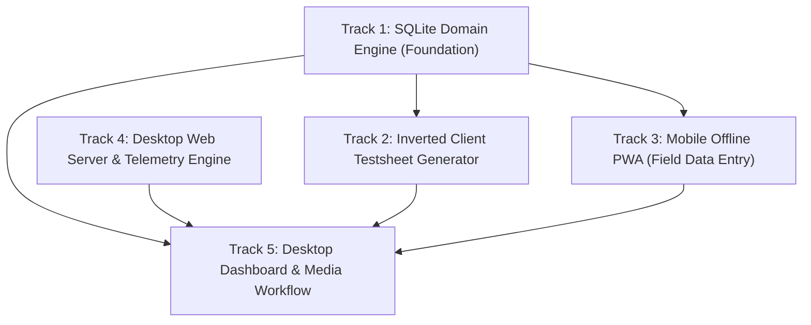

# Master Program Map: Web Migration, SQLite Testsheet & Mobile Field Data Entry

> [!IMPORTANT]
> **Program Planning Architecture**:
> - This is the **Master Program Map** (Tier 1). It provides the high-level roadmap, strategic migration framework, and coordinates the five specialized tracks.
> - Detailed decision tickets and execution frontiers live inside their respective **Track Sub-Maps** (Tier 2) under `tracks/`.
> - Maintained locally during design, migration staging, and fog-of-war resolution.

---

## Destination

Replace the interactive CLI with a dual-surface inspection and report automation platform:
1. An offline-capable mobile Progressive Web App (PWA) powered by client-side SQLite Wasm for field technicians to record substation inspections on Android/iOS without cellular connectivity.
2. A local Windows desktop webapp (FastAPI) for colleagues to orchestrate `WorkflowService`, COM automation, report generation, and media pairing on their laptops.
3. An inverted testsheet pipeline that replaces manual Excel parsing by generating client-compliant `PCE Testsheet` and `PCE VI` Excel/PDF documents directly from the SQLite database.

---

## Architecture Principles

- **Unified SQLite Everywhere**: Both mobile (browser Wasm + OPFS) and desktop (Python `sqlite3`) share the exact same relational table definitions. Transferring data from field to laptop uses direct SQLite database attachments (`ATTACH DATABASE`), eliminating fragile JSON serialization.
- **Dual-Surface Role Separation**:
  - *Mobile Surface*: Fast, touch-friendly, offline-first field data collection.
  - *Desktop Surface*: Heavy background processing, COM Word/Excel slicing, PDF compilation, and bulk camera SD card ingestion.
- **Zero Colleague Setup Overhead**: The desktop app runs locally on Windows laptops without requiring colleagues to install Node.js or configure external databases.
- **Output-Only Testsheet Compliance**: Client Excel and PDF layout requirements are satisfied by templating out from the database, eliminating the need to parse handwritten Excel sheets.

---

## Strategic Migration & Release Plan

### 1. Zero-Disruption Staging Model
The active production line on branch `main` must remain 100% operational for daily team CLI usage at all times.
- **Dedicated Staging Branch**: All migration tracks are developed and integrated inside branch `feature/pwa-web-migration`.
- **Git Worktree Isolation**: Development takes place in a dedicated worktree directory (e.g. `pahang-cli-web`), keeping the primary repository folder clean and instantly available to run or patch `main`.
- **Namespace Isolation (Dark Launching)**: All migration components are built in isolated namespaces (`src/db/`, `src/web/`, `src/generator/`, `web/pwa/`). Legacy CLI entry points (`src/workflow_cli.py`, `run_workflow.py`) remain untouched until the final cutover.
- **Urgent Fixes on Main**: Any mid-migration operational bugfixes committed to `main` are periodically merged into `feature/pwa-web-migration`.

### 2. Synchronized Dual-Surface Cutover
Because field technicians and laptop report compilers are the same individuals, rollout will be a synchronized cutover rather than a fragmented rollout:
- The team continues using the existing CLI throughout development.
- The mobile PWA and desktop web dashboard launch simultaneously once both are certified.
- **Definitive Sunset of Excel Input**: Once mobile PWA field entry is verified, manual Excel testsheet parsing is retired completely; Excel testsheets transition to strictly generated outputs for client compliance.
- **Forward-Only Database Storage**: SQLite stores all new inspections going forward starting from the cutover date. Historical Excel backfill is not required.

### 3. Stage Progression & Verification Gates

| Stage | Focus & Tracks | Deliverables | Verification Gate | Team Impact |
| :--- | :--- | :--- | :--- | :--- |
| **Stage 1: Foundation** | Track 1 | `schema.sql`, repository, composite key DDL, test database engine | Automated tests verify schema captures all substation and defect entities without PK collisions | Zero (Active on CLI) |
| **Stage 2: Core Inversion** | Track 2 | `PceTestsheetRenderer`, `PceViRenderer`, COM PDF compiler | Generator renders pixel-compliant Excel workbooks and PDFs from database records | Zero (Active on CLI) |
| **Stage 3: Desktop Engine** | Track 4 | FastAPI backend, SSE progress stream, COM STA worker, `.bat` launcher | Server handles mock workflow invocations and streams real-time progress without blocking | Zero (Active on CLI) |
| **Stage 4: Mobile Field App** | Track 3 | Standalone PWA, SQLite Wasm + OPFS, multi-step wizard, Web Share `.db` export | Real device test: offline inspection input, camera photo range entry, successful `.db` export | Zero (Active on CLI) |
| **Stage 5: Integration & Dry Run** | Track 5 | Web dashboard, `.db` drag-and-drop merger, SD photo range matcher | Full dry run: import phone `.db`, pair SD photos, generate complete report suite matching CLI quality | Zero (Active on CLI) |
| **Stage 6: Synchronized Cutover** | All | Merge `feature/pwa-web-migration` into `main`, deploy `start_webapp.bat`, PWA bookmark | Team double-clicks launcher, uses PWA on phone; CLI and manual Excel parsing formally deprecated | Full Switchover |

---

## Track Breakdown & Phasing

---

## Program Tracks (Tier 2 Sub-Maps)

### 🗺️ [Track 1: SQLite Domain Engine (Foundation)](./tracks/01-sqlite-domain-engine/map.md)
- **Status**: Ready to chart / Frontier
- **Sub-map Path**: `tracks/01-sqlite-domain-engine/map.md`
- **Scope**: Canonical schema DDL with composite natural keys/UUIDs, Python SQLite repository, project database initialization (`<base_path>/pahang_project.db`), `ATTACH DATABASE` merge mechanics, and in-memory `TestsheetDomainAdapter` bridging SQLite records directly into `TestsheetData` entities.

### 🗺️ [Track 2: Inverted Client Testsheet Generator](./tracks/02-inverted-testsheet-generator/map.md)
- **Status**: Blocked by Track 1
- **Sub-map Path**: `tracks/02-inverted-testsheet-generator/map.md`
- **Scope**: Reading `InspectionRecord` entities and populating client-compliant `PCE Testsheet` and `PCE VI` Excel workbooks, with automated COM PDF compilation.

### 🗺️ [Track 3: Mobile Offline PWA (Field Data Entry)](./tracks/03-mobile-offline-pwa/map.md)
- **Status**: Blocked by Track 1
- **Sub-map Path**: `tracks/03-mobile-offline-pwa/map.md`
- **Scope**: Standalone mobile PWA, SQLite Wasm + OPFS integration, multi-step inspection form wizard (including camera photo ranges), and Web Share API `.db` file export.

### 🗺️ [Track 4: Desktop Web Server & Telemetry Engine](./tracks/04-desktop-web-server/map.md)
- **Status**: Ready to chart / Frontier
- **Sub-map Path**: `tracks/04-desktop-web-server/map.md`
- **Scope**: Local FastAPI server in `src/web/`, Server-Sent Events (SSE) telemetry for `WorkflowService`, COM STA worker thread, and colleague `.bat` launcher.

### 🗺️ [Track 5: Desktop Dashboard & Media Workflow](./tracks/05-desktop-dashboard-and-media/map.md)
- **Status**: Blocked by Tracks 1, 2, 3, 4
- **Sub-map Path**: `tracks/05-desktop-dashboard-and-media/map.md`
- **Scope**: Desktop UI cards replacing CLI menus, mobile `.db` drag-and-drop import, and SD card photo range matcher for `RAW MATERIAL/`.

---

## Decisions so far

- **D-MASTER.1**: Full replacement of CLI with a local Windows desktop webapp.
- **D-MASTER.2**: Dual-surface split: mobile PWA for on-site data entry; local laptop webapp for heavy workflow execution.
- **D-MASTER.3**: Inverted testsheet model: database is the single source of truth; client-compliant Excel/PDF testsheets are generated from database records.
- **D-MASTER.4**: Offline-first mobile strategy: due to zero-reception substations, mobile runs fully offline.
- **D-MASTER.5**: SQLite Wasm + Python SQLite unified engine: identical schema on both ends; laptop merges mobile databases using `ATTACH DATABASE`.
- **D-MASTER.6**: Media ingestion stays on laptop for Phase 1: camera SD cards dump to `RAW MATERIAL/` and pair with database inspections.
- **D-MASTER.7**: Per-project database storage: SQLite database file is stored at `<base_path>/pahang_project.db`.
- **D-MASTER.8**: Two-tier Wayfinder map architecture: master program map coordinating five dedicated track sub-maps.
- **D-MASTER.9**: Staging branch and worktree isolation: all development runs on `feature/pwa-web-migration` in a secondary worktree to protect the active production CLI on `main`.
- **D-MASTER.10**: Synchronized dual-surface rollout: mobile PWA and desktop web dashboard launch together once certified, as field technicians and report compilers are the same team members.
- **D-MASTER.11**: Definitive sunset of manual Excel input: upon mobile PWA certification, manual Excel testsheet parsing is retired completely; Excel testsheets become purely generated outputs.
- **D-MASTER.12**: Forward-only project database storage: SQLite database records new inspections starting from cutover date; historical Excel backfill is omitted.
- **D-MASTER.13**: Collision-free entity identity: schema enforces UUIDs or natural composite keys `(project_key, station, pe_num, inspection_date)` across all tables to ensure safe `ATTACH DATABASE` merges without auto-increment collisions.
- **D-MASTER.14**: Camera photo range linkage: mobile form wizard explicitly captures thermal (`IR`) and digital (`DG`) photo index ranges to feed desktop raw media pairing.
- **D-MASTER.15**: In-memory domain adapter seam: SQLite records are mapped directly into in-memory `TestsheetData` entities via `TestsheetDomainAdapter` (Ticket 0104), allowing downstream workflows (`QuickReportWorkflow`, `FullReportWorkflow`, `UpdateQr02CbaWorkflow`, `PopulateTotalPeWorkflow`, `WhatsAppReportWorkflow`) to consume database inspections without disk round-trips or breaking changes to report generation engines.

---

## Not yet specified (Fog of war)

- **Peer-to-Peer Wi-Fi Hotspot Sync**: Direct browser-to-server sync over local Wi-Fi when technician connects to colleague's hotspot, graduating after manual file export is tested.
- **Mobile Camera In-App Capture**: Capturing condition and visual defect photos directly inside the mobile PWA (deferred to Phase 2).
- **Multi-Technician Merge Conflicts**: Merging multiple partial inspections of the same substation on the same date.

---

## Out of scope

- **TNB Client Layout Changes**: Modifying the client's mandatory Excel/PDF structure (we generate their exact layout).
- **Cloud-Only Central Server**: Running the core engine exclusively in the cloud (prohibited by local Windows COM Word/Excel dependencies and large local raw media directories).
- **Historical Excel Testsheet Backfill**: Parsing past months' handwritten Excel workbooks into SQLite (forward-only model starting from cutover).
