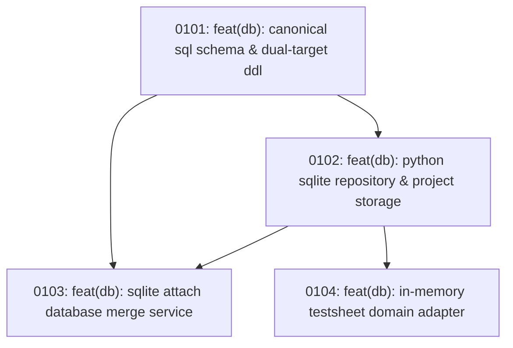

# Track 1 Sub-Map: SQLite Domain Engine (Foundation)

Part of [Master Program Map](../../map.md)

---

## Destination

Establish the authoritative SQLite database layer used across both the Python desktop application and the mobile Wasm PWA. Delivers the unified relational schema capturing all substation inspection data, the Python repository for local project databases (`<base_path>/pahang_project.db`), the `ATTACH DATABASE` merge engine that imports field inspection files into the main project database, and the in-memory domain adapter that allows existing report workflows to consume database records with zero changes.

---

## Notes

- **Dual-Target DDL**: The SQL schema defined here must execute without modification in standard Python `sqlite3` and mobile browser `sqlite3.wasm`.
- **Project Scope**: The active database file is stored at `<base_path>/pahang_project.db` managed by `ProjectEnvironment`.
- **Domain Seam**: Ticket 0104 delivers the in-memory bridge to `TestsheetData`, guaranteeing downstream workflows require zero rewrites (fulfilling D-MASTER.15).
- **Relevant Skills**: `tdd`, `codebase-design`.

---

## Work Breakdown

---

## Tickets

### 0101: feat(db): canonical sql schema & dual-target ddl
- **Status**: Open (Frontier)
- **Ticket File**: [tickets/0101-canonical-sql-schema-and-ddl.md](./tickets/0101-canonical-sql-schema-and-ddl.md)
- **Delivers**: `schema.sql` defining relational tables for `inspections`, `switchgear_panels`, `panel_readings`, `transformers`, `feeder_pillars`, `visual_items`, `defects`, and `equipment_calibrations`. Tested against SQLite 3.40+. Enforces composite natural keys/UUIDs (`D-MASTER.13`) and photo ranges (`D-MASTER.14`).

### 0102: feat(db): python sqlite repository & project storage
- **Status**: Open
- **Blocked by**: 0101
- **Ticket File**: [tickets/0102-python-sqlite-repository.md](./tickets/0102-python-sqlite-repository.md)
- **Delivers**: `InspectionRepository` in `src/db/repository.py` managing connections, transactions, CRUD operations, and automatic table creation inside `<base_path>/pahang_project.db`.

### 0103: feat(db): sqlite attach database merge service
- **Status**: Open
- **Blocked by**: 0101, 0102
- **Ticket File**: [tickets/0103-sqlite-attach-database-merger.md](./tickets/0103-sqlite-attach-database-merger.md)
- **Delivers**: `DatabaseMergeService` that executes `ATTACH DATABASE` on an uploaded mobile `.db` file, merges inspection records into the main project database, and detects conflicts.

### 0104: feat(db): in-memory testsheet domain adapter
- **Status**: Open
- **Blocked by**: 0101, 0102
- **Ticket File**: [tickets/0104-testsheet-domain-adapter.md](./tickets/0104-testsheet-domain-adapter.md)
- **Delivers**: `TestsheetDomainAdapter` in `src/db/adapter.py` mapping SQLite relational records into `TestsheetData` domain entities in memory, allowing downstream report workflows to run without file I/O or workflow changes.
