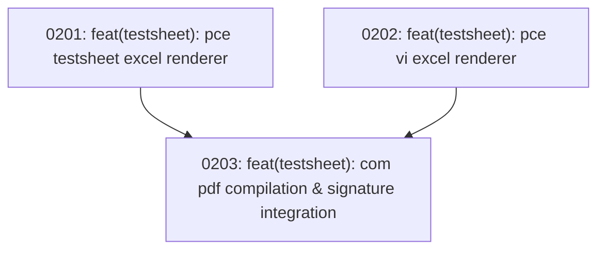

# Track 2 Sub-Map: Inverted Client Testsheet Generator

Part of [Master Program Map](../../map.md)

---

## Destination

Invert the testsheet generation pipeline. Instead of reading handwritten Excel workbooks with brittle cell parsing, this track builds a document generator that reads authoritative `InspectionRecord` entities from the SQLite database and renders perfectly formatted `PCE Testsheet` and `PCE VI` Excel and PDF documents that strictly comply with TNB client requirements.

---

## Notes

- **Client Layout Invariant**: Cell positions, borders, header logos, signature boxes, and fonts must match the official TNB template workbooks.
- **Dual Deliverable**: Generates both `.xlsx` workbooks and `.pdf` files.
- **Relevant Skills**: `tdd`, `codebase-design`.

---

## Work Breakdown

---

## Tickets

### 0201: feat(testsheet): pce testsheet excel renderer
- **Status**: Blocked by Track 1 (Ticket 0102)
- **Ticket File**: [tickets/0201-pce-testsheet-excel-renderer.md](./tickets/0201-pce-testsheet-excel-renderer.md)
- **Delivers**: `PceTestsheetRenderer` populating substation info, switchgear panel specs, resistance matrices, and UltraTEV readings onto the standard PCE Testsheet workbook template.

### 0202: feat(testsheet): pce vi excel renderer
- **Status**: Blocked by Track 1 (Ticket 0102)
- **Ticket File**: [tickets/0202-pce-vi-excel-renderer.md](./tickets/0202-pce-vi-excel-renderer.md)
- **Delivers**: `PceViRenderer` populating visual checklist items, kejanggalan notes, and severity ratings onto the standard PCE VI workbook template.

### 0203: feat(testsheet): com pdf compilation & signature integration
- **Status**: Blocked by 0201, 0202
- **Ticket File**: [tickets/0203-com-pdf-compilation-and-signatures.md](./tickets/0203-com-pdf-compilation-and-signatures.md)
- **Delivers**: End-to-end compilation pipeline converting filled Excel testsheets to PDF via `BatchComSession`, applying digital signatures or clearing placeholders for paper signing.
