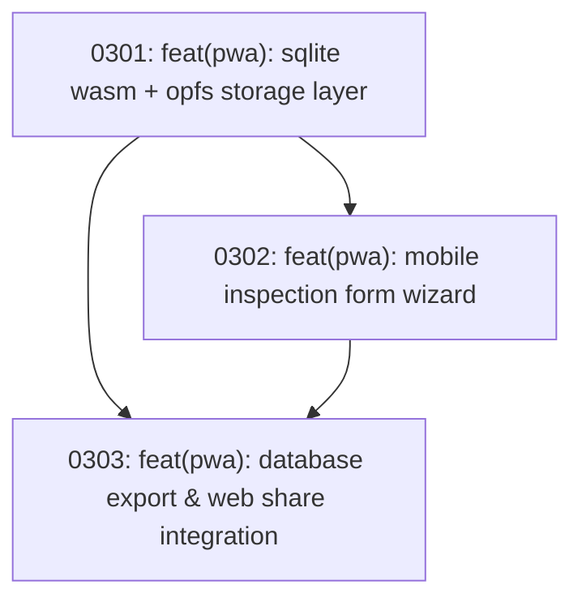

# Track 3 Sub-Map: Mobile Offline PWA (Field Data Entry)

Part of [Master Program Map](../../map.md)

---

## Destination

Deliver an offline-first Progressive Web App (PWA) tailored for Android and iOS smartphones used by field technicians inside substations without internet connectivity. Employs client-side SQLite Wasm running against the browser's Origin Private File System (OPFS), guides technicians through a multi-step data entry wizard, and exports inspection `.db` files directly via the Web Share API.

---

## Notes

- **Offline Invariant**: 100% functional without cellular reception or Wi-Fi. All assets cached via service worker.
- **Identical SQL Schema**: Consumes the exact DDL from Track 1 (`schema.sql`).
- **Relevant Skills**: `prototype`, `codebase-design`.

---

## Work Breakdown

---

## Tickets

### 0301: feat(pwa): sqlite wasm + opfs storage layer
- **Status**: Blocked by Track 1 (Ticket 0101)
- **Ticket File**: [tickets/0301-sqlite-wasm-opfs-integration.md](./tickets/0301-sqlite-wasm-opfs-integration.md)
- **Delivers**: Service worker asset caching and SQLite Wasm web worker initializing the Track 1 schema against the browser OPFS.

### 0302: feat(pwa): mobile inspection form wizard
- **Status**: Blocked by 0301
- **Ticket File**: [tickets/0302-mobile-inspection-form-wizard.md](./tickets/0302-mobile-inspection-form-wizard.md)
- **Delivers**: Touch-friendly multi-step form wizard for substation inspection entry (Metadata, Switchgear panels, TX/FP, Visual checklist, Defects).

### 0303: feat(pwa): database export & web share integration
- **Status**: Blocked by 0301, 0302
- **Ticket File**: [tickets/0303-mobile-db-export-and-share.md](./tickets/0303-mobile-db-export-and-share.md)
- **Delivers**: One-tap `.db` export integrating the Web Share API (`navigator.share`) for immediate sharing to WhatsApp or file download.
