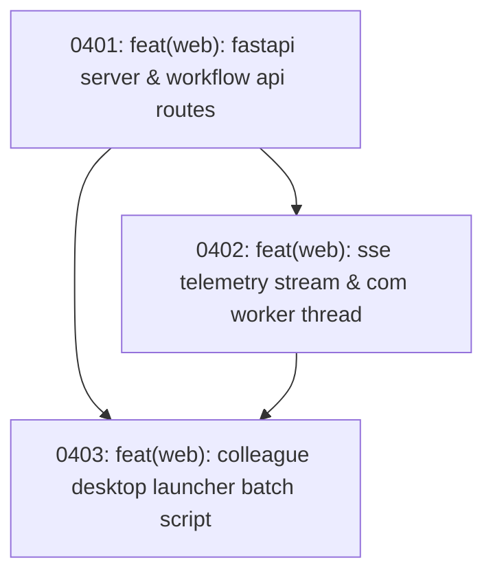

# Track 4 Sub-Map: Desktop Web Server & Telemetry Engine

Part of [Master Program Map](../../map.md)

---

## Destination

Deliver a self-contained local web server (FastAPI) on colleagues' Windows laptops that wraps `WorkflowService`, streams real-time execution progress to the browser via Server-Sent Events (SSE), cleanly isolates Windows COM Word/Excel automation inside a dedicated STA worker thread, and starts with a double-click launcher script.

---

## Notes

- **Zero Node.js Invariant**: Colleague machines only need Python. No npm, node, or webpack required on their laptops.
- **COM Isolation**: Word and Excel COM calls require strict Single-Threaded Apartment (STA) lifecycle management (`pythoncom.CoInitialize()`).
- **Relevant Skills**: `tdd`, `codebase-design`.

---

## Work Breakdown

---

## Tickets

### 0401: feat(web): fastapi server & workflow api routes
- **Status**: Open (Frontier)
- **Ticket File**: [tickets/0401-fastapi-backend-and-workflow-routes.md](./tickets/0401-fastapi-backend-and-workflow-routes.md)
- **Delivers**: FastAPI server in `src/web/app.py` exposing project metadata, directory listings, and workflow execution endpoints wrapping `WorkflowService`.

### 0402: feat(web): sse telemetry stream & com worker thread
- **Status**: Open
- **Blocked by**: 0401
- **Ticket File**: [tickets/0402-sse-telemetry-and-com-worker.md](./tickets/0402-sse-telemetry-and-com-worker.md)
- **Delivers**: SSE streaming `/api/events` endpoint and dedicated COM STA worker thread handling long report builds and conversions without blocking the API.

### 0403: feat(web): colleague desktop launcher batch script
- **Status**: Open
- **Blocked by**: 0401, 0402
- **Ticket File**: [tickets/0403-colleague-launcher-and-packaging.md](./tickets/0403-colleague-launcher-and-packaging.md)
- **Delivers**: `start_webapp.bat` script that verifies virtual environment, updates dependencies, starts the FastAPI server, and launches the browser.
