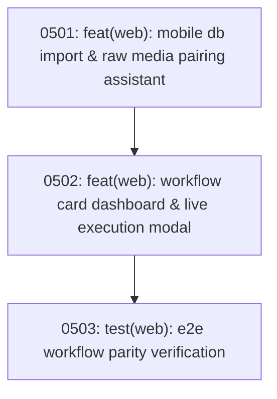

# Track 5 Sub-Map: Desktop Dashboard & Media Workflow

Part of [Master Program Map](../../map.md)

---

## Destination

Deliver the operator-facing desktop web interface that completely replaces the CLI menus. Enables colleagues to drag and drop mobile `.db` inspection files, pair bulk SD card camera photos from `RAW MATERIAL/`, trigger all project and utility workflows with real-time SSE progress indicators, and adjust project settings from their browser.

---

## Notes

- **CLI Parity**: All capabilities currently present in [`src/workflow_cli.py`](file:///C:/Users/ADAM/Desktop/pahang-cli/src/workflow_cli.py) must be available in the web dashboard.
- **Media Linking**: Pairs physical photo ranges from digital camera and FLIR SD dumps with the imported SQLite inspection records.
- **Relevant Skills**: `tdd`, `codebase-design`.

---

## Work Breakdown

---

## Tickets

### 0501: feat(web): mobile db import & raw media pairing assistant
- **Status**: Blocked by Tracks 1, 3, 4
- **Ticket File**: [tickets/0501-mobile-db-import-and-media-pairing.md](./tickets/0501-mobile-db-import-and-media-pairing.md)
- **Delivers**: Drag-and-drop upload for mobile `.db` files, invoking `DatabaseMergeService`, and photo range scanner pairing SD card photos to inspection records.

### 0502: feat(web): workflow card dashboard & live execution modal
- **Status**: Blocked by 0501, Track 2
- **Ticket File**: [tickets/0502-desktop-workflow-card-dashboard.md](./tickets/0502-desktop-workflow-card-dashboard.md)
- **Delivers**: Web UI views for Quick Report, Full Report, Populate TOTAL PE, Update QR02 CBA, and WhatsApp Report with live SSE progress bars and log drawer.

### 0503: test(web): e2e workflow parity verification
- **Status**: Blocked by 0502
- **Ticket File**: [tickets/0503-e2e-workflow-parity-verification.md](./tickets/0503-e2e-workflow-parity-verification.md)
- **Delivers**: End-to-end regression verification ensuring reports produced via the web interface match legacy CLI generated documents.
