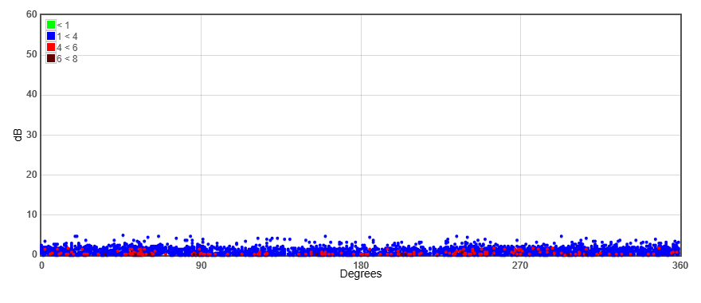
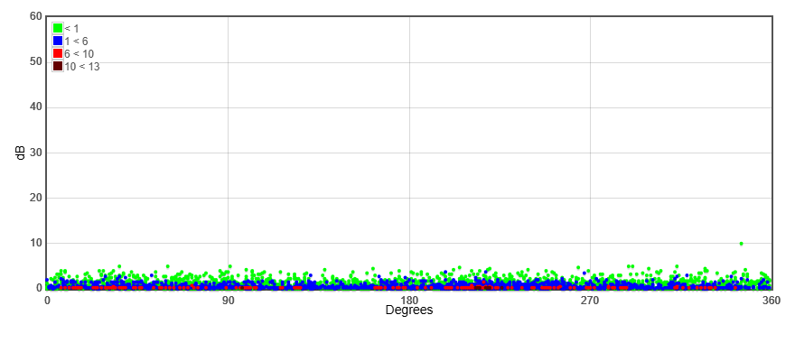
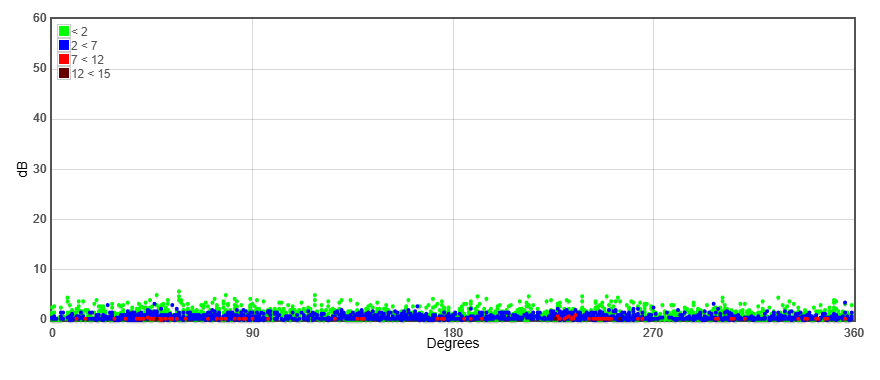
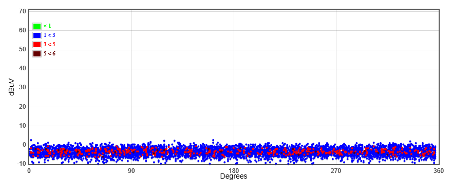
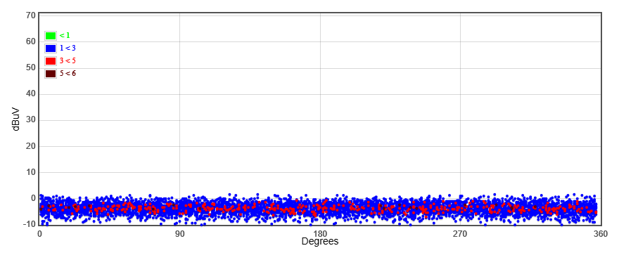
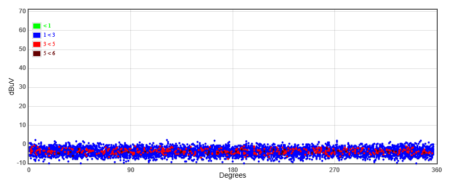
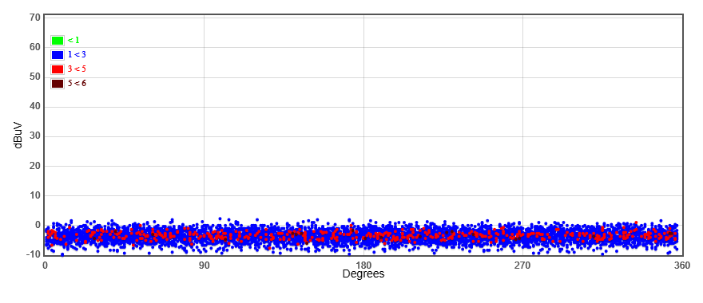

# Option A: Clean Headless Browser Snapshot PRPD Graphs

**Substation**: `149. TAMAN BUKIT BEIRUT PERMAI (IR+VI)`  
**Source Survey**: `RAW MATERIAL\KUANTAN\01. AUGUST\25-08-2026\149. TAMAN BUKIT BEIRUT PERMAI (IR+VI)\RAW DATA\US+TEV\20260825T103351_149-TAMAN-BUKIT-BEIRUT-PERMAI`  
**Method**: Option A — Clean DOM Styling Injection + Headless Chrome Snapshot (No hardcoded pixel cropping).

---

## 1. Switchgear Feeders (TEV PRPD Graphs)

The TEV phase-resolved partial discharge graphs (0°–360° phase, 0–60 dB amplitude):

````carousel

<!-- slide -->

<!-- slide -->

````

---

## 2. Switchgear Feeders & Transformer (Ultrasound Phase Plots)

The Ultrasound phase-resolved partial discharge graphs (0°–360° phase, -10 to 70 dBµV amplitude):

````carousel

<!-- slide -->

<!-- slide -->

<!-- slide -->

````

---

## Summary of Generated Images

| # | Target File | Component | Technology | Resolution | File Size | Content BBox | Status |
|---|:---|:---|:---|:---|:---|:---|:---|
| 1 | `SWG_FEEDER_1_TEV.png` | Feeder 1 | TEV | 880 × 380 px | 33.4 KB | `848 × 338 px` | Verified Untruncated |
| 2 | `SWG_FEEDER_1_US.png` | Feeder 1 | Ultrasound | 880 × 380 px | 60.9 KB | `848 × 334 px` | Verified Untruncated |
| 3 | `SWG_FEEDER_2_TEV.png` | Feeder 2 | TEV | 880 × 380 px | 40.8 KB | `848 × 338 px` | Verified Untruncated |
| 4 | `SWG_FEEDER_2_US.png` | Feeder 2 | Ultrasound | 880 × 380 px | 61.9 KB | `848 × 334 px` | Verified Untruncated |
| 5 | `SWG_FEEDER_3_TEV.png` | Feeder 3 | TEV | 880 × 380 px | 39.0 KB | `848 × 338 px` | Verified Untruncated |
| 6 | `SWG_FEEDER_3_US.png` | Feeder 3 | Ultrasound | 880 × 380 px | 60.4 KB | `848 × 334 px` | Verified Untruncated |
| 7 | `TX_TRANSFORMER_US.png` | Transformer | Ultrasound | 880 × 380 px | 61.3 KB | `848 × 334 px` | Verified Untruncated |
