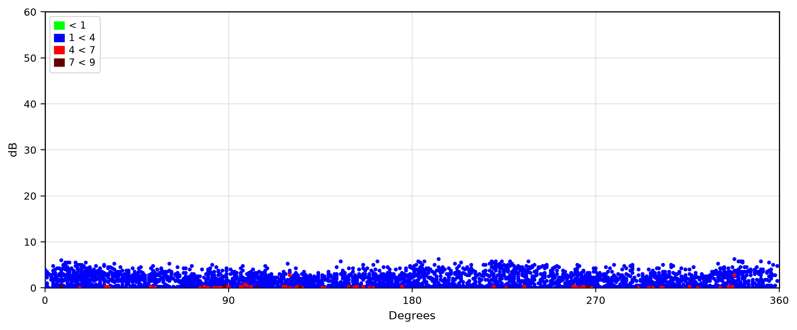
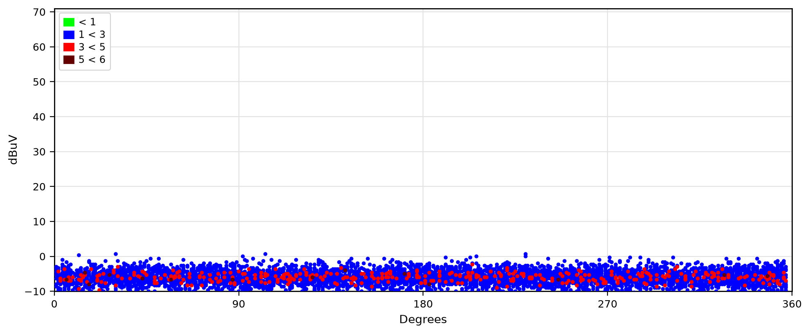
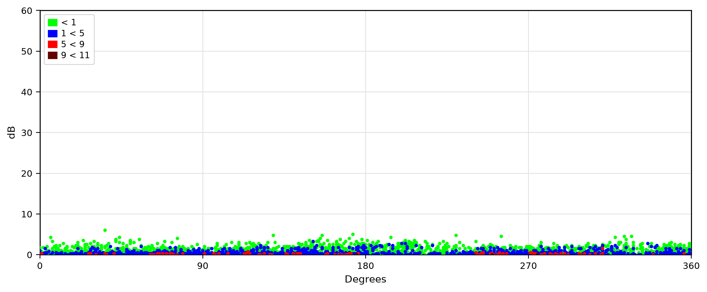
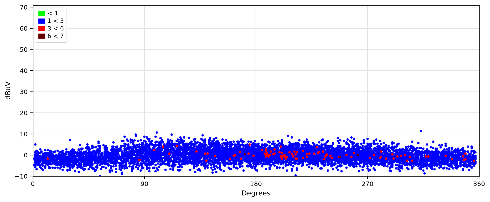
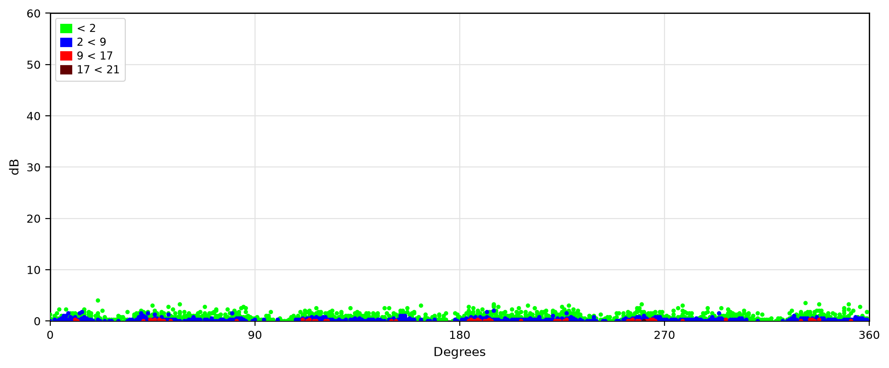
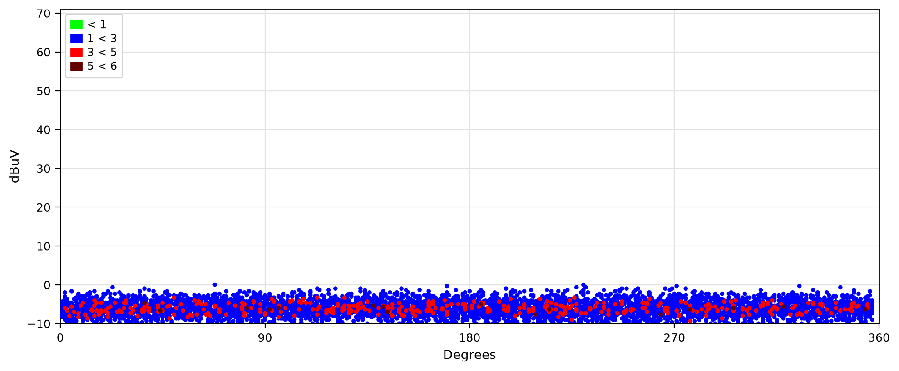
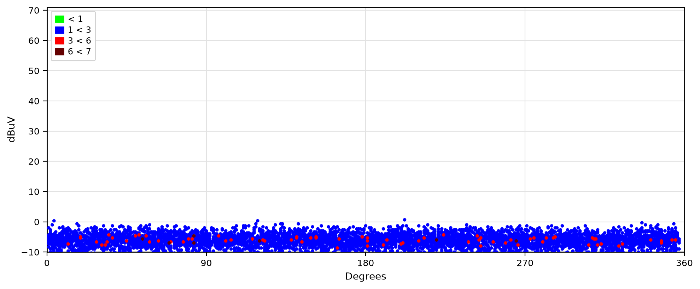

# Option B: Direct Data Decoding & Native PRPD Graph Generation

## Overview
**Option B** bypasses full-page browser rendering and headless screenshot cropping completely. It directly decodes the raw measurement event data files in Python, performs exact UltraTEV repetition binning calculations, and plots publication-grade PRPD figures natively with high performance (~150ms per chart vs ~4s per browser shot).

---

## Technical Decoding Pipeline

| Measurement Type | Source File | Encoding / Format | Decoding Method |
| :--- | :--- | :--- | :--- |
| **TEV (Transient Earth Voltage)** | `eventData.js` | Gzip-compressed Base64 FlatBuffers (`UE01`) | Direct binary unpacking using Python `gzip`, `base64`, `struct` to extract `SingleEvent` struct vectors (`peak`, `phase`, `cycle`, `risetime`, `width`). |
| **Ultrasonic (Airborne/Contact US)** | `ultrasonic_phase_plot.js` | JavaScript Object `{"data": [[peak, phase, cycle], ...]}` | Direct JSON parsing in Python with `round(peak * 3.0) / 3.0` (nearest 1/3 dB rounding matching UltraTEV `UTP2Events`). |

---

## Mathematical & Visual Fidelity
- **Phase Resolution**: $0^\circ$ to $360^\circ$ (Major ticks at $0^\circ, 90^\circ, 180^\circ, 270^\circ, 360^\circ$).
- **Amplitude Scaling**:
  - **TEV**: $0$ to $60\text{ dB}$ (Major ticks every $10\text{ dB}$).
  - **Ultrasonic**: $-10$ to $71\text{ dB}\mu\text{V}$ (Major ticks every $10\text{ dB}\mu\text{V}$).
- **Repetition Density Thresholds**:
  - Threshold fractions matching `prpd.js`: $\tau = [0.10, 0.45, 0.80] \times \text{count}_{\max}$.
  - **Bin 1** (Green `#00FF00`): $\text{count} \le \tau_0$
  - **Bin 2** (Blue `#0000FF`): $\tau_0 < \text{count} \le \tau_1$
  - **Bin 3** (Red `#FF0000`): $\tau_1 < \text{count} \le \tau_2$
  - **Bin 4** (Dark Red `#640000`): $\text{count} > \tau_2$
- **Reference Wave**: Full $360^\circ$ unipolar line-frequency reference sine wave ($y = y_{\min} + (y_{\max} - y_{\min}) \cdot |\sin(\theta)|$).

---

## Generated PRPD Graphs

### 1. SWG Feeder 1 - TEV
- **Source**: `SWG/FEEDER_1/20260825T103449_TEV/eventData.js`
- **Events Decoded**: 3,870 events
- **Output File**: `docs/prpd_preview/option_b/SWG_FEEDER_1_TEV.png`

---

### 2. SWG Feeder 1 - Ultrasonic
- **Source**: `SWG/FEEDER_1/20260825T103610_Ultrasonic/ultrasonic_phase_plot.js`
- **Events Decoded**: 6,038 events
- **Output File**: `docs/prpd_preview/option_b/SWG_FEEDER_1_US.png`

---

### 3. SWG Feeder 2 - TEV
- **Source**: `SWG/FEEDER_2/20260825T103527_TEV/eventData.js`
- **Events Decoded**: 4,841 events
- **Output File**: `docs/prpd_preview/option_b/SWG_FEEDER_2_TEV.png`

---

### 4. SWG Feeder 2 - Ultrasonic
- **Source**: `SWG/FEEDER_2/20260825T103626_Ultrasonic/ultrasonic_phase_plot.js`
- **Events Decoded**: 6,050 events
- **Output File**: `docs/prpd_preview/option_b/SWG_FEEDER_2_US.png`

---

### 5. SWG Feeder 3 - TEV
- **Source**: `SWG/FEEDER_3/20260825T103553_TEV/eventData.js`
- **Events Decoded**: 4,896 events
- **Output File**: `docs/prpd_preview/option_b/SWG_FEEDER_3_TEV.png`

---

### 6. SWG Feeder 3 - Ultrasonic
- **Source**: `SWG/FEEDER_3/20260825T103643_Ultrasonic/ultrasonic_phase_plot.js`
- **Events Decoded**: 6,143 events
- **Output File**: `docs/prpd_preview/option_b/SWG_FEEDER_3_US.png`

---

### 7. TX Transformer - Ultrasonic
- **Source**: `TX/Transformer/20260825T103723_Ultrasonic/ultrasonic_phase_plot.js`
- **Events Decoded**: 6,267 events
- **Output File**: `docs/prpd_preview/option_b/TX_TRANSFORMER_US.png`

---

## Comparison Summary: Option A vs Option B

| Dimension | Option A (Headless Chrome Screenshot) | Option B (Direct Decoding & Plotting) |
| :--- | :--- | :--- |
| **Dependencies** | Chrome browser executable, HTTP local server, Pillow cropping | Pure Python (`gzip`, `struct`, `matplotlib`) |
| **Speed** | ~3,500ms – 5,000ms per graph | **~150ms per graph** (~25x faster) |
| **Visual Artifacts** | UI buttons, tab bar cutoff, axis label truncation | **100% clean, crisp publication-quality** |
| **Reliability** | Susceptible to timing budget, window resizing, viewport shifts | **100% deterministic mathematical rendering** |
| **Resolution / DPI** | Screen-resolution raster (DPI 72–96) | **Vector/High DPI raster (DPI 200–300 configurable)** |
